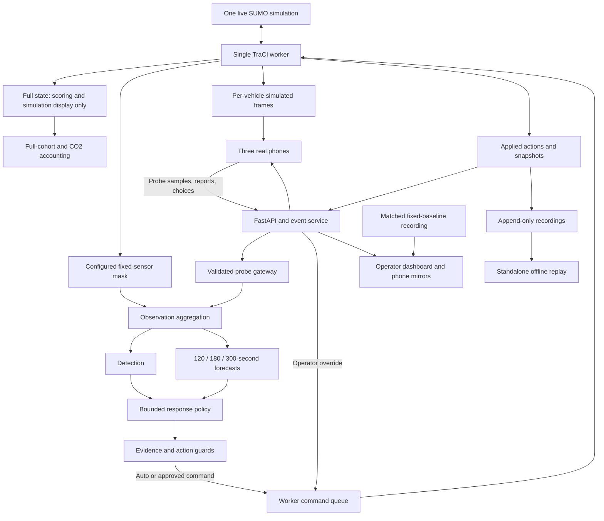

# Agnitia 36-Hour Hackathon: Connected-Phone Traffic Response Build Plan

**Problem statement:** Intelligent Traffic Congestion Response System  
**Track:** TERRA — Planet, Climate & Resilience  
**Team:** Prakhyat, Nandani, Urvashi, and the coordination/backend owner  
**Planning date:** 9 October 2026  
**Status:** Proposed build specification. No simulation, phone-connectivity test, training run, or performance result has been produced for this plan. All thresholds are starting settings.

This document captures the updated build plan, including connected phones as a must-have. It supersedes conflicting recommendations in the earlier review. The complete implementation handoff and JSON contracts are embedded in the appendices so this Markdown file can be shared on its own.

## Contents

1. [Demo concept](#1-demo-concept)
2. [Phone–simulation connection design](#2-phonesimulation-connection-design)
3. [System architecture](#3-system-architecture)
4. [Work breakdown for four people](#4-work-breakdown-for-four-people)
5. [Interface contracts](#5-interface-contracts)
6. [Agent task specs](#6-agent-task-specs)
7. [Checkpoints and cuts](#7-checkpoints-and-cuts)
8. [Evaluation plan](#8-evaluation-plan)
9. [Pitch and report](#9-pitch-and-report)
10. [Risks specific to this demo](#10-risks-specific-to-this-demo)
11. [PRD-ready summary](#11-prd-ready-summary)
12. [Appendix A: Complete implementation handoff](#appendix-a-complete-implementation-handoff)
13. [Appendix B: Shared message schemas](#appendix-b-shared-message-schemas)
14. [Appendix C: Scenario schema](#appendix-c-scenario-schema)
15. [Appendix D: Example rain scenario](#appendix-d-example-rain-scenario)
16. [Appendix E: Example messages](#appendix-e-example-messages)

---

**Build this as a connected incident-response demonstration, with three real phones, one live SUMO simulation, and one clearly labeled recorded baseline.** The phones are now part of the core product.

The biggest danger is making the phones look more capable than they are. Their network connections and human inputs will be real; their vehicle positions, speeds, and road conditions will be simulated. Make that distinction visible throughout.

Companion files, also embedded below:

- [Implementation handoff and 18 agent tasks](agent-build-plan.md)
- [Shared message schemas](contracts.schema.json)
- [Scenario schema](scenario.schema.json)
- [Example rain scenario](rain-demo.example.json)
- [Example messages](messages.example.json)

These are specifications, not implemented software. Documentation and example JSON structures were checked. **No simulation, phone-connectivity test, training run, or performance result has been produced. Every threshold below is a starting setting.**

## 1. DEMO CONCEPT

### The product story

Call the synthetic area **Nandipur Bazaar**. Display:

> **Synthetic Indian market corridor • Mixed traffic • Simulated vehicle data**

The story is worsening rain, an uninstrumented market road, and three drivers encountering different parts of the problem.

The important visual distinction:

- **Observation view:** what the system actually knows. Missing coverage is gray.
- **Simulation view:** what is happening in the simulated world.
- **Baseline:** a recording of the same exogenous scenario and scheduled traffic, using fixed signals.

Do not color an unobserved road green. **Unknown is not uncongested.**

### Spoken story arc

> “It is evening at Nandipur Bazaar. Rain is slowing the market road, but the control room has no sensor there. Urvashi is on a two-wheeler, Nandani is driving an auto, and Prakhyat is approaching with a delivery.
>
> These are real connected phones representing simulated vehicles. When the drivers share their vehicle data, the missing road becomes observable. The system notices the slowdown, forecasts the risk ahead, adjusts signals within limits, and offers a diversion.
>
> Prakhyat accepts. His vehicle changes route. The other drivers continue, and the system manages the traffic around them.
>
> Beside this live run is the same scenario with fixed signals. We finish by counting every scheduled journey and its modeled emissions.”

### Who stands where

| Person | Position | Demo role |
|---|---|---|
| **Coordination/backend owner** | Beside laptop and operator controls | Narrator, start/pause, override, fallback. |
| **Urvashi** | Audience-left, holding phone visibly | Two-wheeler commuter; enables probe sharing. |
| **Nandani** | Center, holding phone | Auto driver; enables sharing and reports waterlogging. |
| **Prakhyat** | Audience-right, holding phone | Delivery driver upstream; accepts a feasible diversion. |

Mirror their three phone cards on the big screen. Judges should not need to read a small phone across the room.

### Ten-minute script

The timings are a rehearsal target. Events must result from actual simulation state, not a timer that manufactures success.

| Time | Story and phone actions | Big screen | Live/recorded/simulated |
|---|---|---|---|
| **0:00–1:00** | Introduce the three drivers. Each lifts their phone; their vehicle highlights. | Synthetic corridor, three role cards, permanent source labels. | Real phones and connections; simulated vehicles. |
| **1:00–2:00** | Begin the rain scenario. Urvashi and Nandani initially have sharing off. Nandani taps **Report waterlogging**. | Market road remains **“No current observations.”** Report appears as **unverified**. A separate simulation view shows the slowdown. | Report is a real tap about a scripted simulated hazard. |
| **2:00–3:00** | **At 2:15, Urvashi and Nandani enable sharing.** Their phones transmit probe samples. | Gray road gains probe markers; counter changes to **“2 physical phones reporting.”** Show sample age and coverage, not an invented vehicle count. | This is the first “wow”: real phone uplinks populate the observation pipeline. |
| **3:00–4:00** | Allow enough simulated history to accumulate. Prakhyat reads the warning on his phone. | Current slowdown, selected 120- or 180-second forecast, evidence count, and reason for concern. | Forecast computed live from permitted observations. |
| **4:00–5:00** | System acts autonomously. Prakhyat accepts a valid bypass offer while still before the decision point. | Signal action appears; his route changes only after an **applied** acknowledgment. Other phone cards update from the same events. | Second “wow”: a real human choice changes the live simulation. |
| **5:00–6:00** | Nandani continues on the route already committed to. Urvashi can dismiss an incident advisory. | Show bounded signal adjustments, bypass queue, and competing-road wait. | Do not force an impossible reroute after a junction has been passed. |
| **6:00–7:00** | Briefly disable one phone’s reporting, then restore it. | Physical-phone count falls; its samples age out. The system reduces confidence or refuses actions that lack evidence. | Third “wow”: visible behavior changes when a sensor disappears. |
| **7:00–8:00** | Increase playback speed after human interactions. Rain restriction ends according to the scenario. | Live response versus **recorded fixed baseline**, aligned by simulation time. | Both road worlds are simulated; only response is running live. |
| **8:00–9:00** | Present completed-cohort results. | Mean journey time, modeled CO₂, scheduled/arrived counts, and the fixed/reactive/predictive experiment. | Separate this live demonstration from previously measured batch results. |
| **9:00–10:00** | Demonstrate operator override, show the audit trail, close. | **Restore fixed timing** request and safe transition; final scoped result. | Real override; no abrupt signal-state jump. |

**Do not script a claim that ignoring advice necessarily makes a driver slower.** Different origins, departure times, and routes make that comparison weak. Demonstrate the input and its effect; use controlled experiments to establish benefit.

### Three-minute version

| Time | Action |
|---|---|
| **0:00–0:25** | Introduce the three phones, synthetic road, and recorded baseline. |
| **0:25–0:45** | Show the sensor gap; Nandani reports the simulated hazard. |
| **0:45–1:05** | Two phones enable sharing; coverage visibly appears. |
| **1:05–1:30** | Show the forecast and automatic bounded response. |
| **1:30–1:50** | Prakhyat accepts; applied acknowledgment and route change appear together. |
| **1:50–2:25** | Accelerate the run or switch to clearly labeled recorded completion. |
| **2:25–2:50** | Show full-cohort journey time, modeled CO₂, and reactive-versus-predictive result. |
| **2:50–3:00** | Close: “When road sensors are missing, connected drivers can contribute observations—and we can test what that changes.” |

### Keep the presentation light

Run at **4× simulated time** initially. Switch to **1× or pause** for phone choices. Use **8× only after interactions**, if the presentation laptop passes a performance test.

A 45-second simulated advisory expiry lasts only 11.25 wall seconds at 4×. That is why time control is part of the demo design.

## 2. PHONE–SIMULATION CONNECTION DESIGN

### Choose this combination

| Option | Decision | Honest meaning |
|---|---|---|
| **A. Phone transmits its simulated vehicle’s position/speed** | **MUST** | Real device and network participation; simulated sensor values. |
| **B. Tap-to-report hazard** | **MUST** | Real human input referring to a simulated location and hazard. |
| **B. Real GPS/accelerometer** | **CUT** | Moving a phone in a room tells you nothing about the simulated road. |
| **C. Accept/ignore route choices** | **MUST** | Real choices cause validated route changes in SUMO. |
| **C. Steering, accelerator, brake controls** | **CUT** | Turns the project into a driving game and undermines traffic experiments. |

Browser geolocation requires a secure context and user permission. Device motion also has browser-specific permission requirements. An ordinary HTTP address on another LAN device is not the phone’s trusted `localhost`. This is unnecessary setup risk for this demo. [Geolocation](https://developer.mozilla.org/en-US/docs/Web/API/Geolocation_API), [device motion permissions](https://developer.mozilla.org/en-US/docs/Web/API/Device_orientation_events/Detecting_device_orientation), [secure contexts](https://developer.mozilla.org/en-US/docs/Web/Security/Defenses/Secure_Contexts)

### Physical setup

**Primary:** a pretested laptop hotspot or private travel router.

**Backup:** another pretested hotspot.

Do not depend on venue Wi-Fi; client isolation may prevent devices from reaching the laptop.

| Item | Configuration |
|---|---|
| Laptop server | FastAPI served by Uvicorn |
| Public demo port | TCP **8000** |
| Phone URL | `http://<actual-laptop-LAN-IP>:8000/driver` |
| Dashboard | `http://<actual-laptop-LAN-IP>:8000/dashboard` |
| WebSocket | Same host, `/ws` |
| TraCI | Local laptop connection only; not accessible from phones |
| Frontend assets | Built and served locally; no CDN, online fonts, or map tiles |
| Internet | Not required during the demonstration |

Use the actual adapter address. Do not hard-code a commonly seen hotspot IP.

After implementation:

```text
python -m uvicorn backend.app:app --host 0.0.0.0 --port 8000 --workers 1
```

Use **one worker**, with no development reload. Multiple web workers would require shared state you do not have time to build. Uvicorn documents these binding and worker settings. [Uvicorn settings](https://uvicorn.dev/settings/)

### Binding a phone to a vehicle

1. Backend creates the three named roles.
2. Operator screen displays three role-specific QR codes.
3. QR opens:

```text
http://<actual-IP>:8000/driver#join=<one-time-code>
```

4. Phone reads the fragment and posts the code to `/api/claim`.
5. Backend atomically claims the role and returns run ID, session ID, bound vehicle ID, and session token.
6. Phone removes the join fragment from the address.
7. WebSocket authenticates using that token.
8. Phone displays its identity prominently: **“You are Delivery — simulated vehicle.”**

Use the phone’s normal camera application to scan the QR. Also show a manual join code.

**One active session per vehicle.** Reconnection restores that session; it must not create a second vehicle.

### How the probe loop actually works

```text
SUMO vehicle state
    ↓
Vehicle frame sent only to its bound phone
    ↓
Phone displays it
    ↓ sharing enabled
Phone transmits probe.sample
    ↓
Backend validates frame identity, age, session and vehicle
    ↓
Observation gateway admits the sample
    ↓
Detection and prediction receive it
```

**The important enforcement:** the controller must not use that vehicle’s hidden SUMO state if the phone does not transmit it.

This is a device-emulation experiment. It demonstrates the communication and decision loop, not independent physical sensing.

### Guidance and response

| Guidance | Phone behavior | Simulation effect |
|---|---|---|
| Reroute offer | Accept or ignore | Accept changes only that vehicle’s route, if still valid. |
| Incident warning | Show/dismiss | No automatic vehicle mutation. |
| Signal update | “Next junction’s current green was extended” | Informational; reflects an applied control event. |
| “Hold 40 km/h for green wave” | **Do not build** | Requires a reliable arrival-time and future-signal prediction that this controller does not provide. |

An **Accept** button must first show **“Applying…”**. It becomes **“Route changed”** only after the worker confirms the TraCI operation.

SUMO route replacement requires the first edge to be the vehicle’s current edge. Late acceptances must be rejected, not forced. [Vehicle control](https://sumo.dlr.de/docs/TraCI/Change_Vehicle_State.html)

### Disconnection behavior

Starting values:

- Heartbeat: every **2 wall seconds**.
- Disconnected: **6 wall seconds** without heartbeat.
- Probe stale: **15 simulated seconds** old.
- Reconnect delays: **1, 2, then 4 wall seconds**.

On disconnect:

- The simulated vehicle continues on its last accepted route.
- It does not disappear or stop.
- No new probe samples are manufactured.
- Pending guidance is canceled or expires.
- Existing observations age out.
- Actions requiring unavailable evidence cannot be renewed.
- Reconnection receives a fresh snapshot, not a backlog of old commands.

Keep phones foregrounded and screens awake. Background execution differs across browsers; do not assume a WebSocket guarantees uninterrupted mobile execution. [Page visibility behavior](https://developer.mozilla.org/en-US/docs/Web/API/Page_Visibility_API)

### Minimal local-demo security

- Password-protected private Wi-Fi.
- Firewall permission limited to the demo subnet and port.
- Random, single-use join codes with a two-minute expiry.
- Per-session tokens generated server-side.
- Driver sessions cannot call operator commands or choose another vehicle.
- Check WebSocket origin and message size.
- Deduplicate input by message ID.
- Do not log tokens.
- Do not put real locations or personal information into this HTTP demo.

**This is a local synthetic-data setup, not a production security design.**

### Fallbacks

1. One phone fails → continue with two.
2. Physical phone fails → replace its view with a laptop browser tab labeled **device emulator**.
3. Wi-Fi fails → use the pretested fallback network.
4. Backend fails → switch within five seconds to standalone recorded replay.
5. Replay fails → local video.

A recorded successful connected-phone run must exist before submission. A fallback does not excuse never having built the connection.

## 3. SYSTEM ARCHITECTURE



### Three strictly separated data paths

| Path | What it may contain | Who may use it |
|---|---|---|
| **Simulation truth** | Every vehicle, hidden queues, emissions, incident schedule | Simulator, scoring, offline training labels, explicitly labeled rendering |
| **Operational observations** | Installed sensors and received probe samples | Detector, forecast, controller |
| **User input** | Reports, accept/ignore, operator override | Validated command/report handlers |

The learner must receive an `ObservationWindow`, **not a TraCI connection**.

The scenario scheduler knows rain will worsen. The predictor must not receive future rain stages.

### Autonomy: decide once

**Default demonstration mode: bounded autonomous control, armed once by the operator.**

At startup:

1. System is in **Manual**.
2. Operator clicks **Arm autonomous response**.
3. Signals and advisories act automatically within the frozen limits.
4. Individual phone vehicles still require a real acceptance to reroute.
5. Operator retains **Pause**, **Manual**, and **Restore fixed timing**.

Every action records triggering observations, forecast/model version where relevant, proposed command, validation outcome, actual application time, and affected signal or vehicle.

**Restore fixed timing is a safe transition, not an instantaneous arbitrary light change.** It also cannot undo a route a driver already took.

### Starting bounds

| Setting | Initial value |
|---|---:|
| Minimum green | 10 simulated seconds |
| Maximum green | 40 simulated seconds |
| Extension increment | 5 simulated seconds |
| Controller reconsideration | Every 10 simulated seconds |
| Response authorization lifetime | 180 simulated seconds before evidence-based renewal |
| Background diversion offer cap | 30% of eligible vehicles |
| Bypass queue-ratio veto | Above 0.35 |
| Advisory expiry | 45 simulated seconds |
| Forecast evidence | Two distinct probes within 60 seconds; latest sample within 15 seconds |
| Recovery | Slowdown below 0.30 for 60 seconds |

These require tuning. They are not public-road safety standards.

`setPhaseDuration` changes the **remaining current-phase duration**. Repeatedly resetting it without tracking elapsed green can accidentally keep a phase alive. Preserve yellow/all-red transitions and use an explicit phase state machine. [Traffic-light control](https://sumo.dlr.de/docs/TraCI/Change_Traffic_Lights_State.html)

### India angle without pretending calibration

- Synthetic bazaar labels and recognizable land uses.
- Left-hand network.
- Two-wheelers, cars, and auto-rickshaw representation.
- Waterlogging and roadside obstruction.
- Explicit sensor gaps.
- Driver observations and limited compliance.

Test `--lateral-resolution` before hour four. SUMO documents sublane behavior and its computational cost. Keep it only if it behaves reliably on the network. [Sublane documentation](https://sumo.dlr.de/docs/Simulation/SublaneModel.html)

## 4. WORK BREAKDOWN FOR FOUR PEOPLE

**Estimates are active work, not guaranteed elapsed time.** Reserve substantial integration/debugging time. Do not allocate all 36 hours to feature implementation.

### Nandani — simulation owner

| Order | Task | Estimate | Inputs | Done criterion / handoff |
|---|---|---:|---|---|
| 1 | Hello World, save a complete scenario | 1 h | Official tutorial | One vehicle finishes; configuration opens on another laptop. |
| 2 | Four-junction topology and two valid routes | 2 h | Frozen topology and ID rules | `bazaar.net.xml`, geometry, ID registry; route smoke test passes. |
| 3 | Types, demand, three role vehicles | 1.5 h | Role IDs and initial schedule | Explicit `.rou.xml`; no duplicate roles; baseline moves. |
| 4 | Sublane trial | 0.5 h | Working network | Short visual recording, runtime observation, keep/cut decision. |
| 5 | Delivery obstruction and normal control run | 2 h | Lane IDs | **H6 gate:** incident jams, no-incident case clears. |
| 6 | Rain ramp and procession presets | 2 h | Scenario schema | Repeatable events with correct restoration. |
| 7 | Detector configuration and emission assumptions | 2 h | Sensor-mask agreement | Detector IDs, emission mapping, loadable output configuration. |
| 8 | Validate batches and debug simulation defects | 3–4 h | Prakhyat’s failed-run reports | No invalid routes, unexplained removals, or inconsistent incidents. |

**First three hours without waiting:** tutorial → topology → actual edge IDs.

Nandani should hand over small verifiable artifacts. “I am still learning SUMO” is not a deliverable; “both routes completed in this configuration” is.

### Prakhyat — detection, forecasting, evaluation

| Order | Task | Estimate | Inputs | Done criterion / handoff |
|---|---|---:|---|---|
| 1 | Metric fixtures and feature contract | 2 h | Shared schemas | Hand-calculated journey/CO₂ tests; synthetic observation fixtures. |
| 2 | Observation aggregation and detector | 2 h | Probe/fixed-sensor records | Unknown stays unknown; repeated samples do not inflate coverage. |
| 3 | Batch-data generation | 2 h + runtime | Validated SUMO scenario and runner | Separate observation, truth, trip, and manifest files. |
| 4 | Persistence, trend, boosting at three horizons | 3 h | Whole-run training split | Three models and validation table; no future leakage. |
| 5 | Reactive/predictive trigger tuning | 2 h | Same bounded controller | Thresholds frozen using validation runs only. |
| 6 | Cohort and emissions accounting | 2.5 h | Trip records and manifests | Entry waits, detours, unfinished trips, units handled correctly. |
| 7 | Held-out experiments and sensor ablation | 2 h + runtime | Frozen artifacts | Per-seed result tables, including losses and incomplete runs. |
| 8 | Evidence slides and report tables | 1.5 h | Final results | Claims trace directly to saved runs. |

**First three hours without waiting:** implement metric fixtures, feature transformations, and persistence/trend against mock CSV data.

### Urvashi — dashboard, phone UI, visuals

| Order | Task | Estimate | Inputs | Done criterion / handoff |
|---|---|---:|---|---|
| 1 | Storyboard and fixture-driven screens | 2 h | Story and schemas | Laptop layout and three phone roles readable without backend. |
| 2 | Phone binding and connection states | 2 h | Claim/WebSocket endpoints | Two real phones show different identities. |
| 3 | Probe-sharing and guidance interactions | 2 h | Frame, guidance, ack messages | Sharing changes uplinks; acceptance waits for applied acknowledgment. |
| 4 | Observation map and sensor-gap reveal | 2 h | Geometry and observations | Gray→observed transition reflects received samples. |
| 5 | Live/baseline comparison and audit view | 2 h | Snapshots and replay frames | No future baseline frames; persistent source labels. |
| 6 | Standalone replay and presentation polish | 2 h | Recorded events | Opens locally without backend. |
| 7 | Pitch visuals and rehearsals | 2–3 h | Actual results | Ten-minute and three-minute versions fit time. |

**First three hours without waiting:** build views using the supplied message examples. Do not wait for SUMO to animate.

### Coordination owner — integration, backend, control

| Order | Task | Estimate | Inputs | Done criterion / handoff |
|---|---|---:|---|---|
| 1 | Freeze contracts, repository ownership, fixture server | 1.5 h | Supplied schemas | Everybody can develop against the same events. |
| 2 | Local networking, claims, sessions, WebSocket | 2 h | Role registry | Two physical phones connect and reconnect correctly. |
| 3 | Single worker and simulation clock | 2.5 h | Nandani’s configuration | One TraCI owner; pause/rate/commands work. |
| 4 | Probe gateway and source isolation | 2 h | Vehicle frames and sensor mask | Missing uplink means missing observation. |
| 5 | Control and autonomy/override state machine | 3 h | Signal registry and detections | Bounds, downstream guards, safe fallback, audit trail. |
| 6 | Validated rerouting and action acknowledgment | 1.5 h | Route registry and phone decisions | Only correct, eligible vehicle reroutes once. |
| 7 | Baseline recording alignment | 1.5 h | Baseline files and checksums | Mismatch rejected; clocks stay aligned. |
| 8 | Integration, fault tests, startup runbook | 3–4 h | Complete system | Cold launch and failover rehearsed. |

**First three hours without waiting:** freeze schemas; serve fake vehicle frames; connect two real phones.

### Dependency order

```text
Schemas + fixtures
    ├── Urvashi builds UI immediately
    ├── Prakhyat builds transformations/tests immediately
    └── Integration owner builds networking immediately

Nandani's valid network + ID registry
    ↓
Real TraCI worker
    ↓
Actual observations + trip outputs
    ├── Prakhyat generates/trains/evaluates
    └── Urvashi swaps fixtures for live messages

Bounded controller + validated model
    ↓
Integrated phone story
    ↓
Frozen experiments, recordings and pitch
```

**Integration meetings:** hour 3, 6, 9, 12, 18, 24, and 30. Each is a working demonstration, not a status discussion.

## 5. INTERFACE CONTRACTS

The embedded JSON schemas are the authoritative field definitions. The following explains how to use them.

### Envelope

Every WebSocket message has:

```json
{
  "v": 1,
  "type": "probe.sample",
  "msg_id": "msg.phone1.12",
  "run_id": "run.demo.001",
  "sender_id": "session.phone1",
  "seq": 12,
  "sim_time_s": 360,
  "payload": {}
}
```

The envelope above illustrates common fields; each concrete message requires its defined payload.

Rules:

- `seq`: monotonic per sender/session.
- `msg_id`: unique within the run; mutation deduplication key.
- `sim_time_s`: server-authoritative; client values are validated references.
- A run reset invalidates all old sessions, frames, and advisories.
- Clients receive filtered subsets of server events; sequence gaps are not automatically errors.
- All units are explicit.

### Vehicle frame and probe return

Server to the bound phone:

```json
{
  "v": 1,
  "type": "vehicle.frame",
  "msg_id": "msg.101",
  "run_id": "run.demo.001",
  "sender_id": "server",
  "seq": 101,
  "sim_time_s": 360,
  "payload": {
    "frame_id": "frame.rider.360",
    "vehicle_id": "veh.role.rider",
    "state": "active",
    "pose": {
      "edge_id": "edge.market",
      "x_m": 200,
      "y_m": 100,
      "speed_mps": 2.0
    }
  }
}
```

Phone to backend, only when sharing is enabled:

```json
{
  "v": 1,
  "type": "probe.sample",
  "msg_id": "msg.phone1.12",
  "run_id": "run.demo.001",
  "sender_id": "session.phone1",
  "seq": 12,
  "sim_time_s": 360,
  "payload": {
    "frame_id": "frame.rider.360",
    "vehicle_id": "veh.role.rider",
    "pose": {
      "edge_id": "edge.market",
      "x_m": 200,
      "y_m": 100,
      "speed_mps": 2.0
    }
  }
}
```

The backend verifies the echoed pose against the issued frame. It does not trust arbitrary phone coordinates.

### Guidance

```json
{
  "v": 1,
  "type": "guidance",
  "msg_id": "msg.120",
  "run_id": "run.demo.001",
  "sender_id": "server",
  "seq": 120,
  "sim_time_s": 500,
  "payload": {
    "advisory_id": "advisory.delivery.1",
    "vehicle_id": "veh.role.delivery",
    "kind": "reroute",
    "route_id": "route.bypass",
    "message": "Market road slowing. Alternate route available.",
    "expires_sim_s": 545
  }
}
```

No invented “saves six minutes” estimate.

### Driver input

```json
{
  "v": 1,
  "type": "driver.decision",
  "msg_id": "msg.phone3.20",
  "run_id": "run.demo.001",
  "sender_id": "session.phone3",
  "seq": 20,
  "sim_time_s": 500,
  "payload": {
    "advisory_id": "advisory.delivery.1",
    "choice": "accept"
  }
}
```

Hazard report payload:

```json
{
  "frame_id": "frame.auto.360",
  "vehicle_id": "veh.role.auto",
  "category": "waterlogging"
}
```

Location comes from the validated frame. A report annotates an incident; it does not change the physical simulation.

### Required message types

| Type | Direction | Purpose |
|---|---|---|
| `session.hello` / `session.ready` | Both | Authentication and binding |
| `heartbeat` | Client→server | Connection liveness |
| `vehicle.frame` | Server→phone | Bound vehicle’s simulated state |
| `probe.sample` / `probe.toggle` | Phone→server | Observations and sharing control |
| `driver.report` | Phone→server | Unverified hazard report |
| `guidance` | Server→phone | Reroute, incident, or signal update |
| `driver.decision` | Phone→server | Accept/ignore |
| `proposal` | Server→operator | Explainable action proposal |
| `operator.command` | Operator→server | Arm, manual, restore, pause, resume, rate, approve |
| `control.event` | Server→views/log | Applied or rejected action |
| `ack` | Server→client | Received/applied/rejected/duplicate |
| `world.snapshot` | Server→authorized view | Full current view after connect/reconnect |

### Scenario file

The scenario manifest defines:

- network, demand, detector, geometry, and registry paths;
- seed and simulation timing;
- fixed-sensor availability;
- phone-bound vehicles;
- explicitly labeled emulated probes;
- exogenous incident schedule;
- controller settings;
- sublane setting;
- emission mappings;
- matched baseline recording.

It is **the application’s JSON format**, not a SUMO API.

For the rain example:

- warm-up ends at simulated second 240;
- rain starts at 300;
- progressively lower speed limits are applied;
- restrictions restore at 900;
- departures end at 900;
- maximum evaluation horizon is 2400.

Those are initial scenario settings, not evidence that the run jams or finishes.

### Naming and files

| Artifact | Convention |
|---|---|
| Network | `sim/net/bazaar.net.xml` |
| SUMO config | `sim/net/bazaar.sumocfg` |
| Detectors | `sim/net/detectors.add.xml` |
| ID/phase/route registry | `sim/net/id-registry.json` |
| UI geometry | `sim/net/geometry.json` |
| Demand | `sim/demand/rain_ramp.seed-042.rou.xml` |
| Scenario | `sim/scenarios/rain_ramp.json` |
| Role vehicles | `veh.role.rider`, `veh.role.auto`, `veh.role.delivery` |
| Run outputs | `runs/<run_id>/` |
| Telemetry | `events.jsonl`, `observations.csv`, `truth.csv` |
| Metrics | `trips.csv`, `results.csv` |
| Provenance | `manifest.json` |

**Nandani’s registry must contain actual SUMO IDs.** SUMO-created signal IDs may not match the proposed names automatically.

### Repository layout

```text
contracts/          Shared schemas, generated types, fixtures
sim/
  net/              Network, geometry, IDs, detectors
  demand/           Frozen per-seed demand
  scenarios/        Incident manifests
  validate.py
  run_headless.py
backend/
  app.py
  session.py
  worker.py
  events.py
  probes.py
  control.py
  replay.py
ml/
  observations.py
  features.py
  detect.py
  train.py
  forecast.py
eval/
  generate.py
  cohort.py
  compare.py
web/src/
  shared/
  dashboard/
  driver/
  replay/
tests/
models/
runs/
scripts/
docs/
```

**Collision rule:** one owner per module; only the integration owner approves shared-contract changes. Agents must not “clean up” other people’s modules while completing their own task.

## 6. AGENT TASK SPECS

Use **18 bounded modules**. Appendix A contains exact proposed paths and named acceptance-test files.

Each agent gets its module specification, shared contracts, one input fixture, owned paths, acceptance command, and an instruction to report changed files, test output, and limitations.

| # | Module / owner | Purpose and input→output | Acceptance test |
|---|---|---|---|
| 1 | Contracts — Integration owner | Schemas→Python/TypeScript representations and fixtures | Reject unknown fields, invalid choices, negative speed. |
| 2 | Network — Nandani | Topology→SUMO network and registry | Main and bypass routes complete; actual IDs resolve. |
| 3 | Demand/types — Nandani | Network→explicit schedules and three roles | Same seed generates same cohort; role IDs unique. |
| 4 | Incidents — Nandani | Scenario manifest→repeatable restrictions | Start/release logged; original speed/program restored. |
| 5 | Worker/clock — Integration owner | Configuration and queued commands→simulation events | Only one TraCI writer; pause freezes simulated time. |
| 6 | Sessions/LAN — Integration owner | Join code→bound authenticated session | Wrong role rejected; reconnect retains vehicle. |
| 7 | Events/snapshots — Integration owner | Applied state→logs and synchronized views | Duplicate command cannot apply twice. |
| 8 | Probe gateway — Integration owner | Phone uplinks and mask→allowed observations | No uplink means no market probe; stale/forged frames rejected. |
| 9 | Aggregation/detection — Prakhyat | Allowed observations→detection state | Normal red does not repeatedly alarm; stale is unknown. |
| 10 | Controller/override — Integration owner | Detection/forecast→bounded commands | Clearance preserved; max green enforced; blocked bypass vetoed. |
| 11 | Batch generator — Prakhyat | Frozen scenarios→training/evaluation files | Same scheduled cohort; labels use correct future window. |
| 12 | Forecasts — Prakhyat | Features→120/180/300-second models | Whole-run splits; persistence/trend comparison; no future inputs. |
| 13 | Cohort/CO₂ — Prakhyat | Trip data→valid metrics | Hand fixture handles entry delay, detour, unfinished trip, units. |
| 14 | Dashboard — Urvashi | Snapshots→map, coverage, audit | Unknown road stays gray; source labels always visible. |
| 15 | Phone UI — Urvashi | Frames/guidance→probe and choice messages | Acceptance waits for applied ack; disconnect visible. |
| 16 | Baseline/replay — Integration owner + Urvashi | Recording→aligned baseline and offline playback | Hash mismatch blocked; future frames never shown as current. |
| 17 | Experiment comparison — Prakhyat | Run results→paired tables | Negative outcomes, missing runs, and denominators retained. |
| 18 | Release/story — All | Working system→runbook, report, recordings | Cold start, phone loss, backend failure, timed rehearsals. |

**Do not ask an agent to “build the backend.”** Ask it to implement, for example:

> “Implement the probe gateway in `backend/probes.py`. Accept only samples matching a frame issued to the authenticated bound vehicle. Reject wrong-run, future, expired, duplicate, or altered frames. Emit observations only after valid uplink. Do not read hidden market detectors. Pass `tests/test_probes.py`.”

That is small enough to review.

## 7. CHECKPOINTS AND CUTS

### Hour-by-hour checkpoints

Each checkpoint asks for an artifact or observable behavior.

| Hour | Owner | Go/no-go evidence |
|---:|---|---|
| **1** | Integration owner + all | Contracts, role IDs, and file ownership frozen. |
| **2** | Integration owner + Urvashi | Two physical phones connect to fixture server. |
| **3** | Nandani + Integration owner | A real SUMO vehicle frame reaches a browser. |
| **4** | Nandani | Sublane keep/cut decision; valid routes exist. |
| **5** | Nandani | Normal fixed-plan run clears ordinary queues. |
| **6** | Nandani + Prakhyat | **Baseline-jams gate:** incident produces sustained congestion and later recovery. |
| **7** | Integration owner | Single-worker commands and event logging work. |
| **8** | Integration owner + Urvashi | Phone roles bind distinctly; claims and reconnect tested. |
| **9** | Integration owner + Prakhyat | Two phone uplinks produce observations; missing uplinks produce a gap. |
| **10** | Integration owner | Signal state machine passes bounds/transition tests. |
| **11** | Integration owner + Nandani | One reactive response runs without invalid routes or commands. |
| **12** | All | **End-to-end gate:** detect→act→phone choice→route change→metrics. |
| **13** | Prakhyat | Feature audit proves no hidden detector or future-event inputs. |
| **14** | Nandani | Gradual rain preset works; release restores limits. |
| **15** | Prakhyat | Training labels and whole-run partitions generated. |
| **16** | Prakhyat | Three boosting models train; trend/persistence run. |
| **17** | Prakhyat + Integration owner | Validation selects a control horizon and freezes initial triggers. |
| **18** | All | One live run beside a matched recorded baseline. |
| **19** | Integration owner + Urvashi | Applied acknowledgments and override visible everywhere. |
| **20** | Prakhyat + Nandani | CO₂ units and emission assumptions checked. |
| **21** | Nandani + Prakhyat | Three scenario presets reproduce. |
| **22** | Prakhyat | Core unseen-seed experiment starts. |
| **23** | Integration owner + Urvashi | Phone disconnect/reconnect and late acceptance tests pass. |
| **24** | All | **Product gate:** complete story, metrics, phones, forecast, replay, and CO₂ exist. |
| **25** | Prakhyat | Sensor-gap ablation completed or running within measured budget. |
| **26** | Integration owner + Urvashi | Standalone replay works with backend terminated. |
| **27** | All | First ten-minute rehearsal; record failures. |
| **28** | All | Fix only rehearsal failures; freeze features. |
| **29** | Prakhyat + Urvashi | Final results slides include losses and limitations. |
| **30** | All | **Release gate:** cold start, local video, report draft, three-minute version. |
| **31** | Integration owner | Package and reproduce from clean launch. |
| **32** | All | Rehearse backup network and phone substitution. |
| **33** | All | Final timed rehearsal. |
| **34** | Integration owner + Prakhyat | Submission artifacts and result claims checked. |
| **35** | All | Charge devices, freeze builds, confirm local assets. |
| **36** | Integration owner | Submit and present the frozen version. |

### Gate failures

- **H6:** simplify topology/demand immediately. No dashboard polish until a valid traffic experiment exists.
- **H12:** simplify controller to fixed phase order with bounded extension and one bypass. Stop visual extras.
- **H18:** use trend operationally while finishing boosting training/evaluation. Never claim boosting controls the run if it does not.
- **H24:** remove secondary live scenarios and extra charts; protect phone connectivity and the core loop.
- **H30:** no new features. Presentation uses the most reliable tested path, with recorded portions labeled.

### Ordered cuts

1. Real GPS, accelerometer, steering, exact green-wave speed advice.
2. Voice, elaborate animation, multilingual polish.
3. Geographic map import and online basemap.
4. Sublane behavior if the early stability test fails.
5. Broad compliance/demand sweeps beyond the core experiment.
6. Live procession and blockage performances; keep their preset/evaluation evidence.
7. Online use of a losing 300-second model; retain its evaluated result.
8. Secondary dashboard charts.
9. Three-phone presentation dependency: two live phones plus one explicit emulator is acceptable fallback.

**Do not cut:** connected phones, restricted sensing, ML training/evaluation, bounded actions, full-cohort accounting, modeled CO₂, fixed/reactive/predictive comparison, or replay.

## 8. EVALUATION PLAN

### First: define what the sparse sensors can measure

Two probe vehicles do not reveal the exact queue length or number of vehicles on an uninstrumented road.

For that road, use a **slowdown score**:

```text
z(t) = clip(1 - median(fresh probe speeds) / reference speed, 0, 1)
```

Aggregate each vehicle once per time bin. A phone sending more messages must not gain more influence.

Features:

- Current slowdown.
- Recent 30-, 60-, and 120-second aggregates.
- Slowdown trend.
- Unique probe count.
- Sample age and missing-data indicators.
- Vehicle-type composition where known.
- Permitted boundary-detector observations.
- Current signal phase and elapsed phase time.

No absolute scenario clock, future rain stages, hidden market queues, or baseline future frames.

### Three forecasting horizons

Train separate `HistGradientBoostingRegressor` models for **120**, **180**, and **300 seconds**.

Compare all against persistence and trend. The estimator is documented by scikit-learn. [Estimator documentation](https://scikit-learn.org/stable/modules/generated/sklearn.ensemble.HistGradientBoostingRegressor.html)

**Recommendation:** start with 180 seconds as the candidate live horizon; choose 120 or 180 from validation. Evaluate 300, but do not assume longer is better.

A five-minute forecast can be less useful because uncertainty grows. It cannot manufacture information about an unobserved future incident.

### Target and control interpretation

Train the first-response predictor on **fixed-policy runs**.

Target:

> Full-state road slowdown averaged over the 30-second window ending at `t + horizon`.

Full state is allowed for offline labels, not input features.

Interpret the forecast as:

> “Risk if the current no-response behavior continues.”

After the intervention starts:

- Stop presenting that model output as a forecast of the controlled future.
- Mark its earlier warning as the intervention trigger.
- Use current observations for response renewal and recovery.
- Do not claim prediction error from a successful intervention means the original warning was wrong.

This is much simpler than building an action-conditioned traffic forecasting model in 36 hours.

### Policies

| Policy | Trigger | Response |
|---|---|---|
| **A — Fixed** | None | Frozen signal plan and original routes. |
| **B — Reactive** | Current observed slowdown crosses the danger condition. | Bounded signals, diversion offers, advisories. |
| **C — Predictive** | Forecast crosses the danger condition with sufficient current evidence. | Identical action options and bounds. |

Tune both B and C on validation data. Do not handicap reactive control with an unnecessarily slow detector.

Initial conditions:

- Reactive: observed slowdown ≥0.70 for 30 seconds, with signal-phase checks.
- Predictive: current slowdown ≥0.30, future slowdown ≥0.70 for 20 seconds, sufficient samples/history.

These are hypotheses to test.

For a scheduled procession, give known closure information equally to both response policies or identify it as a separate advance-information experiment. Do not let predictive control secretly know the future.

### Proposed seed partitions

| Purpose | Seeds |
|---|---|
| Demonstration | 42 |
| Training/development | 100–107 |
| Validation | 200–202 |
| Final held-out evaluation | 300–304 |

Keep every variant derived from the same seed/configuration in the same split.

### Run budget

| Experiment | Proposed runs |
|---|---:|
| Training: 3 scenarios × 2 demand levels × 8 seeds, fixed policy | 48 |
| Forecast validation: same design × 3 validation seeds | 18 |
| Final core: 3 scenarios × 5 test seeds × A/B/C | 45 |
| Minimal sensor ablation: rain × 5 seeds × 2 sensing configurations | 10, with reusable runs |
| Compliance extension: rain × 5 seeds × B/C × 0/20/60% | 30, with reusable 60% runs |

Benchmark one headless run before committing to throughput. Add validation-policy runs within the measured compute budget.

Use another laptop for batches after freezing the network and versions. Never train and run the presentation simultaneously on the presentation machine.

### Compliance

Keep these separate:

1. **Offer fraction:** share of eligible background vehicles offered a diversion.
2. **Compliance:** share of offered vehicles that accept.
3. **Actual diversion:** successfully rerouted / eligible vehicles.
4. **Human phone choices:** recorded separately.

At 30% offered and 60% compliance, expected background diversion is approximately 18% before feasibility rejections.

Offline experiments use deterministic emulated phone sessions and choices tied to simulation time. **The human live demonstration is not the source of the batch statistical claim.**

### Sensor-gap comparison

Compare:

- **Boundary sensors only:** no market-road probe observations.
- **Boundary sensors + three probe vehicles:** same policy and exogenous scenario.

The missing road remains unavailable in the first arm. The controller may abstain or use only justified boundary actions.

Measure time until first usable observation, observation coverage over the incident interval, detection/response time, forecast availability and error, and journey/emissions outcomes.

**Receiving more data is not the same as improving traffic. Report both.**

For the hero scene, exclude background emulated probes from the market road. Otherwise the “phones fill the gap” reveal would be misleading.

### Exact numbers to report

| Category | Report |
|---|---|
| Primary outcome | Mean scheduled-departure-to-arrival journey time, seconds |
| Secondary headline | Whole-cohort modeled CO₂, kg |
| Improvement | Paired percentage change versus fixed |
| Forecast contribution | Predictive versus reactive journey/CO₂ difference |
| Robustness | Per-seed results, median, range, wins out of five |
| Distribution | P95 journey time |
| Accounting | Scheduled, departed, arrived, pending, active, removed, teleported |
| Network burden | Main queue, bypass queue, worst competing-approach wait |
| Forecast quality | MAE at 120/180/300 seconds against persistence and trend |
| Alerts | False alerts per simulated hour, missed events, usable warning lead time |
| Sensors | Fresh coverage fraction and unique reporting vehicles |
| Control | Applied/rejected actions, diversion offers/acceptances/successes |

For vehicle `i`:

```text
J_i = arrival_i - scheduledDeparture_i
```

For the same complete cohort:

```text
Improvement_J = 100 × (mean_J_fixed - mean_J_policy) / mean_J_fixed
```

**If a run does not finish, show it as incomplete.** Do not compute the headline from only the lucky vehicles that arrived.

### CO₂: required, but label the assumptions

SUMO assigns emissions through `emissionClass`; default passenger-car behavior is not a validated auto-rickshaw or two-wheeler model. Document every mapping or proxy. [Emission models](https://sumo.dlr.de/docs/Models/Emissions.html)

For live accumulation:

```text
CO2_kg = sum_over_time_and_vehicles(emission_rate_mg_per_s × step_s) / 1,000,000
```

SUMO vehicle CO₂ rates are in mg/s. [Vehicle measurements](https://sumo.dlr.de/docs/TraCI/Vehicle_Value_Retrieval.html)

Use/check final whole-trip emissions to capture departure/arrival boundaries correctly. Disclose synthetic fleet and demand, emission-class assumptions, any proxies, omitted pre-insertion emissions, and longer-route effects.

The supplied scenario example contains explicitly marked provisional proxies. **It must not be treated as a validated mixed-fleet emissions configuration.**

## 9. PITCH AND REPORT

### Pitch outline

**Opening**

> “This market road has no traffic sensor. But two drivers are already experiencing the slowdown.”

**Human moment**

> “An auto is carrying passengers through the bazaar. A delivery rider is approaching. Rain is reducing road capacity, and fixed signals keep feeding traffic toward the problem.”

**Demonstration**

> “Watch the road become observable when these phones share their simulated vehicle data. Now watch a real choice on this phone change the route.”

**Proof**

> “The recording beside it has the same scheduled traffic and incident, with fixed timing. We count every journey. We also compare reactive control with predictive control, so forecasting has to earn its place.”

**Close**

> “We are testing how sparse observations can support coordinated incident response—and showing where it helps and where it does not.”

### Likely judge questions

| Question | Honest answer |
|---|---|
| **Are the phones actually sensing road traffic?** | “They are real connected probe-device emulators. SUMO supplies their assigned vehicle data; the phones transmit it back. Human reports and route choices are real inputs. We are not measuring this room with GPS.” |
| **Why send data out and back if the laptop already knows it?** | “To implement and test the device-to-control loop. The controller is deliberately denied hidden state unless the configured sensor channel delivers an observation.” |
| **Three phones cannot cover a city.** | “Correct. We demonstrate coverage on a small corridor and report how often observations are sufficient. City-scale penetration remains unverified.” |
| **Does ML improve the response?** | “Here is predictive versus reactive under identical action limits. If the difference is weak or negative, we report that.” |
| **Why is the baseline recorded?** | “It removes presentation load. Its network, demand, incident, and seed match this run, and its playback uses the live simulation clock.” |
| **What if everybody follows the bypass?** | “Offers are capped and blocked when the bypass lacks capacity evidence. We report actual diversion separately from intended compliance.” |
| **Are your CO₂ savings real-world estimates?** | “They are model outputs for a synthetic fleet under stated emission assumptions, not a measured city result.” |
| **Who controls the autonomous system?** | “The operator arms a bounded policy and can pause, switch to manual, or restore fixed timing. Every applied action is logged.” |

### Short-report structure

Target **five pages plus an appendix**:

1. **Problem and story:** user, corridor, sparse-sensing motivation.
2. **System:** architecture, phone emulation, sensor mask, autonomous bounds.
3. **Experiment:** scenarios, policies, seeds, demand, compliance, metrics.
4. **Results:** A/B/C table, forecast comparison, CO₂, sensor ablation.
5. **Limits and reproduction:** failures, assumptions, startup instructions, contribution table.
6. **Appendix:** manifests, emission mappings, parameter values, detailed per-seed results.

The first results table should include negative outcomes. Do not bury them in the appendix.

## 10. RISKS SPECIFIC TO THIS DEMO

| Risk | Mitigation |
|---|---|
| **Phone theater: hidden SUMO data still drives detection** | Hard observation gateway; test that removing uplinks removes observations. |
| **Too few probes to justify a confident forecast** | Require minimum distinct vehicles/history; show unknown and abstain. |
| **Roles reach their destinations before their scene** | Rehearse schedules and departure times; no invisible respawning or vehicle-ID reuse. |
| **Phone acceptance arrives after the route decision point** | Validate location at execution; 1×/pause during interaction; explicit rejection state. |
| **Wall-clock and simulation-clock confusion** | Heartbeats use wall time; forecast/action expiry uses simulated time; label both. |
| **Wi-Fi isolation or changed laptop IP** | Private network, startup connection test, QR generated from actual address. |
| **Phone sleeps or reconnects twice** | Foreground operation, one session/vehicle, snapshot reconnect, no stale-command replay. |
| **Multiple agents modify shared interfaces** | Frozen schemas, owned paths, one integration owner, small module branches. |
| **Nandani is blocked by a complex network** | Small validated steps; synthetic topology; someone reviews her output at H3/H6. |
| **Prakhyat trains against privileged information** | Feature allowlist and test proving scheduler/hidden-truth fields are absent. |
| **Baseline recording no longer matches edited scenario** | Checksum gate; regenerate after any exogenous scenario change. |
| **Live actions help travel time but worsen CO₂** | Show both outcomes; do not infer emissions from queue reduction. |
| **Free coding-agent limits interrupt work** | Keep specs and fixtures locally; humans own integration; no module depends on an unavailable agent session. |
| **Presentation laptop overheats under training and simulation** | One live headless SUMO; recorded baseline; batches on another laptop. |
| **Backend failure leaves everyone improvising** | One-key standalone replay and local video; rehearsed five-second switch. |

## 11. PRD-READY SUMMARY

**Product: Nandipur Bazaar — Connected Incident Response**

### Problem

On a sensor-poor urban corridor, worsening congestion can remain unobserved until queues disrupt surrounding junctions. Operators need usable observations, short-term warnings, bounded responses, and evidence that those responses improve network outcomes.

### Users

Primary: traffic-control operator.  
Secondary: connected drivers contributing observations and receiving guidance.

### Solution

A local demonstration using one live SUMO simulation, three real phones bound to simulated vehicles, and a recorded fixed-time baseline matched to the same network, demand, incident, and seed.

Phones act as probe-device emulators: vehicle position and speed originate in SUMO, while transmission, hazard-report taps, and accept/ignore inputs occur on real devices. A restricted observation gateway ensures missing phone reports remain missing data.

The system detects congestion, evaluates gradient-boosting forecasts at 120, 180, and 300 seconds, and autonomously applies bounded signal adjustments and diversion offers after the operator arms it. Manual mode, override, safe restoration, and an audit log remain available.

### MUST

Connected phones; QR/session binding; simulated mixed traffic; visible sensor gap; gradual rain scenario; two supporting incident presets; detection; trained ML with trend/persistence comparisons; bounded signal control; diversion and advisories; synchronized dashboard/phones; full-cohort journey accounting; modeled CO₂; fixed/reactive/predictive evaluation; matched baseline recording; standalone replay/video; repository, architecture and report.

### SHOULD

Stable sublane behavior, broader compliance experiments, additional demand tests, polished phone mirrors.

### CUT

Real GPS/accelerometer sensing, steering controls, exact green-wave speed advice, native app, cloud dependencies, RL/LSTM, gamification, and online basemaps.

### Demo story

Rain slows an uninstrumented market road. Two drivers enable sharing, making fresh observations appear. The system warns of worsening congestion and acts within limits. A third driver accepts a diversion; the route changes live. The audience sees the matched baseline, complete-cohort outcomes, and operator oversight.

### Key numbers

Mean journey time including entry waits; whole-cohort modeled CO₂; predictive versus reactive improvement; forecast error at each horizon; observation coverage; actual diversion rate; scheduled/arrived/unfinished vehicle counts.

### Success criteria

By hour 6, the incident baseline demonstrably jams while the normal run clears. By hour 12, phone input changes a valid simulation action. By hour 24, the complete story and accounting work. By hour 30, cold start, disconnection recovery, replay, report, and both presentation lengths are rehearsed.

No improvement percentage is promised. All simulated components, recording sources, emission assumptions, incomplete runs, and negative results remain explicit.

---

## Appendix A: Complete implementation handoff

### Connected-phone traffic demo: implementation handoff

**Goal:** build one honest, local-network, phone-connected SUMO demonstration within 36 hours. This document and the accompanying JSON schemas are proposed specifications, not implemented software or measured results.

**Architecture:** one laptop, one live SUMO process, one Python TraCI-owning thread, one FastAPI process, three physical phones, one recorded matched baseline. A separate observation gateway enforces missing sensors. Full simulation state is permitted for rendering, offline labels and scoring, never silently injected into the controller.

**Stack:** the same pinned SUMO installation and TraCI on all machines; Python; FastAPI; Uvicorn; Pydantic; NumPy/pandas; scikit-learn; pytest; JSON Schema validator; Vite/TypeScript; SVG; native WebSocket; Vitest. Use a Python version supported by installed dependencies, not an untested newest version. Freeze versions after the first working connection. No cloud dependency.

**Design:** synthetic Nandipur Bazaar, left-hand traffic, main market route plus parallel bypass, four controlled junctions. Cars, two-wheelers and an auto-rickshaw proxy. Rain ramp is the live story. Blocked delivery vehicle and scheduled procession are supporting presets. Sublane trial before hour 4; keep only if stable and fast enough.

#### Global constraints

- Start immediately on fixtures and parallel tasks; integrate by hour 3. No extra design-approval ceremony is required by this handoff.
- Every numeric controller parameter is an untested starting value, not a road safety standard or result.
- Physical phones emulate floating-car-data devices for assigned simulated vehicles. Position and speed originate in SUMO. Human reports and accept/ignore choices are real inputs, while the road and hazards are simulated.
- No real GPS, accelerometer, steering, native app, service worker, RL, LSTM, rewards, or exact green-wave speed advice.
- Phones must not directly call TraCI or choose their own vehicle ID, route, signal command or authoritative timestamp.
- Exactly one thread owns the TraCI connection. HTTP/WebSocket handlers enqueue commands. One Uvicorn worker; no reload during the demo.
- Autonomy is armed once by the operator. Bounded actions may execute automatically. Driver-controlled vehicles reroute only on a valid accept. Background compliance is simulated and labeled.
- Startup mode is manual. Modes are fixed, manual, auto. Pause is independent of mode. Restore-fixed waits for a safe phase transition; it does not undo routes already taken.
- Full SUMO state is available for simulation rendering and evaluation. Prakhyat's online models receive only the sensor gateway's ObservationWindow.
- Three registered physical-phone probes are the only midblock probe sources on edge.market in the hero scenario. Additional emulated probes outside that road must be labeled and counted separately.
- Every external incident affects all comparison policies identically. A report annotates a hazard; it never creates one.
- Full-cohort metrics include entry waiting and longer diversions. No completed-only headline when a run is incomplete.
- No measured improvement or deployment claim exists yet.

#### 1. Source-of-truth artifacts

- `contracts.schema.json`: JSON Schema Draft 2020-12 for HTTP payloads and WebSocket events. All objects reject unknown fields.
- `scenario.schema.json`: scenario manifest schema; application-specific, not a SUMO configuration schema.
- `rain-demo.example.json`: structural example with untested defaults and illustrative network IDs. Validate IDs against the built network before use. Emission proxies are explicitly marked; replace with verified available classes or disclose and assess proxy sensitivity.
- `messages.example.json`: illustrative frame, probe, driver decision and acknowledgment. Numbers are protocol examples, not results.

Copy these into `contracts/` in the product repository. The integration owner approves shared-contract changes; task agents do not rename shared fields themselves.

#### 2. IDs, units, files

- Junctions `jct.entry`, `jct.market`, `jct.bypass`, `jct.exit`; signals `tls.entry`, etc. SUMO may initially couple junction and signal IDs: the registry must contain actual IDs; do not assume they match.
- Edges `edge.approach`, `edge.market`, `edge.bypass_in`, `edge.bypass_out`, `edge.exit`, plus named cross streets. Registry resolves lane IDs, e.g. `edge.market_0`.
- Types `type.car`, `type.bike`, `type.auto`; artificial blockers are identified separately.
- Roles `veh.role.rider`, `veh.role.auto`, `veh.role.delivery`. No vehicle-ID reuse within a run. After arrival, the phone displays trip complete.
- Background IDs `veh.bg.000001` onward. Routes `route.main` and `route.bypass`; registry contains valid edge sequences and vehicle-class eligibility.
- Scenario IDs `scn.rain_ramp`, `scn.market_block`, `scn.procession`; unique run IDs `run.<scenario>.<policy>.<seed>.<attempt>`.
- Coordinates are local SUMO meters, not latitude/longitude. Time is simulated seconds unless a field explicitly says wall time. Speed is m/s on the wire, km/h only for display. CO2 totals are kg; raw rates are mg/s.
- `sim/net/id-registry.json`: object with `signals` (actual TLS IDs, green phase indices, min/max bounds and movement incoming/receiving lane IDs), `edges` (actual lane IDs and lengths), `routes` (edge sequences and eligible vTypes), `fixed_detectors`, `reference_speed_mps_by_edge`, `excluded_metric_vehicle_ids`.
- `sim/net/geometry.json`: `{ "coordinate_system":"sumo_xy_m", "edges":[{"edge_id":"edge.market","shape_xy_m":[[0,0],[300,0]]}] }`. Coordinates here are illustrative.
- `sim/demand/<scenario>.seed-<NNN>.rou.xml`: explicit vehicles and scheduled departure times, frozen per experiment seed; avoid regenerating demand separately for each policy.
- `runs/<run_id>/manifest.json`: scenario/network/demand/sensor-mask checksums, SUMO and library versions, seed, controller/model versions, emission assumptions, policy, simulated compliance, probe schedule and final validity flags.
- `events.jsonl`: accepted input and server event envelopes, one JSON object per line, plus server wall-receipt timestamp in a logging wrapper. Never log tokens.
- `observations.csv`: `run_id,sim_time_s,edge_id,coverage,mean_speed_mps,slowdown,distinct_probes_60s,sample_age_sim_s,fixed_queue_ratio`; missing values are empty, not zero.
- `truth.csv`: `run_id,sim_time_s,edge_id,vehicle_count,mean_speed_mps,slowdown_true,jam_length_m,co2_mg_s`; forbidden as runtime model input.
- `trips.csv`: `run_id,vehicle_id,vtype_id,scheduled_depart_s,actual_depart_s,arrival_s,status,route_length_m,waiting_s,co2_mg`; status pending/active/arrived/removed. Emission totals must agree with final SUMO output within numerical tolerance.
- `results.csv`: run-level counts, complete/valid flags, mean and p95 journey seconds, waiting seconds, per-approach queues and waits, clearance time, total CO2 kg, action and sensor statistics.

#### 3. Network and connection contract

Prefer a pretested laptop hotspot or private travel router. Shared venue Wi-Fi is a backup because client isolation is possible. No Internet is needed. Verify the actual hotspot address; never assume 192.168.137.1.

Production command after implementation: `python -m uvicorn backend.app:app --host 0.0.0.0 --port 8000 --workers 1`. Build the UI beforehand; FastAPI serves the built assets. One LAN port (TCP 8000); private-network firewall rule limited to the demo subnet. SUMO's dynamically selected TraCI port stays on the laptop and is blocked from LAN ingress. Check the actual listening interfaces on the chosen SUMO build.

Routes: GET `/healthz`; GET `/api/bootstrap`; POST `/api/claim`; GET `/dashboard`; GET `/driver`; WebSocket `/ws`; operator-only POST `/api/run/reset` creates a new run and invalidates all prior sessions. Reset is not recovery of a crashed run.

Each driver QR opens `http://<actual-ip>:8000/driver#join=<one-time-code>`. The frontend reads then removes the fragment, and POSTs `{"join_code":"..."}` to `/api/claim`. A claim returns run_id, session_id, vehicle_id, token. Code expires after 120 wall seconds and is consumed once. Provide a manual code-entry fallback. Native phone-camera QR scanning avoids in-page camera permissions.

WebSocket opens to the same host; the first message is `session.hello`, with the bearer token in its payload. Reject unauthenticated application messages. Session tokens are generated server-side with at least 128 bits of cryptographic randomness, stored in browser sessionStorage, scoped to run and role, and never logged. Validate Origin and Host; rate-limit commands; cap message size at 16 KiB. Plain HTTP is only for synthetic data on the private demo LAN, not a production security claim.

One active device session per vehicle. Reconnect can replace the previous socket for the same session; a second claim for an occupied role is rejected. Operator credentials are distinct from driver credentials. Heartbeat every 2 wall seconds; mark disconnected after 6 wall seconds. Keep screens awake and foreground. Reconnect delays 1, 2, then 4 wall seconds; after authentication send a fresh snapshot. Do not replay old commands automatically.

#### 4. Message semantics

All event messages use `v,type,msg_id,run_id,sender_id,seq,sim_time_s,payload`. `seq` is monotonic per sender/session, not a globally contiguous number expected by every recipient. Server events share one authoritative sequence. Each client sees a filtered subset. `msg_id` is unique in the run and supports idempotency. Duplicate mutation requests return the stored outcome without repeating an action.

Server timestamps are authoritative. Client simulated timestamps must match the referenced frame or guidance and are not trusted for time advancement. New runs invalidate every old frame, session, advisory and command. Reject future, stale, mismatched-vehicle and wrong-run inputs.

- `session.hello`, `heartbeat`: any authenticated role; hello is the authentication exception. `session.ready`, `ack`: server.
- `vehicle.frame`: server -> bound driver only. Active frames contain pose; pending/arrived frames contain null pose. Emit every 5 simulated seconds. Do not use phone wall timers to invent samples.
- `probe.sample`: driver -> server, echo frame_id, vehicle_id and pose. Verify against the retained frame. Only then release that sample to the observation gateway. A disabled reporting toggle or disconnected phone produces no sample. No backfill from hidden truth.
- `probe.toggle`: driver -> server, controls only the bound vehicle's reporting. Reporting starts OFF for the hero's coverage reveal. Offline experiments use a declared fixed participation schedule instead.
- `driver.report`: location resolved from a fresh frame of the bound vehicle. Categories waterlogging/obstruction/slow_traffic. Store as an unverified human report; alone it can produce an advisory, but cannot justify a major control action.
- `driver.decision`: accept/ignore an addressed unexpired advisory. Reject an acceptance after the decision junction. An ignored/expired offer leaves the route unchanged. No automatic acceptance for physical-phone roles.
- `guidance`: reroute requires a non-null route_id; other kinds have null route_id. Signal advice reports the known current plan only, never promises a future green or speed band.
- `proposal`: suggested bounded actions. In manual mode await operator approval; in auto mode run validation and apply autonomously.
- `operator.command`: only operator. approve requires proposal_id; set_rate requires rate; unrelated nullable fields must be null. Restore-fixed is queued for a safe transition. Pausing stops simulated time and recorded-baseline advancement; wall-clock heartbeats continue.
- `control.event`: emitted only after an action is applied or rejected. extend_green/end_green use signal_id, phase_index and remaining_s; reroute uses vehicle_id and route_edges; mode_change uses mode. All unrelated fields null or empty arrays. Preserve clearance phases.
- `ack`: received means queued, not applied. An applied response is emitted only after worker execution. Explicit rejected reasons include expired_advisory, past_decision_edge, wrong_vehicle, wrong_run, stale_frame, duplicate, insufficient_evidence.
- `world.snapshot`: source for synchronized dashboard and read-only mirrors. Driver broadcasts are filtered to their own data; never send all sessions' guidance. `simulation_view` is ground truth for visualization only. Observations drive detection. Baseline uses recorded frames at or before the current live simulation time, not its final values prematurely.

Freshness defaults: latest probe <=15 simulated seconds old, at least two distinct probe vehicles in 60 seconds for an autonomous predictive decision on the uninstrumented link. Repeated messages from one vehicle do not create more probes. Empty or stale coverage is unknown, never free-flow. Wall disconnection removes that session from live count immediately; its last sample naturally expires without backfill. Connected at arrival does not imply current coverage.

A driver disconnection does not stop or delete the simulated vehicle. It follows its last accepted route. Cancel pending guidance for that phone. Previously applied bounded signal changes finish safely; their policy expires without renewal if required observations are unavailable. Fixed fallback and operator overrides remain usable.

#### 5. Controller and forecasting contract

One owner supplies `ObservationWindow`; the online detection/forecast functions receive no TraCI object and no incident scheduler. Functions: `detect(window) -> DetectionState`, `forecast(window, horizon_s) -> ForecastResult`, `propose(observations, forecast, signal_state) -> Proposal | None`. Implement models with typed Python dataclasses or Pydantic and serialize using shared schemas.

Uninstrumented-road feature: slowdown = clamp(1 - median(fresh probe speeds)/reference speed, 0, 1). Aggregate each vehicle to one sample contribution per 5-second bin to avoid message-rate bias. Feature windows cover 30, 60 and 120 seconds, with missingness and coverage counts. Include permitted boundary-detector observations and actual signal state. Never read hidden market E2 detectors online.

Train separate HistGradientBoostingRegressor models for horizons 120, 180, 300 seconds. Baselines: persistence and linear trend. Targets are full-state road slowdown averaged over the 30-second window ending at t+h; labels are offline-only and null on empty roads. Train/tune on fixed-policy runs before interventions; selected predictor proposes the first response only. Once intervention starts, mark the no-action forecast counterfactual and stop using/repainting it as a forecast of the controlled future. Recovery and policy expiry use current permitted observations. This avoids silently training an uncontrolled forecast and interpreting it as an accurate controlled forecast.

Starting trigger: current slowdown >=0.30 and forecast >=0.70 for 20 simulated seconds, with sufficient coverage and at least 60 seconds of observation history; reactive requires observed slowdown >=0.70 for 30 seconds and signal-phase context. Tune both on validation runs; document thresholds and comparable false-alert rates. Normal red queues must not repeatedly trigger alarms. The response policy lasts at most 180 simulated seconds before renewal using current observed congestion and downstream guards; no forecast-based renewal after intervention. Clear after observed slowdown stays below 0.30 for 60 simulated seconds. Missing evidence blocks renewal; transition back to fixed timing safely.

Use the same downstream guards, phase order, min/max green, offer cap, class restrictions and cooldown for reactive/predictive. No arbitrary green-state strings. Read-only signal state is permissible control metadata. Extend only with receiving-link capacity evidence. Bypass availability requires its fixed detector; absent evidence blocks diversion. A report alone is not confirmation. A scheduled procession can be given equally to both response policies in a separately identified planned-information experiment.

At response activation, offer diversion to a stable-hash-selected 30% of eligible background vehicles; each accepts with configured simulated compliance. Physical-phone roles receive offers when eligible and feasible, independently of the background selection; label their manual decisions separately. No route update for a physical-phone vehicle without a real accept. The authoritative fraction is rerouted/eligible, reported separately from offers and compliance.

#### 6. Repository ownership

```text
contracts/                 integration owner; frozen shared schemas + generated frontend types
sim/net/                   Nandani: network, detectors, registry, geometry
sim/demand/                Nandani + Prakhyat's generator: immutable per-seed demand
sim/scenarios/             Nandani: manifests
sim/validate.py            Nandani, reviewed by integration owner
sim/run_headless.py        shared runner, integration owner
backend/app.py             integration owner
backend/session.py         integration owner
backend/worker.py          integration owner, only TraCI owner
backend/events.py          integration owner
backend/probes.py          integration owner
backend/control.py         integration owner
backend/replay.py          integration owner
ml/observations.py         Prakhyat
ml/features.py             Prakhyat
ml/detect.py               Prakhyat
ml/train.py                Prakhyat
ml/forecast.py             Prakhyat
eval/generate.py           Prakhyat
eval/cohort.py             Prakhyat
eval/compare.py            Prakhyat
web/src/shared/            Urvashi
web/src/dashboard/         Urvashi
web/src/driver/            Urvashi
web/src/replay/            Urvashi
tests/                    per-module tests; no wholesale rewrites
docs/                     integration owner + Urvashi
scripts/                  startup, validation, packaging
models/                   model + feature metadata + training manifest
runs/                     generated artifacts, not parallel-agent working files
```

One module/branch per agent; each changes only owned paths. Shared-contract changes go through the integration owner. Do not spawn competing agents over the same module. Budget free-agent usage for concrete fixtures and implementation, not repeated repository-wide analysis. Batch experiments run on a second laptop after demand/network freeze; version and checksum mismatch invalidates comparisons.

#### 7. Agent modules (18)

Each module follows: read contracts -> add the named failing acceptance fixture -> implement only owned files -> run its named test -> hand over changed files, command output and remaining limitations. UI-only visual choices do not need artificial unit tests; behavior and sync do.

| # | Owner / module / estimate | Inputs -> outputs; files | Acceptance check |
|---|---|---|---|
| 1 | Integration / contracts+fixtures / 1.5h | Schemas -> Pydantic models, TS types, fixture events; contracts/, tests/test_contracts.py | pytest tests/test_contracts.py; reject negative speed, unknown fields, invalid actions; example messages parse. |
| 2 | Nandani / network / 3h | Shared topology -> net, IDs, geometry; sim/net/, tests/test_network.py | Both routes complete; actual IDs resolve; left-hand turns inspected. |
| 3 | Nandani / demand+types+sublane spike / 2h | Network -> three types, explicit role/background schedules; sim/demand/, tests/test_demand.py | Same seed same schedule; three role IDs exist once; sublane clip and performance check; no collision/teleport. |
| 4 | Nandani / incidents+validation / 3h | Network+schedule -> three manifests; sim/scenarios/, sim/validate.py, tests/test_incidents.py | No-incident clears; H6 incident jams; release restores original speeds/programs; identical exogenous event log across policies. |
| 5 | Integration / worker+clock / 2.5h | Scenario+command queue -> simulation events; backend/worker.py, sim/run_headless.py, tests/test_worker.py | Fake adapter proves one writer, ordered commands, pause freezes time, restart changes run ID. |
| 6 | Integration / sessions+LAN / 2h | Roles+schemas -> claim/auth/reconnect; backend/session.py, backend/app.py, tests/test_sessions.py | Two real phones connect; second claim/wrong role rejected; rejoin keeps same vehicle without duplicate control. |
| 7 | Integration / event bus+snapshot / 1.5h | Worker events -> JSONL and filtered snapshots; backend/events.py, tests/test_events.py | Duplicate command cannot mutate twice; snapshot restores current state; no token in log. |
| 8 | Integration / probe gateway / 2h | Frames+phone uplinks+sensor mask -> observations; backend/probes.py, tests/test_probes.py | Zero phone uplinks means zero market observations; duplicate/future/stale/wrong-vehicle frames rejected; no hidden detector bypass. |
| 9 | Prakhyat / aggregation+detection / 2h | Allowed samples -> ObservationWindow and detection; ml/observations.py, ml/detect.py, tests/test_detection.py | Repeated one-car samples count as one; normal red does not trigger; stale/empty stays unknown. |
|10 | Integration / control+override / 3h | Detection/forecast+signals -> bounded actions; backend/control.py, tests/test_control.py | Never shorten clearance; no max-green violation; blocked bypass veto; too-late accept rejected; restore-fixed preserves transitions. |
|11 | Prakhyat / batch generator / 2h | Frozen manifests+runner -> per-run observation/truth/trips files; eval/generate.py, tests/test_generate.py | Same scheduled cohort across A/B/C; no test seeds in fitting; labels only after sufficient future data. |
|12 | Prakhyat / features+three-horizon boosting / 3h | Allowed observations+offline labels -> 3 models + trend + report; ml/features.py, ml/train.py, ml/forecast.py, tests/test_forecast.py | No future feature access; split by complete seed; all 3 horizons evaluated against persistence/trend; post-intervention forecast marked inactive. |
|13 | Prakhyat / cohort+CO2 accounting / 2.5h | Raw trips+manifest -> results; eval/cohort.py, tests/test_cohort.py | Hand fixture covers pending entry, detour, removal, unfinished run, CO2 units; no positive headline for incomplete cohort. |
|14 | Urvashi / dashboard / 4h | Fixtures then snapshots -> SVG map, coverage, mirrors, audit; web/src/dashboard/, dashboard.test.ts | At coverage reveal grey road gains actual probe count; stale returns grey; live/recorded/simulated labels persist; screenshot readable. |
|15 | Urvashi / driver UI / 3h | Claim/frame/guidance -> phone view and input messages; web/src/driver/, driver.test.ts | Real phone binds correct role, echoes frames only when sharing on, accept waits for applied ack, ignore retains route, disconnected state visible. |
|16 | Integration + Urvashi / matched replay / 2h shared | Recording+manifest -> clock-aligned baseline and standalone replay; backend/replay.py, web/src/replay/, tests/test_replay.py | No recorded frame newer than live time; mismatched hashes blocked; offline replay opens without backend and is labeled RECORDED. |
|17 | Prakhyat / experiments / 2h active + runtime | Policies+models -> held-out/compliance/sensor-ablation tables; eval/compare.py, tests/test_compare.py | Paired seeds, denominators, incomplete counts and negative outcomes preserved; policy/coverage changes visible. |
|18 | All / runbook+story+release / 3h each | Validated system -> docs/runbook.md, report.md, video, offline bundle | Cold launch, phone reconnect, wrong QR, airplane mode, backend termination, 10-min and 3-min rehearsals; failover <=5 seconds target. |

#### 8. Dependency order and release gates

First three hours independent: Nandani runs Hello World then topology; Prakhyat writes metric fixtures and feature code from synthetic observation CSV; Urvashi builds phone/dashboard views against message fixtures; integration owner freezes contracts and gets two browser clients connected without SUMO. At H3 combine network registry and a real frame into the gateway.

H6: no-incident normal flow and a genuine blocked baseline. H9: two phones send verified simulated probes over LAN and coverage disappears on disconnect. H12: acceptance changes only the bound vehicle; autonomous signal action appears on all screens with an audit event. H18: rain ramp, all three horizons trained/evaluated on validation data, baseline recording matched. H24: full live story, CO2, complete-cohort output, locked final experiment. H30: cold launch, phone-loss test, offline replay and video, report with actual numbers. H30-36: no new features.

Cut order: green-wave promises/real sensors/steering immediately; elaborate animations/voice/multilingual extras; OSM/geographic map; sublane if spike fails; optional broader sensor/compliance sweeps; procession live performance; online 300-second model if it loses (retain evaluated result); secondary charts. Never silently cut connected phones, ML training/evaluation, primary+CO2 accounting, fixed/reactive/predictive comparison, or fallback recording. If core misses H24, simplify UI and controller rather than add more agent work.

#### 9. Experiment lock

- Demo seed 42, development/training seeds 100-107, validation 200-202, final test 300-304. These are proposed partitions, not generated data.
- Train: fixed policy x 3 scenarios x 2 demand levels x 8 seeds = 48 runs. Validation: same with 3 seeds = 18 runs; model and control selection use only these seeds. Budget extra reactive/predictive validation runs after headless performance is measured.
- Final core: 3 scenarios x 5 unseen seeds x 3 policies = 45 runs at declared reference demand and 60% background compliance. Use deterministic emulated versions of all probe sessions and driver decisions, with transport timing tied to simulation time. Human live run is separate from batch evidence.
- All policies receive the same available sensor types, probe participation assignment, known closure information and action bounds. Probe readings naturally differ because trajectories differ. Never feed live-response probe readings into a baseline run.
- Mandatory minimal ablation on rain: predictive x 5 seeds x boundary-only vs boundary+three-probes = 10 runs, with reuse of matching main runs when possible. Hidden market truth remains disabled in both; oracle data scores outcomes only.
- Compliance: rain x 5 seeds x reactive/predictive x 0%,20%,60%, reusing main 60% runs; reserve if runtime permits after core. Distinguish 30% offered, acceptance among offered, actual diverted/eligible, and physical-phone decisions.
- Report forecast MAE at each horizon against persistence/trend, warning lead time, missed events, false alerts/hour, and coverage. Report mean/p95 scheduled-to-arrival journey time, whole-cohort modeled CO2, waiting, arrivals/pending, teleports/removals, queues, bypass burden and policy action counts. Per-seed paired changes, median/range and wins/5; no universal claim from five seeds.
- Primary metric J_i = arrival_i - scheduled_departure_i. Final improvement is 100*(mean_J_fixed - mean_J_policy)/mean_J_fixed. Forecast contribution compares reactive to predictive, not just fixed to predictive.
- Emissions integrate mg/s * simulated seconds / 1e6. Final totals should use/check whole-trip SUMO emission output to capture trip boundaries; stage live accumulation is provisional. Explicitly disclose emission proxies, omitted pre-insertion emissions and synthetic demand. If incomplete, show incomplete cohort and no finished-only savings percentage.

#### 10. Review focus

1. Sensor leakage: test_probes.py rejects hidden detector data, stale frames and synthetic backfill.
2. Simulated vs wall clock: test_worker.py and test_sessions.py check pause, accelerated time, expired guidance and reconnect.
3. Binding/action identity: test_sessions.py and test_control.py reject wrong vehicle, old run, duplicate accept and passed decision point.
4. Cohort/emissions bias: test_cohort.py includes pending, detoured, removed and unfinished vehicles and checks dimensional units.
5. Replay deception: test_replay.py rejects mismatched experiment hashes, prevents future frame leakage and labels offline playback.

#### 11. Demonstration and claim limits

Three teammates stand across the front holding their role phones; the integration owner narrates beside the laptop. Display permanent badges: SYNTHETIC ROAD NETWORK, LIVE RESPONSE, RECORDED FIXED BASELINE, and SIMULATED VEHICLE DATA. At 02:15 of the long demo, the two market drivers enable sharing; the observation map changes from unknown to fresh samples and the counter shows 2 physical phones. Human choices and network transport are live; hazard, movement and probe values are simulated. At 03:00 show a validated multi-minute risk warning. A later driver accepts a feasible bypass while another ignores it. Do not promise that both have identical destinations/times or that ignoring necessarily loses. Show the outcomes actually observed.

Rehearse at 4x, switch to 1x or pause both timelines for phone decisions, use 8x only for the final drain after interaction and benchmarking. Physical-phone messages are event-driven. A longer prediction horizon does not create additional information; choose 120 or 180 seconds for live control from validation, retain 300-second evaluation. No-action forecasts stop governing after intervention. No precise future-green speed advice.

If a phone fails use two phones, then local browser role tabs explicitly labeled emulator. If Wi-Fi fails, try only the pretested fallback network. If backend fails, switch within five seconds to a standalone recorded HTML replay or local video. A backup laptop runs replay, not automatic live failover. The honest minimum product still needs a successful connected-phone run captured before submission.

#### Sources checked for this handoff

- https://sumo.dlr.de/docs/Simulation/SublaneModel.html
- https://sumo.dlr.de/docs/TraCI/Change_Traffic_Lights_State.html
- https://sumo.dlr.de/docs/TraCI/Change_Vehicle_State.html
- https://sumo.dlr.de/docs/TraCI/Vehicle_Value_Retrieval.html
- https://sumo.dlr.de/docs/Models/Emissions.html
- https://fastapi.tiangolo.com/advanced/websockets/
- https://uvicorn.dev/settings/
- https://developer.mozilla.org/en-US/docs/Web/API/Geolocation_API
- https://developer.mozilla.org/en-US/docs/Web/API/Device_orientation_events/Detecting_device_orientation
- https://developer.mozilla.org/en-US/docs/Web/API/Page_Visibility_API
- https://scikit-learn.org/stable/modules/generated/sklearn.ensemble.HistGradientBoostingRegressor.html

---

## Appendix B: Shared message schemas

Original filename: `contracts.schema.json`.

```json
{
  "$schema": "https://json-schema.org/draft/2020-12/schema",
  "$id": "urn:agnitia:contracts:v1",
  "title": "Agnitia application messages v1",
  "description": "Proposed application contracts, not SUMO APIs. See agent-build-plan.md for authorization, timing, and semantic invariants.",
  "oneOf": [
    {
      "type": "object",
      "properties": {
        "v": {
          "const": 1
        },
        "type": {
          "const": "session.hello"
        },
        "msg_id": {
          "type": "string",
          "pattern": "^[A-Za-z0-9_.:-]+$"
        },
        "run_id": {
          "type": "string",
          "pattern": "^[A-Za-z0-9_.:-]+$"
        },
        "sender_id": {
          "type": "string",
          "pattern": "^[A-Za-z0-9_.:-]+$"
        },
        "seq": {
          "type": "integer",
          "minimum": 0
        },
        "sim_time_s": {
          "anyOf": [
            {
              "type": "number",
              "minimum": 0
            },
            {
              "type": "null"
            }
          ]
        },
        "payload": {
          "type": "object",
          "properties": {
            "token": {
              "type": "string",
              "minLength": 1
            },
            "last_server_seq": {
              "type": "integer",
              "minimum": 0
            }
          },
          "required": [
            "token",
            "last_server_seq"
          ],
          "additionalProperties": false
        }
      },
      "required": [
        "v",
        "type",
        "msg_id",
        "run_id",
        "sender_id",
        "seq",
        "sim_time_s",
        "payload"
      ],
      "additionalProperties": false
    },
    {
      "type": "object",
      "properties": {
        "v": {
          "const": 1
        },
        "type": {
          "const": "session.ready"
        },
        "msg_id": {
          "type": "string",
          "pattern": "^[A-Za-z0-9_.:-]+$"
        },
        "run_id": {
          "type": "string",
          "pattern": "^[A-Za-z0-9_.:-]+$"
        },
        "sender_id": {
          "type": "string",
          "pattern": "^[A-Za-z0-9_.:-]+$"
        },
        "seq": {
          "type": "integer",
          "minimum": 0
        },
        "sim_time_s": {
          "anyOf": [
            {
              "type": "number",
              "minimum": 0
            },
            {
              "type": "null"
            }
          ]
        },
        "payload": {
          "type": "object",
          "properties": {
            "session_id": {
              "type": "string",
              "pattern": "^[A-Za-z0-9_.:-]+$"
            },
            "role": {
              "enum": [
                "driver",
                "operator",
                "viewer"
              ]
            },
            "vehicle_id": {
              "anyOf": [
                {
                  "type": "string",
                  "pattern": "^[A-Za-z0-9_.:-]+$"
                },
                {
                  "type": "null"
                }
              ]
            },
            "mode": {
              "enum": [
                "fixed",
                "manual",
                "auto"
              ]
            }
          },
          "required": [
            "session_id",
            "role",
            "vehicle_id",
            "mode"
          ],
          "additionalProperties": false
        }
      },
      "required": [
        "v",
        "type",
        "msg_id",
        "run_id",
        "sender_id",
        "seq",
        "sim_time_s",
        "payload"
      ],
      "additionalProperties": false
    },
    {
      "type": "object",
      "properties": {
        "v": {
          "const": 1
        },
        "type": {
          "const": "heartbeat"
        },
        "msg_id": {
          "type": "string",
          "pattern": "^[A-Za-z0-9_.:-]+$"
        },
        "run_id": {
          "type": "string",
          "pattern": "^[A-Za-z0-9_.:-]+$"
        },
        "sender_id": {
          "type": "string",
          "pattern": "^[A-Za-z0-9_.:-]+$"
        },
        "seq": {
          "type": "integer",
          "minimum": 0
        },
        "sim_time_s": {
          "anyOf": [
            {
              "type": "number",
              "minimum": 0
            },
            {
              "type": "null"
            }
          ]
        },
        "payload": {
          "type": "object",
          "properties": {
            "visible": {
              "type": "boolean"
            }
          },
          "required": [
            "visible"
          ],
          "additionalProperties": false
        }
      },
      "required": [
        "v",
        "type",
        "msg_id",
        "run_id",
        "sender_id",
        "seq",
        "sim_time_s",
        "payload"
      ],
      "additionalProperties": false
    },
    {
      "type": "object",
      "properties": {
        "v": {
          "const": 1
        },
        "type": {
          "const": "vehicle.frame"
        },
        "msg_id": {
          "type": "string",
          "pattern": "^[A-Za-z0-9_.:-]+$"
        },
        "run_id": {
          "type": "string",
          "pattern": "^[A-Za-z0-9_.:-]+$"
        },
        "sender_id": {
          "type": "string",
          "pattern": "^[A-Za-z0-9_.:-]+$"
        },
        "seq": {
          "type": "integer",
          "minimum": 0
        },
        "sim_time_s": {
          "anyOf": [
            {
              "type": "number",
              "minimum": 0
            },
            {
              "type": "null"
            }
          ]
        },
        "payload": {
          "$ref": "#/$defs/frame"
        }
      },
      "required": [
        "v",
        "type",
        "msg_id",
        "run_id",
        "sender_id",
        "seq",
        "sim_time_s",
        "payload"
      ],
      "additionalProperties": false
    },
    {
      "type": "object",
      "properties": {
        "v": {
          "const": 1
        },
        "type": {
          "const": "probe.sample"
        },
        "msg_id": {
          "type": "string",
          "pattern": "^[A-Za-z0-9_.:-]+$"
        },
        "run_id": {
          "type": "string",
          "pattern": "^[A-Za-z0-9_.:-]+$"
        },
        "sender_id": {
          "type": "string",
          "pattern": "^[A-Za-z0-9_.:-]+$"
        },
        "seq": {
          "type": "integer",
          "minimum": 0
        },
        "sim_time_s": {
          "anyOf": [
            {
              "type": "number",
              "minimum": 0
            },
            {
              "type": "null"
            }
          ]
        },
        "payload": {
          "type": "object",
          "properties": {
            "frame_id": {
              "type": "string",
              "pattern": "^[A-Za-z0-9_.:-]+$"
            },
            "vehicle_id": {
              "type": "string",
              "pattern": "^[A-Za-z0-9_.:-]+$"
            },
            "pose": {
              "$ref": "#/$defs/pose"
            }
          },
          "required": [
            "frame_id",
            "vehicle_id",
            "pose"
          ],
          "additionalProperties": false
        }
      },
      "required": [
        "v",
        "type",
        "msg_id",
        "run_id",
        "sender_id",
        "seq",
        "sim_time_s",
        "payload"
      ],
      "additionalProperties": false
    },
    {
      "type": "object",
      "properties": {
        "v": {
          "const": 1
        },
        "type": {
          "const": "probe.toggle"
        },
        "msg_id": {
          "type": "string",
          "pattern": "^[A-Za-z0-9_.:-]+$"
        },
        "run_id": {
          "type": "string",
          "pattern": "^[A-Za-z0-9_.:-]+$"
        },
        "sender_id": {
          "type": "string",
          "pattern": "^[A-Za-z0-9_.:-]+$"
        },
        "seq": {
          "type": "integer",
          "minimum": 0
        },
        "sim_time_s": {
          "anyOf": [
            {
              "type": "number",
              "minimum": 0
            },
            {
              "type": "null"
            }
          ]
        },
        "payload": {
          "type": "object",
          "properties": {
            "enabled": {
              "type": "boolean"
            }
          },
          "required": [
            "enabled"
          ],
          "additionalProperties": false
        }
      },
      "required": [
        "v",
        "type",
        "msg_id",
        "run_id",
        "sender_id",
        "seq",
        "sim_time_s",
        "payload"
      ],
      "additionalProperties": false
    },
    {
      "type": "object",
      "properties": {
        "v": {
          "const": 1
        },
        "type": {
          "const": "driver.report"
        },
        "msg_id": {
          "type": "string",
          "pattern": "^[A-Za-z0-9_.:-]+$"
        },
        "run_id": {
          "type": "string",
          "pattern": "^[A-Za-z0-9_.:-]+$"
        },
        "sender_id": {
          "type": "string",
          "pattern": "^[A-Za-z0-9_.:-]+$"
        },
        "seq": {
          "type": "integer",
          "minimum": 0
        },
        "sim_time_s": {
          "anyOf": [
            {
              "type": "number",
              "minimum": 0
            },
            {
              "type": "null"
            }
          ]
        },
        "payload": {
          "type": "object",
          "properties": {
            "frame_id": {
              "type": "string",
              "pattern": "^[A-Za-z0-9_.:-]+$"
            },
            "vehicle_id": {
              "type": "string",
              "pattern": "^[A-Za-z0-9_.:-]+$"
            },
            "category": {
              "enum": [
                "waterlogging",
                "obstruction",
                "slow_traffic"
              ]
            }
          },
          "required": [
            "frame_id",
            "vehicle_id",
            "category"
          ],
          "additionalProperties": false
        }
      },
      "required": [
        "v",
        "type",
        "msg_id",
        "run_id",
        "sender_id",
        "seq",
        "sim_time_s",
        "payload"
      ],
      "additionalProperties": false
    },
    {
      "type": "object",
      "properties": {
        "v": {
          "const": 1
        },
        "type": {
          "const": "driver.decision"
        },
        "msg_id": {
          "type": "string",
          "pattern": "^[A-Za-z0-9_.:-]+$"
        },
        "run_id": {
          "type": "string",
          "pattern": "^[A-Za-z0-9_.:-]+$"
        },
        "sender_id": {
          "type": "string",
          "pattern": "^[A-Za-z0-9_.:-]+$"
        },
        "seq": {
          "type": "integer",
          "minimum": 0
        },
        "sim_time_s": {
          "anyOf": [
            {
              "type": "number",
              "minimum": 0
            },
            {
              "type": "null"
            }
          ]
        },
        "payload": {
          "type": "object",
          "properties": {
            "advisory_id": {
              "type": "string",
              "pattern": "^[A-Za-z0-9_.:-]+$"
            },
            "choice": {
              "enum": [
                "accept",
                "ignore"
              ]
            }
          },
          "required": [
            "advisory_id",
            "choice"
          ],
          "additionalProperties": false
        }
      },
      "required": [
        "v",
        "type",
        "msg_id",
        "run_id",
        "sender_id",
        "seq",
        "sim_time_s",
        "payload"
      ],
      "additionalProperties": false
    },
    {
      "type": "object",
      "properties": {
        "v": {
          "const": 1
        },
        "type": {
          "const": "guidance"
        },
        "msg_id": {
          "type": "string",
          "pattern": "^[A-Za-z0-9_.:-]+$"
        },
        "run_id": {
          "type": "string",
          "pattern": "^[A-Za-z0-9_.:-]+$"
        },
        "sender_id": {
          "type": "string",
          "pattern": "^[A-Za-z0-9_.:-]+$"
        },
        "seq": {
          "type": "integer",
          "minimum": 0
        },
        "sim_time_s": {
          "anyOf": [
            {
              "type": "number",
              "minimum": 0
            },
            {
              "type": "null"
            }
          ]
        },
        "payload": {
          "$ref": "#/$defs/guidance"
        }
      },
      "required": [
        "v",
        "type",
        "msg_id",
        "run_id",
        "sender_id",
        "seq",
        "sim_time_s",
        "payload"
      ],
      "additionalProperties": false
    },
    {
      "type": "object",
      "properties": {
        "v": {
          "const": 1
        },
        "type": {
          "const": "proposal"
        },
        "msg_id": {
          "type": "string",
          "pattern": "^[A-Za-z0-9_.:-]+$"
        },
        "run_id": {
          "type": "string",
          "pattern": "^[A-Za-z0-9_.:-]+$"
        },
        "sender_id": {
          "type": "string",
          "pattern": "^[A-Za-z0-9_.:-]+$"
        },
        "seq": {
          "type": "integer",
          "minimum": 0
        },
        "sim_time_s": {
          "anyOf": [
            {
              "type": "number",
              "minimum": 0
            },
            {
              "type": "null"
            }
          ]
        },
        "payload": {
          "$ref": "#/$defs/proposal"
        }
      },
      "required": [
        "v",
        "type",
        "msg_id",
        "run_id",
        "sender_id",
        "seq",
        "sim_time_s",
        "payload"
      ],
      "additionalProperties": false
    },
    {
      "type": "object",
      "properties": {
        "v": {
          "const": 1
        },
        "type": {
          "const": "operator.command"
        },
        "msg_id": {
          "type": "string",
          "pattern": "^[A-Za-z0-9_.:-]+$"
        },
        "run_id": {
          "type": "string",
          "pattern": "^[A-Za-z0-9_.:-]+$"
        },
        "sender_id": {
          "type": "string",
          "pattern": "^[A-Za-z0-9_.:-]+$"
        },
        "seq": {
          "type": "integer",
          "minimum": 0
        },
        "sim_time_s": {
          "anyOf": [
            {
              "type": "number",
              "minimum": 0
            },
            {
              "type": "null"
            }
          ]
        },
        "payload": {
          "type": "object",
          "properties": {
            "command": {
              "enum": [
                "arm_auto",
                "set_manual",
                "restore_fixed",
                "pause",
                "resume",
                "set_rate",
                "approve"
              ]
            },
            "proposal_id": {
              "anyOf": [
                {
                  "type": "string",
                  "pattern": "^[A-Za-z0-9_.:-]+$"
                },
                {
                  "type": "null"
                }
              ]
            },
            "rate": {
              "anyOf": [
                {
                  "enum": [
                    1,
                    4,
                    8
                  ]
                },
                {
                  "type": "null"
                }
              ]
            }
          },
          "required": [
            "command",
            "proposal_id",
            "rate"
          ],
          "additionalProperties": false
        }
      },
      "required": [
        "v",
        "type",
        "msg_id",
        "run_id",
        "sender_id",
        "seq",
        "sim_time_s",
        "payload"
      ],
      "additionalProperties": false
    },
    {
      "type": "object",
      "properties": {
        "v": {
          "const": 1
        },
        "type": {
          "const": "control.event"
        },
        "msg_id": {
          "type": "string",
          "pattern": "^[A-Za-z0-9_.:-]+$"
        },
        "run_id": {
          "type": "string",
          "pattern": "^[A-Za-z0-9_.:-]+$"
        },
        "sender_id": {
          "type": "string",
          "pattern": "^[A-Za-z0-9_.:-]+$"
        },
        "seq": {
          "type": "integer",
          "minimum": 0
        },
        "sim_time_s": {
          "anyOf": [
            {
              "type": "number",
              "minimum": 0
            },
            {
              "type": "null"
            }
          ]
        },
        "payload": {
          "type": "object",
          "properties": {
            "action": {
              "$ref": "#/$defs/action"
            },
            "status": {
              "enum": [
                "applied",
                "rejected"
              ]
            },
            "reason": {
              "type": "string",
              "minLength": 1
            },
            "trigger": {
              "enum": [
                "reactive",
                "predictive",
                "operator",
                "safety"
              ]
            }
          },
          "required": [
            "action",
            "status",
            "reason",
            "trigger"
          ],
          "additionalProperties": false
        }
      },
      "required": [
        "v",
        "type",
        "msg_id",
        "run_id",
        "sender_id",
        "seq",
        "sim_time_s",
        "payload"
      ],
      "additionalProperties": false
    },
    {
      "type": "object",
      "properties": {
        "v": {
          "const": 1
        },
        "type": {
          "const": "ack"
        },
        "msg_id": {
          "type": "string",
          "pattern": "^[A-Za-z0-9_.:-]+$"
        },
        "run_id": {
          "type": "string",
          "pattern": "^[A-Za-z0-9_.:-]+$"
        },
        "sender_id": {
          "type": "string",
          "pattern": "^[A-Za-z0-9_.:-]+$"
        },
        "seq": {
          "type": "integer",
          "minimum": 0
        },
        "sim_time_s": {
          "anyOf": [
            {
              "type": "number",
              "minimum": 0
            },
            {
              "type": "null"
            }
          ]
        },
        "payload": {
          "type": "object",
          "properties": {
            "in_reply_to": {
              "type": "string",
              "pattern": "^[A-Za-z0-9_.:-]+$"
            },
            "status": {
              "enum": [
                "received",
                "applied",
                "rejected",
                "duplicate"
              ]
            },
            "reason": {
              "type": "string",
              "minLength": 1
            }
          },
          "required": [
            "in_reply_to",
            "status",
            "reason"
          ],
          "additionalProperties": false
        }
      },
      "required": [
        "v",
        "type",
        "msg_id",
        "run_id",
        "sender_id",
        "seq",
        "sim_time_s",
        "payload"
      ],
      "additionalProperties": false
    },
    {
      "type": "object",
      "properties": {
        "v": {
          "const": 1
        },
        "type": {
          "const": "world.snapshot"
        },
        "msg_id": {
          "type": "string",
          "pattern": "^[A-Za-z0-9_.:-]+$"
        },
        "run_id": {
          "type": "string",
          "pattern": "^[A-Za-z0-9_.:-]+$"
        },
        "sender_id": {
          "type": "string",
          "pattern": "^[A-Za-z0-9_.:-]+$"
        },
        "seq": {
          "type": "integer",
          "minimum": 0
        },
        "sim_time_s": {
          "anyOf": [
            {
              "type": "number",
              "minimum": 0
            },
            {
              "type": "null"
            }
          ]
        },
        "payload": {
          "$ref": "#/$defs/snapshot"
        }
      },
      "required": [
        "v",
        "type",
        "msg_id",
        "run_id",
        "sender_id",
        "seq",
        "sim_time_s",
        "payload"
      ],
      "additionalProperties": false
    },
    {
      "$ref": "#/$defs/claim_request"
    },
    {
      "$ref": "#/$defs/claim_response"
    },
    {
      "$ref": "#/$defs/bootstrap"
    }
  ],
  "$defs": {
    "pose": {
      "type": "object",
      "properties": {
        "edge_id": {
          "type": "string",
          "pattern": "^[A-Za-z0-9_.:-]+$"
        },
        "x_m": {
          "type": "number"
        },
        "y_m": {
          "type": "number"
        },
        "speed_mps": {
          "type": "number",
          "minimum": 0
        }
      },
      "required": [
        "edge_id",
        "x_m",
        "y_m",
        "speed_mps"
      ],
      "additionalProperties": false
    },
    "frame": {
      "type": "object",
      "properties": {
        "frame_id": {
          "type": "string",
          "pattern": "^[A-Za-z0-9_.:-]+$"
        },
        "vehicle_id": {
          "type": "string",
          "pattern": "^[A-Za-z0-9_.:-]+$"
        },
        "state": {
          "enum": [
            "pending",
            "active",
            "arrived"
          ]
        },
        "pose": {
          "anyOf": [
            {
              "$ref": "#/$defs/pose"
            },
            {
              "type": "null"
            }
          ]
        }
      },
      "required": [
        "frame_id",
        "vehicle_id",
        "state",
        "pose"
      ],
      "additionalProperties": false
    },
    "observation": {
      "type": "object",
      "properties": {
        "edge_id": {
          "type": "string",
          "pattern": "^[A-Za-z0-9_.:-]+$"
        },
        "coverage": {
          "enum": [
            "fresh",
            "stale",
            "unknown"
          ]
        },
        "sources": {
          "type": "array",
          "items": {
            "enum": [
              "fixed",
              "phone",
              "emulated_probe"
            ]
          }
        },
        "mean_speed_mps": {
          "anyOf": [
            {
              "type": "number",
              "minimum": 0
            },
            {
              "type": "null"
            }
          ]
        },
        "slowdown": {
          "anyOf": [
            {
              "type": "number",
              "minimum": 0,
              "maximum": 1
            },
            {
              "type": "null"
            }
          ]
        },
        "distinct_probes_60s": {
          "type": "integer",
          "minimum": 0
        },
        "sample_age_sim_s": {
          "anyOf": [
            {
              "type": "number",
              "minimum": 0
            },
            {
              "type": "null"
            }
          ]
        },
        "fixed_queue_ratio": {
          "anyOf": [
            {
              "type": "number",
              "minimum": 0,
              "maximum": 1
            },
            {
              "type": "null"
            }
          ]
        }
      },
      "required": [
        "edge_id",
        "coverage",
        "sources",
        "mean_speed_mps",
        "slowdown",
        "distinct_probes_60s",
        "sample_age_sim_s",
        "fixed_queue_ratio"
      ],
      "additionalProperties": false
    },
    "forecast": {
      "type": "object",
      "properties": {
        "edge_id": {
          "type": "string",
          "pattern": "^[A-Za-z0-9_.:-]+$"
        },
        "model": {
          "enum": [
            "persistence",
            "trend",
            "boosting"
          ]
        },
        "horizon_s": {
          "enum": [
            120,
            180,
            300
          ]
        },
        "predicted_slowdown": {
          "anyOf": [
            {
              "type": "number",
              "minimum": 0,
              "maximum": 1
            },
            {
              "type": "null"
            }
          ]
        },
        "usable_for_control": {
          "type": "boolean"
        },
        "reason": {
          "type": "string",
          "minLength": 1
        }
      },
      "required": [
        "edge_id",
        "model",
        "horizon_s",
        "predicted_slowdown",
        "usable_for_control",
        "reason"
      ],
      "additionalProperties": false
    },
    "guidance": {
      "type": "object",
      "properties": {
        "advisory_id": {
          "type": "string",
          "pattern": "^[A-Za-z0-9_.:-]+$"
        },
        "vehicle_id": {
          "type": "string",
          "pattern": "^[A-Za-z0-9_.:-]+$"
        },
        "kind": {
          "enum": [
            "reroute",
            "incident",
            "signal_update"
          ]
        },
        "route_id": {
          "anyOf": [
            {
              "type": "string",
              "pattern": "^[A-Za-z0-9_.:-]+$"
            },
            {
              "type": "null"
            }
          ]
        },
        "message": {
          "type": "string",
          "minLength": 1
        },
        "expires_sim_s": {
          "type": "number",
          "minimum": 0
        }
      },
      "required": [
        "advisory_id",
        "vehicle_id",
        "kind",
        "route_id",
        "message",
        "expires_sim_s"
      ],
      "additionalProperties": false
    },
    "action": {
      "type": "object",
      "properties": {
        "action_id": {
          "type": "string",
          "pattern": "^[A-Za-z0-9_.:-]+$"
        },
        "kind": {
          "enum": [
            "extend_green",
            "end_green",
            "reroute",
            "mode_change",
            "advisory"
          ]
        },
        "signal_id": {
          "anyOf": [
            {
              "type": "string",
              "pattern": "^[A-Za-z0-9_.:-]+$"
            },
            {
              "type": "null"
            }
          ]
        },
        "phase_index": {
          "anyOf": [
            {
              "type": "integer",
              "minimum": 0
            },
            {
              "type": "null"
            }
          ]
        },
        "remaining_s": {
          "anyOf": [
            {
              "type": "number",
              "minimum": 0
            },
            {
              "type": "null"
            }
          ]
        },
        "vehicle_id": {
          "anyOf": [
            {
              "type": "string",
              "pattern": "^[A-Za-z0-9_.:-]+$"
            },
            {
              "type": "null"
            }
          ]
        },
        "route_edges": {
          "type": "array",
          "items": {
            "type": "string",
            "pattern": "^[A-Za-z0-9_.:-]+$"
          }
        },
        "mode": {
          "anyOf": [
            {
              "enum": [
                "fixed",
                "manual",
                "auto"
              ]
            },
            {
              "type": "null"
            }
          ]
        }
      },
      "required": [
        "action_id",
        "kind",
        "signal_id",
        "phase_index",
        "remaining_s",
        "vehicle_id",
        "route_edges",
        "mode"
      ],
      "additionalProperties": false
    },
    "counts": {
      "type": "object",
      "properties": {
        "scheduled": {
          "type": "integer",
          "minimum": 0
        },
        "departed": {
          "type": "integer",
          "minimum": 0
        },
        "arrived": {
          "type": "integer",
          "minimum": 0
        },
        "active": {
          "type": "integer",
          "minimum": 0
        },
        "pending": {
          "type": "integer",
          "minimum": 0
        },
        "teleported": {
          "type": "integer",
          "minimum": 0
        },
        "removed": {
          "type": "integer",
          "minimum": 0
        }
      },
      "required": [
        "scheduled",
        "departed",
        "arrived",
        "active",
        "pending",
        "teleported",
        "removed"
      ],
      "additionalProperties": false
    },
    "metrics": {
      "type": "object",
      "properties": {
        "complete": {
          "type": "boolean"
        },
        "mean_journey_s": {
          "anyOf": [
            {
              "type": "number",
              "minimum": 0
            },
            {
              "type": "null"
            }
          ]
        },
        "p95_journey_s": {
          "anyOf": [
            {
              "type": "number",
              "minimum": 0
            },
            {
              "type": "null"
            }
          ]
        },
        "total_wait_s": {
          "type": "number",
          "minimum": 0
        },
        "co2_kg_so_far": {
          "type": "number",
          "minimum": 0
        },
        "co2_kg_final": {
          "anyOf": [
            {
              "type": "number",
              "minimum": 0
            },
            {
              "type": "null"
            }
          ]
        }
      },
      "required": [
        "complete",
        "mean_journey_s",
        "p95_journey_s",
        "total_wait_s",
        "co2_kg_so_far",
        "co2_kg_final"
      ],
      "additionalProperties": false
    },
    "driver": {
      "type": "object",
      "properties": {
        "session_id": {
          "type": "string",
          "pattern": "^[A-Za-z0-9_.:-]+$"
        },
        "vehicle_id": {
          "type": "string",
          "pattern": "^[A-Za-z0-9_.:-]+$"
        },
        "connected": {
          "type": "boolean"
        },
        "reporting": {
          "type": "boolean"
        },
        "last_seen_wall_ms": {
          "type": "number",
          "minimum": 0
        }
      },
      "required": [
        "session_id",
        "vehicle_id",
        "connected",
        "reporting",
        "last_seen_wall_ms"
      ],
      "additionalProperties": false
    },
    "render_road": {
      "type": "object",
      "properties": {
        "edge_id": {
          "type": "string",
          "pattern": "^[A-Za-z0-9_.:-]+$"
        },
        "vehicle_count": {
          "type": "integer",
          "minimum": 0
        },
        "jam_length_m": {
          "type": "number",
          "minimum": 0
        }
      },
      "required": [
        "edge_id",
        "vehicle_count",
        "jam_length_m"
      ],
      "additionalProperties": false
    },
    "signal": {
      "type": "object",
      "properties": {
        "signal_id": {
          "type": "string",
          "pattern": "^[A-Za-z0-9_.:-]+$"
        },
        "phase_index": {
          "type": "integer",
          "minimum": 0
        },
        "state": {
          "type": "string",
          "minLength": 1
        },
        "remaining_s": {
          "type": "number",
          "minimum": 0
        }
      },
      "required": [
        "signal_id",
        "phase_index",
        "state",
        "remaining_s"
      ],
      "additionalProperties": false
    },
    "proposal": {
      "type": "object",
      "properties": {
        "proposal_id": {
          "type": "string",
          "pattern": "^[A-Za-z0-9_.:-]+$"
        },
        "trigger": {
          "enum": [
            "reactive",
            "predictive"
          ]
        },
        "reason": {
          "type": "string",
          "minLength": 1
        },
        "expires_sim_s": {
          "type": "number",
          "minimum": 0
        },
        "actions": {
          "type": "array",
          "items": {
            "$ref": "#/$defs/action"
          }
        }
      },
      "required": [
        "proposal_id",
        "trigger",
        "reason",
        "expires_sim_s",
        "actions"
      ],
      "additionalProperties": false
    },
    "snapshot": {
      "type": "object",
      "properties": {
        "mode": {
          "enum": [
            "fixed",
            "manual",
            "auto"
          ]
        },
        "paused": {
          "type": "boolean"
        },
        "rate": {
          "enum": [
            1,
            4,
            8
          ]
        },
        "observations": {
          "type": "array",
          "items": {
            "$ref": "#/$defs/observation"
          }
        },
        "forecasts": {
          "type": "array",
          "items": {
            "$ref": "#/$defs/forecast"
          }
        },
        "signals": {
          "type": "array",
          "items": {
            "$ref": "#/$defs/signal"
          }
        },
        "drivers": {
          "type": "array",
          "items": {
            "$ref": "#/$defs/driver"
          }
        },
        "counts": {
          "$ref": "#/$defs/counts"
        },
        "metrics": {
          "$ref": "#/$defs/metrics"
        },
        "active_guidance": {
          "type": "array",
          "items": {
            "$ref": "#/$defs/guidance"
          }
        },
        "proposals": {
          "type": "array",
          "items": {
            "$ref": "#/$defs/proposal"
          }
        },
        "simulation_view": {
          "type": "object",
          "properties": {
            "label": {
              "const": "SIMULATION GROUND TRUTH - DISPLAY ONLY"
            },
            "roads": {
              "type": "array",
              "items": {
                "$ref": "#/$defs/render_road"
              }
            }
          },
          "required": [
            "label",
            "roads"
          ],
          "additionalProperties": false
        },
        "baseline": {
          "type": "object",
          "properties": {
            "status": {
              "enum": [
                "matched",
                "unavailable",
                "mismatch"
              ]
            },
            "recording_id": {
              "anyOf": [
                {
                  "type": "string",
                  "pattern": "^[A-Za-z0-9_.:-]+$"
                },
                {
                  "type": "null"
                }
              ]
            },
            "sim_time_s": {
              "anyOf": [
                {
                  "type": "number",
                  "minimum": 0
                },
                {
                  "type": "null"
                }
              ]
            },
            "roads": {
              "type": "array",
              "items": {
                "$ref": "#/$defs/render_road"
              }
            },
            "counts": {
              "anyOf": [
                {
                  "$ref": "#/$defs/counts"
                },
                {
                  "type": "null"
                }
              ]
            },
            "metrics": {
              "anyOf": [
                {
                  "$ref": "#/$defs/metrics"
                },
                {
                  "type": "null"
                }
              ]
            }
          },
          "required": [
            "status",
            "recording_id",
            "sim_time_s",
            "roads",
            "counts",
            "metrics"
          ],
          "additionalProperties": false
        }
      },
      "required": [
        "mode",
        "paused",
        "rate",
        "observations",
        "forecasts",
        "signals",
        "drivers",
        "counts",
        "metrics",
        "active_guidance",
        "proposals",
        "simulation_view",
        "baseline"
      ],
      "additionalProperties": false
    },
    "claim_request": {
      "type": "object",
      "properties": {
        "join_code": {
          "type": "string",
          "minLength": 1
        }
      },
      "required": [
        "join_code"
      ],
      "additionalProperties": false
    },
    "claim_response": {
      "type": "object",
      "properties": {
        "run_id": {
          "type": "string",
          "pattern": "^[A-Za-z0-9_.:-]+$"
        },
        "session_id": {
          "type": "string",
          "pattern": "^[A-Za-z0-9_.:-]+$"
        },
        "vehicle_id": {
          "type": "string",
          "pattern": "^[A-Za-z0-9_.:-]+$"
        },
        "token": {
          "type": "string",
          "minLength": 1
        }
      },
      "required": [
        "run_id",
        "session_id",
        "vehicle_id",
        "token"
      ],
      "additionalProperties": false
    },
    "bootstrap": {
      "type": "object",
      "properties": {
        "v": {
          "const": 1
        },
        "run_id": {
          "type": "string",
          "pattern": "^[A-Za-z0-9_.:-]+$"
        },
        "scenario_id": {
          "type": "string",
          "pattern": "^[A-Za-z0-9_.:-]+$"
        },
        "scenario_label": {
          "type": "string",
          "minLength": 1
        },
        "ws_path": {
          "const": "/ws"
        }
      },
      "required": [
        "v",
        "run_id",
        "scenario_id",
        "scenario_label",
        "ws_path"
      ],
      "additionalProperties": false
    }
  }
}
```

---

## Appendix C: Scenario schema

Original filename: `scenario.schema.json`.

```json
{
  "type": "object",
  "properties": {
    "schema_version": {
      "const": 1
    },
    "scenario_id": {
      "type": "string",
      "pattern": "^[A-Za-z0-9_.:-]+$"
    },
    "label": {
      "type": "string",
      "minLength": 1
    },
    "synthetic": {
      "const": true
    },
    "sumocfg": {
      "type": "string",
      "minLength": 1
    },
    "network_file": {
      "type": "string",
      "minLength": 1
    },
    "demand_file": {
      "type": "string",
      "minLength": 1
    },
    "additional_file": {
      "type": "string",
      "minLength": 1
    },
    "geometry_file": {
      "type": "string",
      "minLength": 1
    },
    "id_registry_file": {
      "type": "string",
      "minLength": 1
    },
    "seed": {
      "type": "integer",
      "minimum": 0
    },
    "step_s": {
      "const": 1
    },
    "warmup_end_s": {
      "type": "number",
      "minimum": 0
    },
    "departures_end_s": {
      "type": "number",
      "minimum": 0
    },
    "max_end_s": {
      "type": "number",
      "minimum": 0
    },
    "sensor_mask_id": {
      "type": "string",
      "pattern": "^[A-Za-z0-9_.:-]+$"
    },
    "fixed_detector_ids": {
      "type": "array",
      "items": {
        "type": "string",
        "pattern": "^[A-Za-z0-9_.:-]+$"
      }
    },
    "probe_bindings": {
      "type": "array",
      "items": {
        "$ref": "#/$defs/probe"
      }
    },
    "emulated_probe_fraction": {
      "type": "number",
      "minimum": 0,
      "maximum": 1
    },
    "emulated_probe_excluded_edges": {
      "type": "array",
      "items": {
        "type": "string",
        "pattern": "^[A-Za-z0-9_.:-]+$"
      }
    },
    "incidents": {
      "type": "array",
      "items": {
        "$ref": "#/$defs/incident"
      }
    },
    "control": {
      "type": "object",
      "properties": {
        "policy": {
          "enum": [
            "fixed",
            "reactive",
            "predictive"
          ]
        },
        "mode": {
          "enum": [
            "fixed",
            "manual",
            "auto"
          ]
        },
        "decision_interval_s": {
          "type": "number",
          "minimum": 0
        },
        "forecast_horizon_s": {
          "enum": [
            120,
            180,
            300
          ]
        },
        "danger_slowdown": {
          "type": "number",
          "minimum": 0,
          "maximum": 1
        },
        "evidence_slowdown": {
          "type": "number",
          "minimum": 0,
          "maximum": 1
        },
        "min_distinct_probes_60s": {
          "type": "integer",
          "minimum": 0
        },
        "max_sample_age_s": {
          "type": "number",
          "minimum": 0
        },
        "reactive_persistence_s": {
          "type": "number",
          "minimum": 0
        },
        "forecast_persistence_s": {
          "type": "number",
          "minimum": 0
        },
        "forecast_history_s": {
          "type": "number",
          "minimum": 0
        },
        "response_ttl_s": {
          "type": "number",
          "minimum": 0
        },
        "recovery_persistence_s": {
          "type": "number",
          "minimum": 0
        },
        "clear_slowdown": {
          "type": "number",
          "minimum": 0,
          "maximum": 1
        },
        "min_green_s": {
          "type": "number",
          "minimum": 0
        },
        "max_green_s": {
          "type": "number",
          "minimum": 0
        },
        "extension_s": {
          "type": "number",
          "minimum": 0
        },
        "offer_fraction": {
          "type": "number",
          "minimum": 0,
          "maximum": 1
        },
        "compliance": {
          "type": "number",
          "minimum": 0,
          "maximum": 1
        },
        "advisory_ttl_s": {
          "type": "number",
          "minimum": 0
        },
        "bypass_queue_limit": {
          "type": "number",
          "minimum": 0,
          "maximum": 1
        },
        "require_bypass_fixed_sensor": {
          "type": "boolean"
        }
      },
      "required": [
        "policy",
        "mode",
        "decision_interval_s",
        "forecast_horizon_s",
        "danger_slowdown",
        "evidence_slowdown",
        "min_distinct_probes_60s",
        "max_sample_age_s",
        "reactive_persistence_s",
        "forecast_persistence_s",
        "forecast_history_s",
        "response_ttl_s",
        "recovery_persistence_s",
        "clear_slowdown",
        "min_green_s",
        "max_green_s",
        "extension_s",
        "offer_fraction",
        "compliance",
        "advisory_ttl_s",
        "bypass_queue_limit",
        "require_bypass_fixed_sensor"
      ],
      "additionalProperties": false
    },
    "sublane": {
      "type": "object",
      "properties": {
        "enabled": {
          "type": "boolean"
        },
        "lateral_resolution_m": {
          "type": "number",
          "exclusiveMinimum": 0
        }
      },
      "required": [
        "enabled",
        "lateral_resolution_m"
      ],
      "additionalProperties": false
    },
    "emissions": {
      "type": "object",
      "properties": {
        "enabled": {
          "const": true
        },
        "mappings": {
          "type": "array",
          "items": {
            "$ref": "#/$defs/emission_mapping"
          }
        }
      },
      "required": [
        "enabled",
        "mappings"
      ],
      "additionalProperties": false
    },
    "baseline_recording_id": {
      "anyOf": [
        {
          "type": "string",
          "pattern": "^[A-Za-z0-9_.:-]+$"
        },
        {
          "type": "null"
        }
      ]
    }
  },
  "required": [
    "schema_version",
    "scenario_id",
    "label",
    "synthetic",
    "sumocfg",
    "network_file",
    "demand_file",
    "additional_file",
    "geometry_file",
    "id_registry_file",
    "seed",
    "step_s",
    "warmup_end_s",
    "departures_end_s",
    "max_end_s",
    "sensor_mask_id",
    "fixed_detector_ids",
    "probe_bindings",
    "emulated_probe_fraction",
    "emulated_probe_excluded_edges",
    "incidents",
    "control",
    "sublane",
    "emissions",
    "baseline_recording_id"
  ],
  "additionalProperties": false,
  "$schema": "https://json-schema.org/draft/2020-12/schema",
  "$id": "urn:agnitia:scenario:v1",
  "$defs": {
    "stage": {
      "type": "object",
      "properties": {
        "at_sim_s": {
          "type": "number",
          "minimum": 0
        },
        "speed_mps": {
          "type": "number",
          "exclusiveMinimum": 0
        }
      },
      "required": [
        "at_sim_s",
        "speed_mps"
      ],
      "additionalProperties": false
    },
    "incident": {
      "type": "object",
      "properties": {
        "incident_id": {
          "type": "string",
          "pattern": "^[A-Za-z0-9_.:-]+$"
        },
        "kind": {
          "enum": [
            "on_lane_stop",
            "speed_ramp",
            "signal_closure"
          ]
        },
        "start_sim_s": {
          "type": "number",
          "minimum": 0
        },
        "end_sim_s": {
          "type": "number",
          "minimum": 0
        },
        "lane_ids": {
          "type": "array",
          "items": {
            "type": "string",
            "pattern": "^[A-Za-z0-9_.:-]+$"
          }
        },
        "stopped_vehicle_id": {
          "anyOf": [
            {
              "type": "string",
              "pattern": "^[A-Za-z0-9_.:-]+$"
            },
            {
              "type": "null"
            }
          ]
        },
        "stop_pos_m": {
          "anyOf": [
            {
              "type": "number",
              "minimum": 0
            },
            {
              "type": "null"
            }
          ]
        },
        "signal_id": {
          "anyOf": [
            {
              "type": "string",
              "pattern": "^[A-Za-z0-9_.:-]+$"
            },
            {
              "type": "null"
            }
          ]
        },
        "closure_program_id": {
          "anyOf": [
            {
              "type": "string",
              "pattern": "^[A-Za-z0-9_.:-]+$"
            },
            {
              "type": "null"
            }
          ]
        },
        "speed_stages": {
          "type": "array",
          "items": {
            "$ref": "#/$defs/stage"
          }
        }
      },
      "required": [
        "incident_id",
        "kind",
        "start_sim_s",
        "end_sim_s",
        "lane_ids",
        "stopped_vehicle_id",
        "stop_pos_m",
        "signal_id",
        "closure_program_id",
        "speed_stages"
      ],
      "additionalProperties": false
    },
    "probe": {
      "type": "object",
      "properties": {
        "vehicle_id": {
          "type": "string",
          "pattern": "^[A-Za-z0-9_.:-]+$"
        },
        "channel": {
          "enum": [
            "phone",
            "emulated"
          ]
        },
        "role": {
          "type": "string",
          "minLength": 1
        }
      },
      "required": [
        "vehicle_id",
        "channel",
        "role"
      ],
      "additionalProperties": false
    },
    "emission_mapping": {
      "type": "object",
      "properties": {
        "vtype_id": {
          "type": "string",
          "pattern": "^[A-Za-z0-9_.:-]+$"
        },
        "sumo_emission_class": {
          "type": "string",
          "minLength": 1
        },
        "assumption": {
          "type": "string",
          "minLength": 1
        }
      },
      "required": [
        "vtype_id",
        "sumo_emission_class",
        "assumption"
      ],
      "additionalProperties": false
    }
  },
  "title": "Scenario manifest v1",
  "description": "Application configuration; compile incidents into verified TraCI calls. Paths relative to repository root. Example parameters are untested starting settings."
}
```

---

## Appendix D: Example rain scenario

Original filename: `rain-demo.example.json`.

```json
{
  "schema_version": 1,
  "scenario_id": "scn.rain_ramp",
  "label": "Nandipur Bazaar - synthetic corridor",
  "synthetic": true,
  "sumocfg": "sim/net/bazaar.sumocfg",
  "network_file": "sim/net/bazaar.net.xml",
  "demand_file": "sim/demand/rain_ramp.seed-042.rou.xml",
  "additional_file": "sim/net/detectors.add.xml",
  "geometry_file": "sim/net/geometry.json",
  "id_registry_file": "sim/net/id-registry.json",
  "seed": 42,
  "step_s": 1,
  "warmup_end_s": 240,
  "departures_end_s": 900,
  "max_end_s": 2400,
  "sensor_mask_id": "mask.market_gap",
  "fixed_detector_ids": [
    "det.entry",
    "det.bypass",
    "det.exit"
  ],
  "probe_bindings": [
    {
      "vehicle_id": "veh.role.rider",
      "channel": "phone",
      "role": "two-wheeler commuter"
    },
    {
      "vehicle_id": "veh.role.auto",
      "channel": "phone",
      "role": "auto driver"
    },
    {
      "vehicle_id": "veh.role.delivery",
      "channel": "phone",
      "role": "delivery driver"
    }
  ],
  "emulated_probe_fraction": 0.1,
  "emulated_probe_excluded_edges": [
    "edge.market"
  ],
  "incidents": [
    {
      "incident_id": "inc.rain",
      "kind": "speed_ramp",
      "start_sim_s": 300,
      "end_sim_s": 900,
      "lane_ids": [
        "edge.market_0",
        "edge.market_1"
      ],
      "stopped_vehicle_id": null,
      "stop_pos_m": null,
      "signal_id": null,
      "closure_program_id": null,
      "speed_stages": [
        {
          "at_sim_s": 300,
          "speed_mps": 8.0
        },
        {
          "at_sim_s": 420,
          "speed_mps": 5.0
        },
        {
          "at_sim_s": 540,
          "speed_mps": 2.0
        }
      ]
    }
  ],
  "control": {
    "policy": "predictive",
    "mode": "manual",
    "decision_interval_s": 10,
    "forecast_horizon_s": 180,
    "danger_slowdown": 0.7,
    "evidence_slowdown": 0.3,
    "min_distinct_probes_60s": 2,
    "max_sample_age_s": 15,
    "reactive_persistence_s": 30,
    "forecast_persistence_s": 20,
    "forecast_history_s": 60,
    "response_ttl_s": 180,
    "recovery_persistence_s": 60,
    "clear_slowdown": 0.3,
    "min_green_s": 10,
    "max_green_s": 40,
    "extension_s": 5,
    "offer_fraction": 0.3,
    "compliance": 0.6,
    "advisory_ttl_s": 45,
    "bypass_queue_limit": 0.35,
    "require_bypass_fixed_sensor": true
  },
  "sublane": {
    "enabled": false,
    "lateral_resolution_m": 0.8
  },
  "emissions": {
    "enabled": true,
    "mappings": [
      {
        "vtype_id": "type.car",
        "sumo_emission_class": "HBEFA3/PC_G_EU4",
        "assumption": "Documented passenger-car class; synthetic fleet assumption, not Indian calibration."
      },
      {
        "vtype_id": "type.bike",
        "sumo_emission_class": "HBEFA3/PC_G_EU4",
        "assumption": "Temporary passenger-car proxy for contract example only; replace with verified available class before reporting mixed-fleet CO2."
      },
      {
        "vtype_id": "type.auto",
        "sumo_emission_class": "HBEFA3/PC_G_EU4",
        "assumption": "Temporary passenger-car proxy for contract example only; replace or explicitly report sensitivity before claiming mixed-fleet CO2."
      }
    ]
  },
  "baseline_recording_id": null
}
```

---

## Appendix E: Example messages

Original filename: `messages.example.json`.

```json
[
  {
    "v": 1,
    "type": "vehicle.frame",
    "msg_id": "msg.101",
    "run_id": "run.demo.001",
    "sender_id": "server",
    "seq": 101,
    "sim_time_s": 360,
    "payload": {
      "frame_id": "frame.rider.360",
      "vehicle_id": "veh.role.rider",
      "state": "active",
      "pose": {
        "edge_id": "edge.market",
        "x_m": 200,
        "y_m": 100,
        "speed_mps": 2.0
      }
    }
  },
  {
    "v": 1,
    "type": "probe.sample",
    "msg_id": "msg.phone1.12",
    "run_id": "run.demo.001",
    "sender_id": "session.phone1",
    "seq": 12,
    "sim_time_s": 360,
    "payload": {
      "frame_id": "frame.rider.360",
      "vehicle_id": "veh.role.rider",
      "pose": {
        "edge_id": "edge.market",
        "x_m": 200,
        "y_m": 100,
        "speed_mps": 2.0
      }
    }
  },
  {
    "v": 1,
    "type": "driver.decision",
    "msg_id": "msg.phone3.20",
    "run_id": "run.demo.001",
    "sender_id": "session.phone3",
    "seq": 20,
    "sim_time_s": 500,
    "payload": {
      "advisory_id": "advisory.delivery.1",
      "choice": "accept"
    }
  },
  {
    "v": 1,
    "type": "ack",
    "msg_id": "msg.125",
    "run_id": "run.demo.001",
    "sender_id": "server",
    "seq": 125,
    "sim_time_s": 501,
    "payload": {
      "in_reply_to": "msg.phone3.20",
      "status": "applied",
      "reason": "Route changed at the eligible upstream decision edge."
    }
  }
]
```
