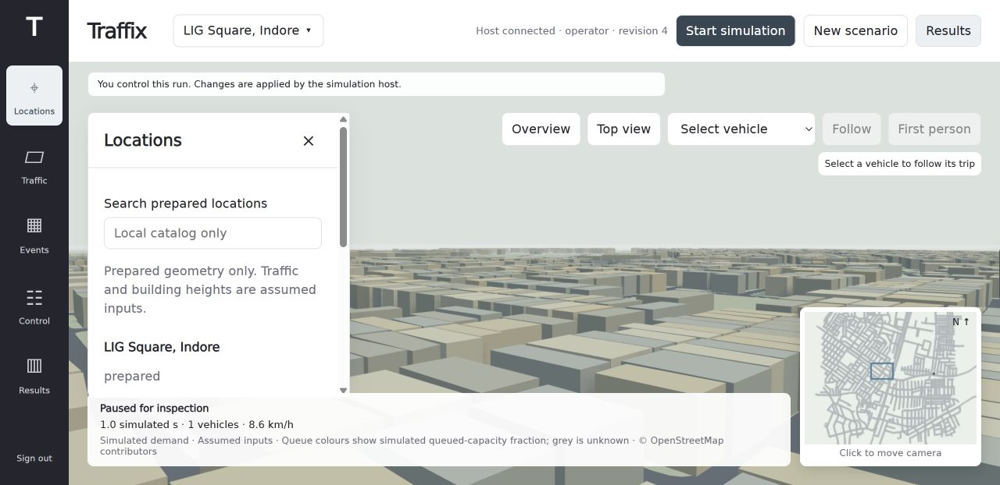
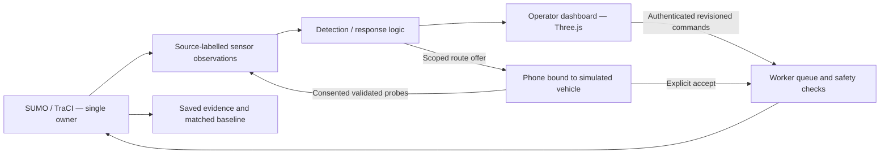

<div align="center">

# Traffix ↗

### Less waiting. Better decisions. Moving together.

**An intelligent traffic congestion response prototype for Indian mixed traffic.**

[Live demo](https://traffix-demo.vercel.app) · [Frontend source](landing/) · [System review](https://github.com/makekush7-netizen/Traffix-/blob/feat/kush-demo-polish/docs/prakhyat-integration-review.md) · [Product requirements](https://github.com/makekush7-netizen/Traffix-/blob/feat/kush-demo-polish/docs/traffix-harness-prd-v1.md) · [Mobile app](https://github.com/makekush7-netizen/Traffix-/tree/feat/kush-demo-polish/mobile-app)

Built for the Agnitia hackathon · TERRA track · LIG Square, Indore

</div>



## Why Traffix?

Traffic changes faster than fixed signal plans. Mixed vehicle speeds, blocked exits and unexpected events can turn a local queue into a wider jam. Traffix connects observations, operator decisions and driver guidance so responses can be tested and compared before deployment.

Our starting point is a **local SUMO simulation on OpenStreetMap geometry around LIG Square, Indore**. Traffic demand is assumed; this is not a live city traffic feed.

## What is built

| Module | Current state |
|---|---|
| Simulation and operator dashboard | Unified build on [`feat/prakhyat-unified-simulation`](https://github.com/makekush7-netizen/Traffix-/tree/feat/prakhyat-unified-simulation), draft [PR #3](https://github.com/makekush7-netizen/Traffix-/pull/3). 3D scene, mixed vehicles, minimap, events, roles and shared control lease. |
| Signal response | Fixed timing, bounded queue response, actuated and capacity-aware pressure heuristic. Clearance and receiving-space checks; not trained ML control. |
| Native Android app | Expo / React Native app on this coordinator branch: own-vehicle ride view, consent controls, profile, visual learning and settings. Unified-host integration is pending. |
| Phone browser adapter | One-use join codes, server-assigned simulated vehicles, authenticated frames and opted-in probe uplinks. Driver acceptance precedes worker-confirmed rerouting. |
| Results | Complete matched-cohort comparisons and modeled SUMO CO2. Existing small completed comparison shows 0% benefit; useful congested-case improvement remains to be demonstrated. |
| Public frontend | Static landing page and browser-only traffic illustration in `landing/`, ready for Vercel. The illustration does not run SUMO or prove an improvement. |

**Still to validate:** native app ↔ unified host, two physical phones and two admin laptops, short-term forecast quality, field-camera accuracy, emergency preemption and further reviewed Indore locations. See the [integration review](https://github.com/makekush7-netizen/Traffix-/blob/feat/kush-demo-polish/docs/prakhyat-integration-review.md) for evidence and priorities.

## Architecture



Phones report their assigned **simulated** vehicle; this prototype does not use a phone's real GPS to measure city traffic. Missing or stale observations remain unknown. No observations are fabricated from a connected phone without uplinks and consent.

## Run the submission frontend

No package install or build step is needed:

```powershell
python -m http.server 8080 --directory landing
```

Open `http://localhost:8080`. Deployment instructions are in [landing/README.md](landing/README.md).

## Run the existing coordinator demo

First check out the coordinator build with `git fetch origin` and `git switch feat/kush-demo-polish`. The default branch contains the submission frontend and initial scaffold; active app and simulation builds remain on their named branches. Then, on Windows, create a Python environment, install requirements and check the environment:

```powershell
python -m venv .venv
.\.venv\Scripts\Activate.ps1
pip install -r requirements.txt
python scripts/check_env.py
```

SUMO / TraCI must be available. For the existing response experiment:

```powershell
.\scripts\run_response.ps1
```

Open `http://localhost:8004/response`. For the earlier phone-bound mentoring demo, run `scripts/run_mobile.ps1` and follow the [demo runbook](https://github.com/makekush7-netizen/Traffix-/blob/feat/kush-demo-polish/docs/demo-runbook.md).

## Run the unified simulation build

Use the **unified simulation branch**, not this coordinator checkout:

```powershell
git fetch origin
git switch feat/prakhyat-unified-simulation
```

Follow that branch's `docs/phone-and-recovery-guide.md` and `scripts/setup_unified.ps1`. It specifies Python 3.12, SUMO 1.28.0 and explicitly configured local accounts. Default operator URL: `http://127.0.0.1:8005/operator/index.html`.

Do not commit account passwords or tokens. Other devices must use the host's reachable private LAN address. Public access requires a separately secured reachable simulation host; deploying this landing page does not deploy SUMO.

## Verification and limits

Coordinator review of unified commit `6778fe8`: **72 targeted Python tests passed; 18 JavaScript tests passed**. An additional real-SUMO in-process HTTP/WebSocket smoke verified claim, own-state and frame delivery. These are not physical-device or full-suite claims. Prakhyat reports a remaining legacy baseline/network-hash incompatibility; details are in the [review](https://github.com/makekush7-netizen/Traffix-/blob/feat/kush-demo-polish/docs/prakhyat-integration-review.md).

We do not claim calibrated demand, deployed public signal control, proven forecasting or measured carbon savings. SUMO CO2 is modeled, and incomplete or fault-bearing runs cannot support improvement headlines.

## Repository map

| Directory | Purpose |
|---|---|
| `landing/` | Public submission frontend |
| `mobile-app/` | Native Android companion |
| `backend/` | FastAPI services, phone gateway and local harness |
| `contracts/` | Frozen message schemas and versioned interfaces |
| `sim/` | Simulation assets and ID registry |
| `web/` | Browser phone and operator interfaces |
| `ml/`, `eval/`, `models/` | Detection/forecast work and evaluation |
| `tests/` | Protocol, worker, simulation and integration checks |
| `docs/` | PRD, setup, module handoffs and evidence |

## Team

**Kush** — coordinator, bridge and native app · **Nandani** — simulation topology · **Prakhyat** — unified simulation, dashboard and ML · **Urvashi** — interface work.

Read [AGENTS.md](AGENTS.md) and [OWNERS.md](OWNERS.md) before contributing. Main is kept separate from ongoing module branches; no draft simulation merge is implied by this submission.

