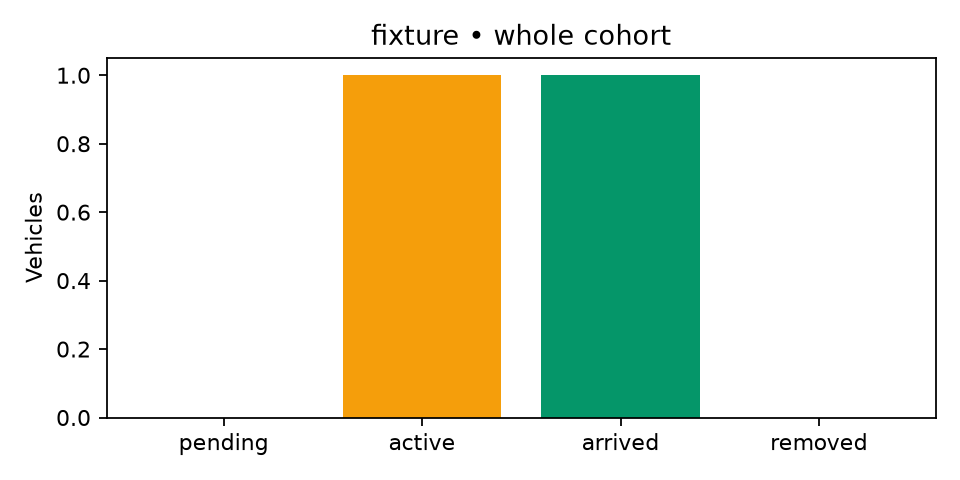
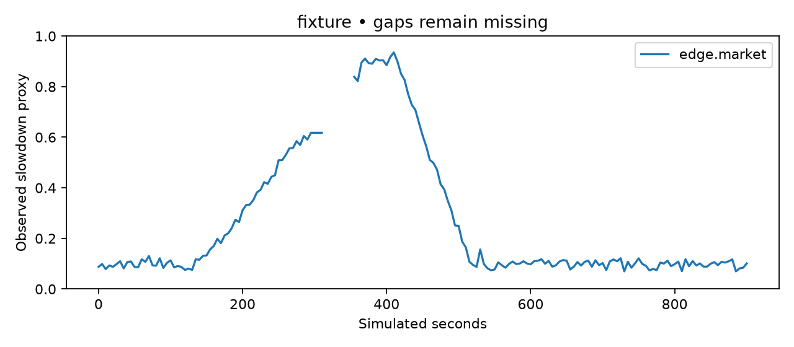

# Run evidence: run.fixture.fixed.300

Data source: **fixture**. These numbers describe this run only.
**FIXTURE — not SUMO results. Do not put these numbers in the pitch.**

| Measure | Value |
|---|---:|
| Scheduled cohort | 2 |
| Arrived / active / pending / removed | 1 / 1 / 0 / 0 |
| Teleported | 0 |
| Complete and valid | False / False |
| Mean journey, scheduled departure to arrival | Unavailable |
| P95 journey | Unavailable |
| Logged cumulative waiting (not entry delay) | 10.00 s |
| Modelled CO2, final whole cohort | Unavailable |
| Known CO2 so far (may omit missing records) | 1.00 kg |

## Interpretation

Journey time includes entry waiting and detours. Completed-only averages are suppressed when any cohort trip is unfinished, removed or teleported. CO2 is SUMO-modelled vehicle emissions with chosen emission classes; it is not a climate-impact measurement or a calibrated India fleet estimate. A paired fixed/reactive/predictive experiment is required before claiming improvement.
