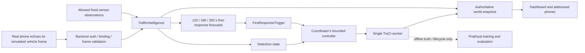

# Prakhyat — implementation and team handoff

**Project:** Traffix, Agnitia 36-hour hackathon.  
**Location on this computer:** `C:\Users\prakh\Desktop\Traffix`.  
**Status:** independent ML/evaluation implementation is runnable; real simulation integration and traffic results are pending.  
**Evidence rule:** everything under `artifacts/fixture-demo` is artificial software-test data, not SUMO or India traffic evidence.

**Verified after the independent-work audit:** 101 tests passed; the complete fixture pipeline and 11 module CLI boundaries ran successfully. Shared schema examples and ML payloads are covered by the tests. Plans now match the experiment lock: 48 training jobs at two demand levels, 18 validation, 15 fixed-policy forecast-test, 45 core policy, 10 sensor-ablation and 30 optional compliance jobs. None has been executed in SUMO. Real SUMO readiness is checked separately with `scripts/doctor.py`. See the independent-work audit for repaired defects and limits of this verification.

## 1. What is built

| Prakhyat task | Implemented files | Status / next dependency |
|---|---|---|
| Metric fixtures and causal features | `tests/`, `ml/features.py` | Tested; feature audit documented |
| Phone/fixed observation aggregation | `ml/observations.py` | Tested; backend must pass validated uplinks |
| Jam detection | `ml/detect.py` | Tested rules; calibrate on actual green/red traces |
| Training-data generation | `eval/generate.py`, `eval/merge.py` | Job planning/execution and causal datasets ready; real runner/assets needed |
| Three forecast horizons | `ml/forecast.py`, `ml/train.py` | Persistence/trend + three boosting models exercised on fixtures |
| First-response trigger/tuning | `ml/trigger.py`, `eval/tune.py` | Validation-only screening ready; actual controller outcome tuning pending |
| Journey/CO2 accounting | `eval/cohort.py`, `eval/io.py`, `eval/collect.py` | Explicit demand, pending/unfinished/removed trips, units and integrity tested |
| Held-out forecast/detection evaluation | `eval/forecasts.py`, `eval/detection.py` | Implemented; current scores are fixture-only |
| Policy experiments and ablations | `eval/compare.py`, `eval/ablation.py` | Paired policy/cross-mask reporting ready; no real results yet |
| Event / network / applied-action metrics | `eval/events.py`, `eval/network.py` | Missed events, false alerts/hour, queue/bypass burden and deduplicated action counts tested |
| Mentor/report evidence | `eval/report.py`, `eval/pipeline.py` | Markdown, JSON, CSV and charts generated; genuine SUMO plots pending |
| Help Nandani get first run | `scripts/doctor.py`, handoff checklist below | Readiness diagnosis ready; no SUMO binary/network currently verified |

Shared JSON schemas and examples from the approved build plan are in `contracts/`. Their original fields are preserved. The original planning documents were not replaced.

## 2. Run the software now

In PowerShell, from the project folder:

```powershell
& .\.venv\Scripts\python.exe -m pytest -q
& .\.venv\Scripts\python.exe -m eval.pipeline --output-dir artifacts/fixture-demo
& .\.venv\Scripts\python.exe scripts/doctor.py --output artifacts/prakhyat-preflight.json
```

The fixture pipeline creates 2,896 observation/dataset rows across the declared seed partitions at its default settings. This is a software exercise, not a measured performance result. It trains three models, scores held-out forecasts, screens validation triggers, exercises the in-process runtime and creates a deliberately incomplete-cohort report.

Open `artifacts/fixture-demo/mentor-report/report.md`. The journey headline is **Unavailable** because the fixture cohort is unfinished. Generated observation plots visibly preserve gaps. Fixture model manifests explicitly say `data_source: fixture`; loaded fixture boosting models return `usable_for_control: false`.

The preflight check returns exit 2 while SUMO, its Python client or scenario assets are missing. That is a dependency status, not an ML-test failure. On another computer, install Python 3.12 and recreate the virtual environment using `requirements-lock.txt`; do not share `.venv`.

## 3. Backend integration: exact boundary



Create one instance for each run; never reuse it after reset. All online clocks below are **simulated seconds**, not phone wall time.

```python
from ml.integration import TrafficIntelligence
from ml.forecast import ForecastService
from ml.trigger import FirstResponseTrigger

# Reference speeds come from Nandani's registry. Keep them frozen during incidents.
intelligence = TrafficIntelligence(
    run_id,
    registry['reference_speed_mps_by_edge'],
    allowed_fixed_edges=allowed_fixed_edges_from_sensor_mask,
    # Omit forecaster until genuine SUMO models are available; trend works immediately.
    # forecaster=ForecastService.from_directory('models/sumo-v1'),
)
predictive_trigger = FirstResponseTrigger()  # unvalidated starting settings

# Only after the backend has authenticated, bound and matched the echoed frame:
intelligence.ingest_probe(validated_probe_message)

# Only for physically permitted fixed sensors on edges in the configured allowlist:
intelligence.aggregator.add_fixed(edge_id, sample_sim_time_s, speed_mps, queue_ratio)

# Call once every 5 simulated seconds in the owning worker / serialized event loop.
out = intelligence.tick(
    sim_time_s,
    signal_context_by_edge,
    intervention_active=response_has_started,
    methods=('trend',),  # add 'persistence' or 'boosting' to display/evaluate them
)
```

`signal_context_by_edge` has this shape:

```json
{
  "edge.market": {"serving_green": true, "phase_age_s": 8}
}
```

The coordinator resolves this from actual serving movements/phases in the signal registry. Missing context defaults to not serving green. Normal red slowdown alone cannot activate this detector/trigger. Detection and predictive triggering also require 10 seconds of continuing qualifying evidence during serving green, after the initial phase guard. This is an **unvalidated starting setting**, not a calibrated queue-discharge rule. Phase changes, missing evidence and clock gaps reset that green-evidence streak.

`out` contains:

- `observations`: shared `$defs.observation` payloads;
- `forecasts`: shared `$defs.forecast` payloads;
- `detections`: per-edge `active`, `usable_for_control`, `evidence_s`, `reason`;
- `log_rows`: CSV-ready allowed observations, fresh count and signal context;
- `events`: **internal convenience records only**, not new authorized WebSocket message types.

Put `observations` and `forecasts` into the existing authoritative `world.snapshot` payload. The backend still supplies sequence numbers, envelopes, counts, vehicle states, proposals, guidance, baseline alignment and other required snapshot fields. Do not send the raw internal `events` list as if it were part of the shared wire schema.

For reactive eligibility, check **both** `detection.active` and `detection.usable_for_control`. For predictive eligibility, select one forecast method/horizon and call `FirstResponseTrigger.update(observation, forecast, serving_green=..., phase_age_s=..., intervention_active=...)` using that edge's latest internal observation (`intelligence.history[edge_id][-1]`). Its `eligible` flag is a proposal prerequisite, not permission to bypass downstream guards, phase bounds, operator mode or route eligibility.

The coordinator owns idempotency, action execution and operator oversight. Call with `intervention_active=True` after the first applied action; all no-action forecasts then become unavailable. A disconnected phone's last accepted sample expires naturally without hidden-state backfill. Emulated offline samples go through `ingest_emulated_probe(ProbeSample(..., source='emulated_probe'))` and retain their label.

## 4. Nandani → Prakhyat / coordinator handoff

Do these in order. A concrete working file is the checkpoint; a tutorial watched is not.

| Checkpoint | Nandani supplies | Prakhyat checks |
|---|---|---|
| First working run | SUMO version, one `.sumocfg`, `.net.xml`, explicit `.rou.xml`, tripinfo output | Both intended routes/vehicle types load and complete; scheduled IDs are visible |
| Registry | `sim/net/id-registry.json` | Actual edge/lane/TLS IDs; positive reference speeds; blocker exclusions |
| Incident baseline | Frozen seed-42 demand, incident preset, no-action logs | Sustained jam through serving green and later recovery; hour-six gate |
| Training seeds | Explicit per-seed demand for 100–107 and 200–202 | Reproducible, no regeneration between policies, no hidden incomplete trips |
| Held-out seeds | Frozen 300–304 demand and the same incident/network | Kept out of fitting/tuning; full cohort drains or failure is reported |
| Emissions | Actual per-type emission classes and assumptions | Whole-trip units and missing records; bike/auto proxy assumptions visible |

Registry minimum used by Prakhyat:

```json
{
  "reference_speed_mps_by_edge": {"edge.market": 10.0},
  "excluded_metric_vehicle_ids": ["veh.blocker.001"]
}
```

This is a subset example, not permission to omit the registry's signal, lane and route data required by the backend. The reference speed is an initial illustrative value; use the actual corridor assumption. No fixed market detector may feed online detection when that edge is masked.

Naming follows the original plan: `sim/demand/<scenario>.seed-<NNN>.rou.xml`; runs `run.<scenario>.<policy>.<seed>.<attempt>`; `veh.bg.*`, `veh.role.*`, `edge.*`. For two demand levels, use `sim/demand/<scenario>.<demand_id>.seed-<NNN>.rou.xml` and have the runner resolve each planned `demand_id` to its frozen file. Exact filenames are an integration handoff extension. Explicit numeric scheduled departures are mandatory for metric import. Expand flows before evaluation. Keep blocker IDs declared separately.

Use SUMO tripinfo for all vehicles, enable unfinished output and emissions output, and export the worker's lifecycle state. Tripinfo alone may omit a scheduled vehicle; the importer refuses to call it pending without lifecycle evidence. The [official TripInfo documentation](https://sumo.dlr.de/docs/Simulation/Output/TripInfo.html) defines these output options and units.

## 5. Exact file handoff

One finalized run directory:

```text
runs/<run_id>/
  manifest.json
  observations.csv
  truth.csv
  trips.csv
  lifecycle.csv           # needed when importing incomplete tripinfo XML
  tripinfo.xml            # optional raw SUMO evidence; preserve it
  detections.csv          # optional detector benchmark output
  events.jsonl            # backend-authoritative audit/replay log
```

### Manifest

The runner must echo every job field from the batch plan. In addition, the collector requires these audit fields:

```json
{
  "run_id": "run.scn.rain_ramp.fixed.300.example",
  "scenario_id": "scn.rain_ramp",
  "demand_id": "demand.reference",
  "seed": 300,
  "policy": "fixed",
  "compliance": 0.6,
  "sensor_mask_id": "mask.market_gap",
  "data_source": "sumo",
  "cohort_sha256": "ACTUAL_FROZEN_DEMAND_CHECKSUM",
  "network_sha256": "ACTUAL_NETWORK_CHECKSUM",
  "incident_sha256": "ACTUAL_EXOGENOUS_INCIDENT_CHECKSUM",
  "scheduled_cohort_size": 500,
  "teleported": 0,
  "excluded_metric_vehicle_ids": [],
  "model_version": "actual-artifact-hash-or-none",
  "controller_version": "actual-commit-or-version",
  "emission_assumptions": {"classes_by_vtype": {}, "proxy_limitations": "Actual mappings required"},
  "comparison_config": {"step_s": 1, "action_bounds": "Actual shared limits required", "closure_knowledge": "Actual shared inputs required"},
  "probe_assignment": {"vehicle_ids": ["veh.role.bike", "veh.role.auto", "veh.role.delivery"], "replay_schedule_sha256": "ACTUAL_FROZEN_PROBE_SCHEDULE"},
  "bypass_edge_ids": ["edge.bypass"]
}
```

The example count/checksums are placeholders, not results. `scheduled_cohort_size` counts all explicit vehicles before blocker exclusions. Every such ID gets one row in `trips.csv`. Hash the frozen scheduled cohort, not the arrivals-only subset. Hash the exogenous incident schedule, not policy-dependent action events.

`comparison_config` freezes shared action bounds, simulation timing and information available across policies. Do not put the intentionally different policy/model/trigger identifier in this common configuration. Log those separately. `probe_assignment` freezes participating vehicle IDs and simulated sampling schedule within a policy comparison; physical-phone demo interactions are separate from seeded, labelled emulated-probe evaluation. `emission_assumptions` freezes fleet classes, proxy assumptions and emission-model settings.

The collector hashes these raw JSON objects canonically. It also computes the actual metric-cohort fingerprint from sorted `(vehicle_id, scheduled_depart_s, vtype_id)` records and hashes declared exclusions; it overwrites supplied versions. A changed exclusion set cannot manufacture a paired gain. Missing common configuration/probe fingerprints suppress policy gains; missing emission assumptions suppress CO2 gains. Sensor ablation deliberately allows a different probe assignment while keeping the traffic cohort and other common settings frozen.

### Observation log

Required for dataset generation after manifest enrichment:

```text
run_id,seed,policy,data_source,edge_id,sim_time_s,coverage,sources,mean_speed_mps,slowdown,distinct_probes_60s,fresh_probes,sample_age_sim_s,fixed_queue_ratio
```

- `sources`: comma-separated `phone`, `emulated_probe`, `fixed`; ordinary CSV quoting handles multiple sources.
- `coverage`: `fresh`, `stale`, `unknown`; missing measurements are empty cells.
- `fresh_probes`: number of unique **currently fresh** vehicles. This is an ML-log extension to the original CSV; it does not change the shared observation payload. If omitted, probe freshness defaults to zero and blocks forecast control.
- Add `serving_green,phase_age_s` for detector/trigger replay. These are read-only current signal metadata and do not enter the regressor features.
- Seed, policy, scenario, demand and provenance are enriched and checked against `manifest.json` by `eval.merge`; never copy truth values into observations. Dataset generation and tuning reject contradictory available truth metadata.

### Truth log

```text
run_id,edge_id,sim_time_s,slowdown_true,vehicle_count,mean_speed_mps,jam_length_m,co2_mg_s
```

Use exact 5-second bins for the default labeller, with `slowdown_true` null on an empty edge. This file is offline only. The hour-six jam gate additionally needs `policy,serving_green,phase_age_s`; independently defined `jam_label` is needed for detector/tuning scores. Use full-state queue persistence through service, not a copy of the detector's own active flag, to define that label. Record that definition in the report.

### Trip and lifecycle logs

```text
vehicle_id,scheduled_depart_s,actual_depart_s,arrival_s,status,waiting_s,co2_mg,vtype_id,route_length_m
```

`status` is `pending`, `active`, `arrived` or `removed`. Pending departures and unfinished arrivals are empty. `waiting_s` is one cumulative vehicle total, not a value repeatedly summed each tick. `co2_mg` is cumulative vehicle emissions, not the current emission rate.

Lifecycle CSV minimum: `vehicle_id,status,actual_depart_s,arrival_s`. It must explicitly identify vehicles missing from tripinfo, including never-inserted vehicles. Removed trips/teleports invalidate the journey headline. Do not silently delete them.

These additional log/audit fields are documented here for the integration owner to implement; they are not silently added to the approved wire schemas.

## 6. Genuine training: commands and gates

1. Get the no-action baseline to jam **and recover**. Starting gate settings are severe slowdown ≥.70, jam length ≥50 m, persistence ≥60 s, at least 10 seconds of continuing qualifying serving-green evidence and recovery ≥30 s. Distinct jam episodes are scored separately; clear intervals never count toward persistence. These are unvalidated starting values; inspect the actual corridor before freezing them.

```powershell
& .\.venv\Scripts\python.exe -m eval.jam_gate --truth runs/<baseline-run>/truth.csv --output artifacts/baseline-gate.json
```

Exit 2 is a no-go. Do not train a controller-benefit story on a baseline that never jams.

2. Ask the coordinator's real runner to generate fixed-policy training/validation/test observation traces. The batch executor invokes a supplied runner serially as `runner --job <absolute-json> --output-dir <absolute-dir>`, with no shell interpolation. Each output directory must be new. A successful exit with missing exports or mismatched job metadata is rejected.

```powershell
& .\.venv\Scripts\python.exe scripts/build_experiment_plans.py
& .\.venv\Scripts\python.exe -m eval.generate execute --plan artifacts/training-plan.json --output-dir runs/training --runner .\.venv\Scripts\python.exe -m backend.batch_runner
```

`backend.batch_runner` is the coordinator's **pending integration module**, not a file supplied by this ML implementation. Do not run this command until that interface exists. Training is 3 scenarios × 2 demand levels × seeds 100–107 = 48 jobs. Validation is the same configuration × seeds 200–202 = 18 jobs. Execute validation and fixed-policy forecast-test plans into separate directories, then merge those fixed logs with training logs for the frozen seed split. Training alone has no validation or test rows. Reuse fixed core-policy runs for forecast-test jobs because their IDs are identical. Never run batches alongside the live demo worker on the same TraCI connection.

3. Put training, validation and forecast-test finalized directories beneath one `runs/fixed-data` parent (or otherwise organize them as direct child run directories). Merge verified logs, build causal labels, train and evaluate:

```powershell
& .\.venv\Scripts\python.exe -m eval.merge --runs runs/fixed-data --output-dir work/ml-logs
& .\.venv\Scripts\python.exe -m eval.generate dataset --observations work/ml-logs/observations.csv --truth work/ml-logs/truth.csv --output work/dataset.csv
& .\.venv\Scripts\python.exe -m ml.train --dataset work/dataset.csv --output-dir models/sumo-v1
& .\.venv\Scripts\python.exe -m eval.forecasts --dataset work/dataset.csv --models models/sumo-v1 --output artifacts/forecast-test.json
```

`eval.merge` accepts fixed policy by default and rejects log/manifest metadata mismatches. `data_source: sumo` comes from the verified run manifest. Mixed fixture/real datasets are rejected. Every horizon's labels validate before any trained model is written. Checksum/version/policy checks protect subsequent loading; load only trusted local artifacts.

Current feature contract is version 2: history features use the same retained 120-second window online and offline. Rebuild older artifacts. Persistence, trend and boosting target the same average of 5-second bins in the 30-second window ending at `t+h`; trend is not a single future endpoint. Nonfinite model predictions are unavailable and cannot authorize control. A provenance string alone does not prove a real SUMO run; the runner and preserved raw evidence remain the trust boundary.

4. Replay **validation seeds 200–202 only** through the tuner:

```powershell
& .\.venv\Scripts\python.exe -m eval.tune --observations work/validation-observations.csv --truth work/validation-truth.csv --method trend --horizon-s 180 --output artifacts/trigger-validation.json
```

Create the two validation files by filtering the merged files to seeds 200–202. Repeat for horizons 120/300 and for boosting with `--method boosting --models models/sumo-v1`. No test/demo/training seed may enter the tuner.

The tuner screens 18 first-alert settings across reactive and predictive rules. It reports false alerts, false alerts per simulated network-hour, missed independent jam events, missed edges, warning lead and detection delay. A false early alert cannot erase a later missed event. It considers the first alert per run/edge because the forecast is a first-response model. Matching allows warnings up to the selected horizon before a labelled jam; declare this evaluation convention. It does not simulate a changed controller, establish an optimal horizon or prove journey gains. Compare proposed settings on validation policy runs with the **same bounded actions and false-alert definition**, then freeze the selected horizon, predictor and thresholds before test runs.

## 7. Held-out policy experiment

Generate the expected core plan:

```powershell
& .\.venv\Scripts\python.exe -m eval.generate plan --scenarios scn.rain_ramp scn.market_block scn.procession --seeds 300 301 302 303 304 --output artifacts/policy-plan.json
```

This produces 45 jobs at reference demand, compliance .6 with `mask.market_gap`. The scenarios are declared targets, not verified simulation presets. Run only validated scenarios; disclose any missing presets. `scripts/build_experiment_plans.py` also creates the mandatory rain/predictive sensor-ablation plan (10 jobs: five seeds × boundary-only versus boundary plus three probes) and the optional rain/reactive+predictive compliance plan (30 jobs: five seeds × two policies × 0/.2/.6). Reuse overlapping jobs from the core plan. Mask IDs and participation schedules need coordinator resolution; these plans do not create sensor assets.

After finalized runner outputs exist:

```powershell
& .\.venv\Scripts\python.exe -m eval.collect --runs runs/policies --output artifacts/run-results.csv
& .\.venv\Scripts\python.exe -m eval.compare --results artifacts/run-results.csv --plan artifacts/policy-plan.json --output artifacts/policy-comparison.json
& .\.venv\Scripts\python.exe -m eval.collect --runs runs/sensor-ablation --output artifacts/ablation-results.csv
& .\.venv\Scripts\python.exe -m eval.ablation --results artifacts/ablation-results.csv --plan artifacts/sensor-ablation-plan.json --baseline-mask mask.boundary_only --phone-mask mask.market_gap --output artifacts/sensor-ablation.json
```

Collection diagnostics are saved alongside the CSV. The comparison creates JSON, per-seed pair CSV and Markdown tables. Always pass the expected plan so a seed with no successful runs remains in the denominator. Changed cohort/network/incident fingerprints are rejected. Invalid/incomplete runs cannot produce a positive headline.

Report: mean/p95 scheduled-to-arrival journey, scheduled/arrived/active/pending/removed/teleported counts, predictive-versus-fixed and predictive-versus-reactive paired changes, modelled CO2 final/assumptions, valid/attempted seeds, wins and min/median/max changes. Prediction is useful only if it improves outcomes over reactive control on held-out paired runs; otherwise report that it did not.

Forecast report: per-method/per-horizon MAE, per-seed/macro-seed MAE, eligible-row counts and future-severity precision/recall at the declared threshold. Detection report: precision/recall plus coverage; unknown or missing observations count as missed true jams, not excluded positives.

Secondary run evidence is automatically collected when `truth.csv` has queue lengths and `events.jsonl` contains authoritative `control.event` records. It includes queue-sample coverage, peak summed queue, network queue burden in m·s, declared bypass burden/peak, applied signal actions, applied reroutes/distinct rerouted vehicles, mode changes and rejections. Duplicate identical action records count once. Missing timestamps are invalid; missing queue readings or large time gaps make the affected burden unavailable. The integration owner must export a stable edge set and define bypass edges. Queue integration uses right-endpoint samples on logged edges; it is not a network-wide guarantee if roads were omitted.

```powershell
& .\.venv\Scripts\python.exe -m eval.network --truth runs/<run>/truth.csv --events runs/<run>/events.jsonl --bypass-edges edge.bypass --output artifacts/network-evidence.json
```

Preserve this JSON and the collector's scalar columns alongside the report. Do not display absent action logs as proof of zero interventions.

For a genuine run's mentor/report chart:

```powershell
& .\.venv\Scripts\python.exe -m eval.report --trips runs/<run>/trips.csv --metadata runs/<run>/manifest.json --observations runs/<run>/observations.csv --output-dir artifacts/mentor-evidence
```

Alternatively import raw SUMO output with `--tripinfo <xml> --demand <explicit-rou.xml> --lifecycle <csv>`. Preserve raw evidence next to the report. CO2 is vehicle-emission-model output with explicit fleet assumptions, never a calibrated India or real-world climate benefit claim.

## 8. Remaining gates and safe cuts

| Gate | Required next evidence | Owner |
|---|---|---|
| First SUMO run | Actual network loads and vehicles arrive | Nandani |
| H6 baseline jam | Persistent jam through green and later recovery | Nandani + Prakhyat |
| Live observations | Two real phones accepted by gateway, stale gap after sharing stops | Coordinator + Prakhyat |
| Real models | Fixed-policy seeded logs, frozen splits, three trained artifacts | Prakhyat after runner handoff |
| Trigger freeze | Validation-only forecasts/false alerts and controlled-run outcomes | Prakhyat + coordinator |
| Final traffic proof | Fixed/reactive/predictive paired results, whole cohort | Prakhyat + Nandani |
| Pitch claim audit | Actual saved figures/denominators and emission assumptions | Prakhyat + Urvashi |

If behind, use the tested detector/trend and preserve the three-horizon ML training requirement for the report. Cut extra scenarios, extensive compliance grids and decorative ML charts before cutting whole-cohort accounting, phone-source honesty or the baseline-jams gate. Do not treat fixture MAE or early-warning lead as traffic improvement. No RL/LSTM/gamification is implemented.

## 9. Agent ownership and acceptance commands

| Module group | Acceptance target |
|---|---|
| Aggregation/source isolation | `tests/test_observations.py`, `test_validation.py` |
| Detector/first-response trigger | `test_detection.py`, `test_trigger.py` |
| Runtime/shared payload compatibility | `test_integration.py`, `test_contracts.py` |
| Causal dataset/batch execution/merge | `test_dataset.py`, `test_generate_execution.py`, `test_merge.py` |
| Training/artifact loading | `test_train.py`, `test_artifacts.py`, `test_fixture.py` |
| Validation/test scoring | `test_tune.py`, `test_evaluation.py` |
| Cohort/XML/collection/comparison | `test_cohort.py`, `test_io.py`, `test_collection.py`, `test_compare.py` |
| Baseline prerequisite | `test_jam_gate.py` |

Agents working on Prakhyat's next steps should edit `ml/`, `eval/` and their tests. Do not change backend, UI or simulation ownership files to bypass a missing dependency. Do not rename shared contract fields. The final independent verification is the test suite plus the fixture pipeline; genuine SUMO validation is a separate required gate.
