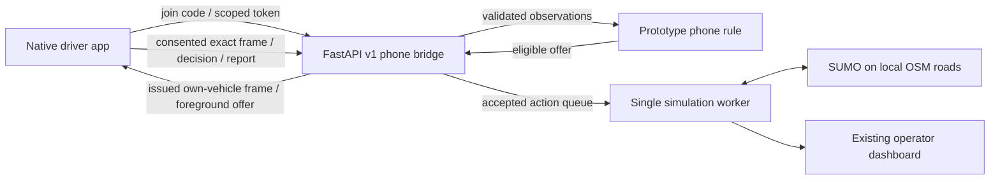

# Traffix Android preview — 10 October 2026

## Delivered

`mobile-app/` contains Kush's native React Native/Expo SDK 57 driver client.
The app uses an original violet/coral road icon and transparent traffic-island
illustration, cream surfaces, colourful cards and four Expo Router destinations:
Home, Ride, Learn and Settings. The session owner persists across navigation.
Supporting text has stronger contrast and the header wraps with larger text.

Implemented: operator QR/code invitations, authenticated bound vehicle session,
local OSM route geometry, fresh simulated speed/position, explicit sharing consent,
foreground reroute offers, accept/decline with server acknowledgment, slow-traffic
reports, traffic-learning cards, secure credential storage and USB/Wi-Fi host setup.
Completed journeys still permit withdrawal of previously enabled sharing.

The standalone **ARM64 APK** includes its JS and assets; Expo Go/Metro is not needed.
It is a preview signed with the Android development key, not a store release.

- Laptop artifact: `mobile-app/builds/traffix-preview.apk` (ignored by Git).
- Phone copy: `Downloads/Traffix-preview-2026-10-10.apk`.
- Size: 53,797,019 bytes.
- SHA-256: `2ab32b82f2c9367aa4fb282623ca5184b6f668b9b4e938145c5fdac3115ff25d`.
- Laptop and phone copies have matching checksums.

## Verified and blocked

| Check | Result |
|---|---|
| Native Gradle release build | Passed; final packaging 532 tasks, 24 executed |
| TypeScript | Passed |
| Lint, including root app | Passed, zero warnings |
| Mobile protocol/adapter tests | 9 passed |
| Existing bridge/guidance/end-to-end tests | 22 passed, one framework deprecation warning |
| Actual adapter against disposable SUMO host | Passed: own frame, zero uplinks before consent, 3 accepted samples, withdrawal, reconnect sharing off, reset rejoin |
| Physical USB device | One authorized Xiaomi M2101K6P, Android 12, ARM64 |
| Physical installation/visual test | **Not completed**: Android canceled installation while locked (`INSTALL_FAILED_USER_RESTRICTED`); a Play Protect dialog was awaiting a response |

The live adapter test used **emulated probes** on port 8005. It does not establish
two physical phone connections or a physically tested native UI. The APK is on
the phone, but successful file transfer is not successful installation. Unlock
the phone and respond to the installation dialog before a device smoke test.

## Use it

1. Keep `scripts/run_response.ps1 -Port 8004` running. Open the laptop's
   `http://localhost:8004/dashboard` to issue a fresh invitation; reset a completed
   run before linking new phones.
2. Install the APK, open Traffix and choose **Join a simulated ride**.
3. USB: use `http://127.0.0.1:8004` after `adb reverse tcp:8004 tcp:8004` and paste
   the operator's code. Wi-Fi: use the laptop's LAN address and scan its QR/code.
4. Start the simulation on the operator dashboard. Ride displays the bound
   vehicle's position, current route and speed. Sharing is off until chosen.
5. A reroute needs enabled operator guidance, eligible position, fresh supporting
   phone evidence and a safe bypass. Review and accept; confirmation comes after
   the simulation worker applies it. A single phone does not guarantee an offer.

For source/rebuild instructions read `mobile-app/README.md`; visual rules are in
`mobile-app/design.md`. `scripts/build_native_mobile.ps1` builds in a short physical
temporary directory and saves the APK back. It excludes generated native/Gradle
caches, uses a short CMake object staging folder and verifies its temporary target
before cleanup. These fixes address Windows long paths and drive-alias failures.

## Architecture and integration boundary

Prakhyat's new unified host remains a separate module. The current native adapter
uses existing v1 endpoints; its versioned replacement requires his API/mock and
build return from `docs/prakhyat-final-build.md`. Preserve server-assigned identity,
run/frame provenance, expiration, decision acknowledgment and explicit consent.

## Remaining scope

Position is simulated, not phone GPS. No native background push, real trip tracking,
local YOLO incident inference, numerical safe-speed recommendation or public
deployment is enabled. QR camera scanning is not traffic classification. CO₂ and
time saved stay unavailable until valid matched completed-run evidence exists.
The current host rule is not a live trained ML controller.

Before public distribution: versioned host integration, HTTPS/native network
hardening, production signing, dependency remediation and real-device testing.
The saved local dependency audit lists 28 findings (18 high, 10 moderate); suggested
incompatible major downgrades were not applied. The preview's manifest excludes
microphone, storage, overlay and location access; camera is requested only for QR.

## Personal and learning update — 1.1.0 (10 October 2026)

Kush requested visual learning, a named profile, a logo introduction, richer
settings and personalized impact. This revision preserves the existing phone
bridge and adds native client features only:

- Four original transparent PNG learning illustrations, interactive two-option
  knowledge checks, saved learned state and optional illustration visibility.
- Device-local profile: Unicode name, four avatar choices, usual vehicle.
  Operator-bound vehicle identity is unchanged. No cloud account is implied.
- Approximately one-second cold-launch logo introduction, without network delay.
- Working speed units, Home tip preference, local activity/arrival history,
  connection troubleshooting, privacy details and scoped profile erasure.
- Impact page explicitly keeps CO₂ unavailable pending matched completed-run
  evidence; no fabricated savings or trip completion. Last 20 local vehicles
  are retained. Reconnects use a run/vehicle/host key and nondecreasing sample
  record to avoid duplicate trip/activity claims.

Storage errors are visible, and credentials are stored separately. Erasing the
profile does not unbind the vehicle or delete operator evidence. Connection
loss/reset/leave does not count as arrival. Original lesson assets and exact
built-in imagegen prompts are in `mobile-app/assets/lesson-sources.json`.

Validation: 12 mobile tests passed; TypeScript and lint passed. The new tests
cover Unicode/empty/oversized names, invalid persisted preferences/progress and
repeated/reconnected ride records. Native build/device status is recorded below.
No changes to SUMO, ML, frozen contracts or backend transport were required.

Manual acceptance after installing 1.1.0: open Home → add Kush as name → Save;
restart and confirm greeting persists. Open all four illustrated lessons; wrong
answer must not allow completion, correct answer must save progress. Hide
illustrations and Home tips in Settings, restart to confirm preferences. Switch
speed units on a linked active vehicle. Check activity after a confirmed arrival,
then reset/rejoin; counters must not fabricate completion or carbon savings.
Erase local profile and confirm credentials remain separate.

1.1.0 build result: `BUILD SUCCESSFUL` (full regeneration 6m17s, final
incremental package 1m24s). Android package `in.traffix.driver`, versionCode 2,
versionName 1.1.0, ARM64, local preview signing. APK: `mobile-app/builds/traffix-preview-1.1.0.apk`
(60,240,095 bytes). SHA256: `953df9714c03a6f85578e1d56d9f6f2e8fe677ede04594f92da8b424afae3733`.
The generic `traffix-preview.apk` is also updated. All four lesson images were
verified in packaged Android resources; visible pixels match their originals.

Device status at delivery: `ae4400d3 unauthorized`. No new APK was installed
or copied to the phone in this update; no native visual/interaction pass is
claimed. Unlock and accept Android's USB debugging authorization to allow
installation. The earlier phone Downloads APK is version 1.0.0. Keep existing
app data by installing this version with `adb install -r`, not uninstalling.
Source/client checks pass, but the manual acceptance list above remains pending.

The local Gradle daemon initially failed its IPv4 lock-socket bind; this build
succeeded without the IPv4 override, using Java21, 2 workers and a 2GB heap.

## Native launch fix — 1.1.1

Kush's launch video exposed the unconfigured native Expo template drawable:
`Theme.App.SplashScreen` inherited AppTheme and used the splash logo as the
window background, stretching the template before JavaScript rendered.

Configured the SDK-compatible `expo-splash-screen` 57.0.9 plugin with the
existing Traffix icon, `#FFFCF7` background, 104dp contained image and matching
dark-mode background. Removed the timed JavaScript intro modal. Module-level
`preventAutoHideAsync` holds the native logo until local profile readiness, then
`hideAsync` releases it with a short fade. Network/host availability is independent
of launch readiness. VersionName 1.1.1/versionCode 3. Generated Android resources
now use Theme.SplashScreen, windowSplashScreenBackground, the real logo and
SplashScreenManager activity registration; generated native files are not edited
in the repository.

Validation: lint, typecheck and all 12 mobile tests passed. The SDK module install
reported 29 dependency findings (18 high, 11 moderate); production dependency
remediation remains pending. No incompatible auto-fix/downgrade was applied.
Native build and installation verification follows below.

Physical cold-start testing of 1.1.1 on the Xiaomi Android12 device showed a dark
blank native window despite the configured Expo logo; the React UI opened and
restored Kush's saved profile. That intermediate build is not the final launch
fix. Revision 1.1.2/versionCode4 adds `plugins/withLaunchTheme.js`: explicit
framework splash background/icon attributes, a centered bitmap layer-list
fallback, light AppTheme and disabled force-dark on the app/splash themes. The
plugin is ordered before expo-splash-screen so its styles callback runs after
Expo recreates the splash style group. No global device theme is changed.
Generated resource inspection confirms both themes keep the intended values.

Final native build: 1.1.2 `BUILD SUCCESSFUL in 5m35s`. APK
`mobile-app/builds/traffix-preview-1.1.2.apk` (60,722,929 bytes); SHA256
`33d98cdcf0c5d5987331668848419193a9014c42c1169a5f03dd874c04f4bfff`. Generic preview APK updated.
The phone disconnected before installation (`device ae4400d3 not found`), so
1.1.2 device installation and cold-start visual verification remain pending.
1.1.1 was installed successfully, but its dark startup frame failed the visual
gate; do not claim it delivers the final clean intro. Reconnect the phone and
install 1.1.2 with `adb install -r`, then repeat the own-app launch captures.
