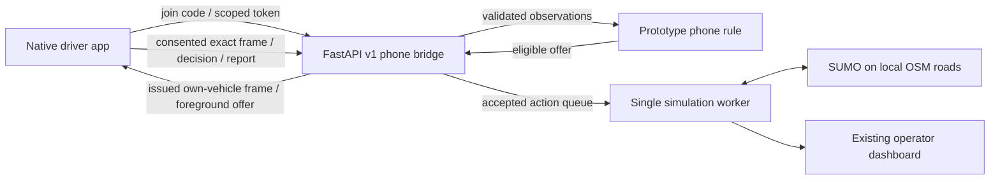

# Traffix Android preview — 10 October 2026

## Delivered

`mobile-app/` contains Kush's native React Native/Expo SDK 57 driver client.
The app uses an original violet/coral road icon and transparent traffic-island
illustration, cream surfaces, colourful cards and four Expo Router destinations:
Home, Ride, Learn and Settings. The session owner persists across navigation.
Supporting text has stronger contrast and the header wraps with larger text.

Implemented: operator QR/code invitations, authenticated bound vehicle session,
local OSM route geometry, fresh simulated speed/position, explicit sharing consent,
foreground reroute offers, accept/decline with server acknowledgment, slow-traffic
reports, traffic-learning cards, secure credential storage and USB/Wi-Fi host setup.
Completed journeys still permit withdrawal of previously enabled sharing.

The standalone **ARM64 APK** includes its JS and assets; Expo Go/Metro is not needed.
It is a preview signed with the Android development key, not a store release.

- Laptop artifact: `mobile-app/builds/traffix-preview.apk` (ignored by Git).
- Phone copy: `Downloads/Traffix-preview-2026-10-10.apk`.
- Size: 53,797,019 bytes.
- SHA-256: `2ab32b82f2c9367aa4fb282623ca5184b6f668b9b4e938145c5fdac3115ff25d`.
- Laptop and phone copies have matching checksums.

## Verified and blocked

| Check | Result |
|---|---|
| Native Gradle release build | Passed; final packaging 532 tasks, 24 executed |
| TypeScript | Passed |
| Lint, including root app | Passed, zero warnings |
| Mobile protocol/adapter tests | 9 passed |
| Existing bridge/guidance/end-to-end tests | 22 passed, one framework deprecation warning |
| Actual adapter against disposable SUMO host | Passed: own frame, zero uplinks before consent, 3 accepted samples, withdrawal, reconnect sharing off, reset rejoin |
| Physical USB device | One authorized Xiaomi M2101K6P, Android 12, ARM64 |
| Physical installation/visual test | **Not completed**: Android canceled installation while locked (`INSTALL_FAILED_USER_RESTRICTED`); a Play Protect dialog was awaiting a response |

The live adapter test used **emulated probes** on port 8005. It does not establish
two physical phone connections or a physically tested native UI. The APK is on
the phone, but successful file transfer is not successful installation. Unlock
the phone and respond to the installation dialog before a device smoke test.

## Use it

1. Keep `scripts/run_response.ps1 -Port 8004` running. Open the laptop's
   `http://localhost:8004/dashboard` to issue a fresh invitation; reset a completed
   run before linking new phones.
2. Install the APK, open Traffix and choose **Join a simulated ride**.
3. USB: use `http://127.0.0.1:8004` after `adb reverse tcp:8004 tcp:8004` and paste
   the operator's code. Wi-Fi: use the laptop's LAN address and scan its QR/code.
4. Start the simulation on the operator dashboard. Ride displays the bound
   vehicle's position, current route and speed. Sharing is off until chosen.
5. A reroute needs enabled operator guidance, eligible position, fresh supporting
   phone evidence and a safe bypass. Review and accept; confirmation comes after
   the simulation worker applies it. A single phone does not guarantee an offer.

For source/rebuild instructions read `mobile-app/README.md`; visual rules are in
`mobile-app/design.md`. `scripts/build_native_mobile.ps1` builds in a short physical
temporary directory and saves the APK back. It excludes generated native/Gradle
caches, uses a short CMake object staging folder and verifies its temporary target
before cleanup. These fixes address Windows long paths and drive-alias failures.

## Architecture and integration boundary

Prakhyat's new unified host remains a separate module. The current native adapter
uses existing v1 endpoints; its versioned replacement requires his API/mock and
build return from `docs/prakhyat-final-build.md`. Preserve server-assigned identity,
run/frame provenance, expiration, decision acknowledgment and explicit consent.

## Remaining scope

Position is simulated, not phone GPS. No native background push, real trip tracking,
local YOLO incident inference, numerical safe-speed recommendation or public
deployment is enabled. QR camera scanning is not traffic classification. CO₂ and
time saved stay unavailable until valid matched completed-run evidence exists.
The current host rule is not a live trained ML controller.

Before public distribution: versioned host integration, HTTPS/native network
hardening, production signing, dependency remediation and real-device testing.
The saved local dependency audit lists 28 findings (18 high, 10 moderate); suggested
incompatible major downgrades were not applied. The preview's manifest excludes
microphone, storage, overlay and location access; camera is requested only for QR.
