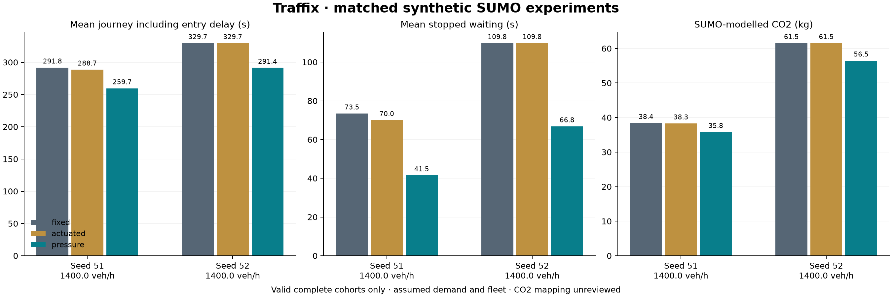

# Traffix: measured improvement for the final PPT

Measured in SUMO 1.28.0 on 10 October 2026. These are synthetic simulation results on OSM road geometry, not measured Indian road improvements. No controller parameters were changed during this evaluation.

## Copy this onto the results slide

> **11.31% shorter mean journey time and 7.48% lower modelled CO₂**, averaged across two held-out seeds, compared with fixed-time signals. All 128 scheduled vehicles completed under each policy; no collisions or teleports occurred in these held-out runs.

The percentages are arithmetic means of the two paired percentage reductions, not pooled vehicle-weighted estimates or confidence intervals. Journey time includes delay waiting to enter the network. The two seeds are a small validation sample, not proof of general performance.

| Held-out test | Fixed journey | Pressure journey | Journey reduction | Fixed CO₂ | Pressure CO₂ | CO₂ reduction |
|---|---:|---:|---:|---:|---:|---:|
| Seed 51, 49 vehicles | 291.83 s | 259.67 s | 11.02% | 38.4030 kg | 35.8072 kg | 6.76% |
| Seed 52, 79 vehicles | 329.67 s | 291.43 s | 11.60% | 61.5328 kg | 56.4836 kg | 8.21% |



## What algorithm actually produced this?

**Capacity-aware pressure control:** score candidate signal phases using upstream queued-capacity fractions minus downstream occupied-capacity fractions, weighted by assumed saturation flow. Serve the strongest eligible phase while respecting configured green bounds, receiving space, hysteresis, maximum-red priority where safe, and yellow/all-red clearance.

This is an adaptive heuristic inspired by max-pressure research. It is not an optimality guarantee, reinforcement learning, or a validated predictive controller. Current signal inputs are simulated installed lane sensors. Phone-based coverage and the phone guidance pipeline are separate; this experiment does not establish phone-only signal control.

Three policies were tested: **fixed**, **actuated** (bounded green extensions), and **pressure**. Across the two held-out normal seeds, actuated control reduced mean journey time by only **0.54%** on average (range −0.01% to 1.08%). Pressure achieved **11.31%** (range 11.02% to 11.60%). The existing pressure algorithm already delivered a reproducible benefit, so it was not tuned against these held-out outcomes.

## All test cases, including limitations

| Case | Demand and horizon | Outcome |
|---|---|---|
| Development, seed 42 | 1,400 veh/h for 180 s; up to 900 s drain | All policies completed 63/63. Pressure journey −12.22%; modelled CO₂ −8.21%. Excluded from held-out headline. |
| Held-out, seed 51 | Same settings | All policies completed 49/49; paired results above. |
| Held-out, seed 52 | Same settings | All policies completed 79/79; paired results above. |
| Stress, seed 53 | 2,400 veh/h for 180 s; up to 900 s drain | Fixed completed 133/135; actuated and pressure completed 135/135. **No fixed-versus-adaptive percentage saving is valid for this case.** |
| Initial development attempt | Seed 42, shorter 180 s wall-clock allowance | Fixed run timed out; attempt retained. Subsequent batches used a declared 900 s wall-clock allowance. |

Each pair shares network, generated demand, seed, scenario, simulation settings and execution fingerprint. Only policy differs. This is finite demand with a drain period, not sustained peak-hour robustness. No fleet emissions calibration was established; CO₂ is a SUMO model output and its emission-class mapping remains unreviewed.

The separate long-running live Explore session also accumulated a large queue and collision involvements during UI verification. It is not one of the paired benchmark cohorts and cannot support an improvement claim. Sustained overload and collision robustness remain unresolved; do not present the finite-cohort results as solving that live case.

Fairness matters: seed 42 pressure reduced the average but increased P95 stopped waiting from **171.95 s to 186.08 s**. Held-out seed 51 P95 stopped waiting improved from **168.05 s to 120.60 s**, and seed 52 from **253.60 s to 171.22 s**. Do not claim every driver always benefits.

## Prediction and the mentor requests

The requested direction was earlier warning, visible autonomous bounded actions, downstream-space protection, phone coverage, honest matched comparisons and modelled climate impact. The benchmark above proves a reactive-control benefit only. It does **not** measure forecast accuracy or show that prediction beats reaction.

Next forecasting gate: train gradient boosting on permitted observation histories from whole training runs; compare with persistence and trend at 120/180/300 seconds on disjoint seeds. Use causal speed/slowdown history, slopes, sample age and contributor count. Report MAE and usable coverage at each horizon. Then compare frozen predictive and reactive controllers on identical gradual-demand scenarios. Do not put an invented prediction accuracy on the slide.

## Credible phone-as-sensor explanation

Say: **“An opt-in phone can act as a moving traffic probe. Its location, time and speed help estimate traffic on roads without fixed sensors. Our demo uses real connected phones relaying simulated vehicle observations; field GPS validation remains.”**

[UC Berkeley's Mobile Century field experiment](https://traffic.berkeley.edu/project/mobilecentury) supports using GPS-equipped phones to reconstruct traffic velocity maps under its highway experiment conditions. [UC Berkeley/CITRIS Mobile Millennium](https://citris-uc.org/research/project/mobile-millenium/) describes the phone-data collection and feedback architecture. Neither source establishes Traffix's accuracy, an India-wide coverage rate, or exact queue lengths from sparse phones.

The [algorithm and sensor evidence note](ppt-algorithm-and-sensor-evidence.md) includes research links, emissions assumptions and the actual demo data-path boundary.

## Show it to judges

1. Use the saved pressure run for seed 51 or 52 in Results and select its matched fixed baseline.
2. Label saved simulation playback **recorded**, even when the laptop host is live.
3. Show the policy chart and same-seed queue timeline, not two unrelated live scenes.
4. Say: “Across both held-out runs, every scheduled trip completed. Average journey time fell 11.31%. The overloaded case did not produce a complete baseline, so we do not claim a saving for it.”

## Reproduce and audit

Run with the repository Python environment and SUMO available:

```powershell
python -m scripts.evaluate_unified --seeds 51 52 --policies fixed actuated pressure --rate 1400 --duration 180 --drain 900 --pace 20 --wall-limit 900 --output runs/ppt-evaluation/heldout-normal.json
python -m scripts.report_unified_benchmark runs/ppt-evaluation/heldout-normal.json --output artifacts/ppt-benchmark-heldout
python -m scripts.plot_unified_benchmark artifacts/ppt-benchmark-heldout/report.json --output artifacts/ppt-benchmark-heldout/policy-comparison.png
```

Committed evidence: `artifacts/ppt-benchmark-evidence/` holds batch manifests, completed trip XML and checksums of local recordings. Full recordings remain under local `runs/<run_id>/recording.json`. Per-run tables, negative outcomes and invalid comparisons are retained in the development, held-out and stress artifact folders. A rerun can overwrite local outputs; use a new output filename if preserving this exact evidence.
