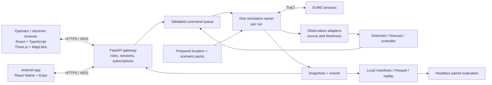

# Traffix product requirements: simulation harness and connected applications

Version 1.0 · 9 October 2026 · Owner: Kush · Primary simulation host: Prakhyat

**Status:** proposed implementation baseline for the next build, researched against
primary documentation. Requirements below describe the target product, not features
already delivered. UI styling and screen composition belong in a later `design.md`.
This document does not deploy a service or change the running demonstrations.

## 1. Product decision

Build a searchable Indore traffic experimentation system. An operator selects a
prepared location, configures demand, introduces an incident and compares traffic
responses. A real phone binds to one simulated vehicle and receives the same route
and driving advisories shown in that vehicle's first-person view.

The harness is the evidence-producing test environment for Traffix's operator and
driver products. Its useful outcome is a reproducible answer to: **does this response
reduce delay without creating unacceptable queues elsewhere?** Visual polish makes
that answer understandable; traffic generation and evaluation make it credible.

Prakhyat's RTX 5060 with 8 GB VRAM, 32 GB RAM and disk space is a reasonable development
host for a bounded pilot. Actual capacity is unmeasured. Record CPU model, GPU driver,
available RAM and SSD throughput before selecting a supported workload. The GPU helps
local rendering and optional model workloads; it does not automatically accelerate
SUMO's traffic stepping. A remote browser renders using its own device's GPU.

### Constraints we accept

- Local authoritative simulation, remotely accessible dashboard and Android app.
- Several prepared Indore locations; one active interactive run initially.
- Real mapped geometry, explicitly assumed or measured demand, distinct vehicle classes.
- Simple operator flow with advanced controls behind an expander.
- Persistent vehicle identity across dashboard, minimap, phone and first-person view.
- Experiment events, control explanations, replay and matched baseline evaluation.
- Low operating cost with a useful fully local mode.

### Constraints we tighten

- Searching an arbitrary place does not promise an instant validated simulation.
- Do not target a GTA-scale open world, photorealism or city-wide microscopic traffic in v1.
- No camera-dependent vehicle spawning/despawning in measured runs.
- Do not claim real traffic, police readiness, predictive benefit or carbon savings from appearance.
- An optional LLM explains approved facts; it never chooses or executes signal phases.
- Native apps and online deployment are newly requested product scope. Older offline-only
  repo rules remain applicable to existing demos until a scoped implementation update is made.

## 2. Current assets and gaps

| Reuse | Limitation to address |
|---|---|
| Offline LIG geometry and SUMO/TraCI adapter | Demand and signal timing are not field-calibrated |
| Six visual vehicle types and Three.js scene | Roads lack prominence; buildings are repetitive; signal dots are ambiguous |
| Phone QR claim, authentication, validated frames and WebSockets | Browser prototype; requires reset/rejoin; no native background notifications |
| Accepted route change with worker acknowledgement | Limited prevalidated route choices and a small staged scenario |
| Queue-responsive five-second extension experiment | No full phase selection, green wave or proven network-wide benefit |
| Saved manifests, run outputs, tests and replay | Need a unified run catalog, paired evaluator and clear user-facing provenance |
| Prakhyat's gradient-boosted slowdown models | Held-out early-warning and control benefit remain unproven; live ML stays gated |

Existing baseline, phone and response demos remain regression fixtures. Build the
unified experience incrementally; do not discard the observation gateway or worker.

## 3. Users, permissions and main journeys

**Operator:** select location, configure demand, create a run, schedule incidents,
enable a controller, inspect explanations and export results.
**Driver participant:** join a vehicle, opt into observations, inspect own trip,
receive guidance and accept/decline a route. Cannot create events or signal commands.
**Observer/mentor:** view a live or recorded run; no mutation permissions.
**Researcher:** run headless batches, manage datasets and compare policies.

Main flow: **Location → Traffic preset → Run → Optional event → Response → Compare.**
The first screen exposes location, quiet/normal/busy demand, control mode and Start.
Advanced settings show numerical assumptions and reproducibility options.

Two explicit run modes:

- **Explore:** operator can inject events and edit future demand. Every edit is recorded.
  A new trip may be assigned after completion with the participant's consent.
- **Experiment:** scenario, schedule and cohort freeze before execution. Each restart
  creates a new run ID. Completion shows results; optional looping creates separate
  runs with a visible counter and never combines their metrics.

Refreshing a viewer reconnects; it must not reset a shared active run. Provide an
obvious New run action. Run reset invalidates old route offers and frame references.

## 4. Location search and map preparation

### H01 — Prepared location catalog

Start with LIG Square. Candidate next packs: Palasia and Vijay Nagar, subject to OSM
coverage, topology review and team selection. They are candidates, not validated packs.
Use one reviewed junction cluster with upstream arrival and downstream storage buffers
per pack; initial area target about 1–2 km across, adjusted to actual route needs.

A pack contains a versioned boundary, OSM source date, coordinate transform, SUMO
network, original-to-canonical ID registry, legal routes, signal movement map, building
assets, minimap tiles/data, demand presets, sensor configuration and validation report.

Search results distinguish **Ready**, **Needs preparation** and **Outside pilot area**.
Maintain a local Indore place-name index for prepared packs. An optional external
geocoder finds places outside it; search submits a preparation job rather than
pretending that road geometry already supplies traffic or correct signal logic.

Preparation stages: download permitted source → build left-hand road network → inspect
connections, lane counts and turn permissions → map movements/signals → validate routes
by vehicle class → build visual assets → smoke-test demand → publish versioned pack.
Progress includes failure reasons and retry; no runtime shell access from the dashboard.

### H02 — Coordinate consistency

Store WGS84 geographic positions and explicit projected local coordinates. Use the
same transformation for SUMO, 3D, minimap and phone routes. Automated round-trip
coordinate tests and visual landmark checks must pass before publication.

OSM attribution is visible. Package self-generated or properly licensed offline tiles;
do not bulk-download the public standard tile service. The public Nominatim service
has rate/use restrictions and does not permit client autocomplete. Use the local index
for autocomplete, and verify the chosen provider's terms for additional geocoding.
[OSM tile policy](https://operations.osmfoundation.org/policies/tiles/),
[Nominatim policy](https://operations.osmfoundation.org/policies/nominatim/).

## 5. Traffic generation: where the vehicles come from

### H03 — Demand is trips, not a visual car-count slider

Define origin/destination zones at network boundaries and meaningful internal sources:
parking access, residential entries, commercial areas and bus stops. Each time interval
has class-specific departures, destinations, turn proportions and a random seed.

A four-arm junction has four approach flows, potentially multiple lanes per approach;
it is not automatically a four-lane road. Read and review each approach's actual lane
layout. Define left/through/right/U-turn permissions, shared lanes, median restrictions
and exit capacities. Never manufacture equal arrivals on all arms for visual symmetry.

Use seeded time-varying arrival schedules. Independent low-volume arrivals may use a
Poisson assumption; signal-fed approaches should include platoons and correlated gaps.
Both are scenario assumptions until calibrated. Store generated departures before a
paired experiment so controllers receive the same intended demand.

At insertion, obey available gap and vehicle permissions. When a queue blocks entry,
retain delayed demand and record insertion delay. Never silently drop vehicles to keep
the scene smooth. Report scheduled, inserted, pending, arrived and unfinished counts.
Vehicles depart only through valid destinations or explicitly modelled parking/stops.

Recommended pipeline: legal candidate routes with `duarouter`; fit measured edge/turn
counts with `routeSampler`; use origin-destination inputs when available. Random trips
are useful for smoke tests, not as evidence of real LIG demand. SUMO documents demand
and count-fitting tools for these purposes.
[Demand](https://sumo.dlr.de/docs/Demand/Introduction_to_demand_modelling_in_SUMO.html),
[routeSampler](https://sumo.dlr.de/docs/Tools/Turns.html).

### H04 — Simple customization

Basic controls: traffic level, time profile, vehicle mix, incident and seed.
Advanced: approach arrivals in vehicles/hour, turns, bus schedules, demand duration,
phone penetration and bounded driver-behavior distributions. Display resulting counts
and validate that proportions sum correctly. A traffic-level slider scales a documented
base profile; it does not assert the selected level matches today's traffic.

### H05 — Indian mixed traffic

Classes: motorcycle, car, auto-rickshaw, e-rickshaw, bus, delivery/commercial and ambulance.
Class parameters include dimensions, acceleration, deceleration, desired-speed distribution,
standstill gap, headway, lateral clearance, stops, turn permissions and emission class.
Assign stable per-driver parameters using independent seeded streams. Actual speed
comes from car following, signals, road limits and incidents, not frame-by-frame noise.

Retain the pinned default SUMO car-following behavior as the first baseline. Compare
an IDM configuration only as a separately calibrated experiment; do not change models
while also changing demand and then attribute all differences to signal control.

Introduce SUMO's sublane model after the lane-following baseline is stable. It supports
side-by-side two-wheelers and lateral behavior, but requires calibrated widths/gaps and
more testing. Limited noncompliance profiles are a later stress test, with explicit
rates and observable faults. Do not equate collision suppression with realistic traffic.
[SUMO sublane model](https://sumo.dlr.de/docs/Simulation/SublaneModel.html).

## 6. Visual simulation and exploration

### H06 — Roads are the primary visual layer

Road surfaces, lane edges, stop lines, crossings, medians and directional arrows must
remain readable at the default camera distance. Use quiet building colors, controlled
shadows and road-label decluttering. Tall buildings fade when they obscure selected
roads. Congestion heat overlays are optional and carry a source/freshness legend.

Buildings use OSM heights/levels where available. Missing heights get deterministic
category-based assumptions labelled in the pack metadata. Differentiate residential,
commercial, industrial and landmark forms with low-poly roofs, materials and height
variation. Do not claim photogrammetry or accurate facade reconstruction.

The requested bottom-up appearance is a short presentation-only reveal when a pack
loads. It does not delay simulation timestamps or change geometry. Include Skip/reduced
motion. Use original/licensed low-poly assets and texture atlases. Image generation can
produce approved textures/icons or concept art; it does not itself produce a rigged
traffic model or validated road network.

Use game-rendering techniques such as instancing, distance-based detail, culling,
mesh pooling, asynchronous asset loading and interpolated rendering. Do not claim to
reproduce GTA V's proprietary traffic algorithms. Rendering may omit distant meshes;
the simulation must still contain their vehicles.
[Three.js instancing](https://threejs.org/docs/pages/InstancedMesh.html).

### H07 — Minimap and traversal

Keep Three.js as the primary 3D renderer; add MapLibre GL JS for a north-up/heading-up
minimap and search map. Synchronize bounds, selected vehicle, route, incident boundaries
and camera footprint. Clicking the minimap changes viewpoint, not vehicle position.
Orbit, pan, zoom, top-down, follow and reset-camera controls use consistent shortcuts.
Route selection occurs separately through a validated trip action.

MapLibre documents Three.js integration, so a unified custom-layer renderer is a later
option if coordinate and performance tests justify migration. Avoid replacing both
the existing simulator and renderer at once.
[MapLibre integration](https://maplibre.org/maplibre-gl-js/docs/examples/add-a-3d-model-using-threejs/).

### H08 — Vehicle and first-person views

Select a vehicle to enter follow, driver-eye or overhead mode. Camera anchors differ
for car, motorcycle and auto; use their model dimensions and smooth orientation.
Provide dashboard/handlebar framing and a minimal HUD: current speed, next turn,
applicable signal movement, advisory, connection age and simulation label.

FPV is a camera on the same authoritative vehicle, not a second driving engine.
No keyboard steering in v1. The HUD and phone consume the same advisory ID and state;
accepting on either surface is idempotent. A selected vehicle that exits shows Trip
complete rather than silently attaching the user to another car.

### H09 — Replace ambiguous signal dots

Build a reviewed mapping from SUMO controlled links to incoming lane and permitted
movement. Show readable physical signal heads at stop lines and a selected-junction
overlay with left/through/right arrows, protected/permissive status, current phase,
served lanes, next committed transition and controller reason.

Group links only when they truly share a signal indication and movement meaning.
Never collapse an entire junction to one green/red lamp. Use red/yellow/green for
actual indications only. Use separate blue/amber borders and text for demand pressure,
prediction uncertainty or intervention state; congestion heat must not recolor a red
signal as green. Distinguish countdown to a committed transition from an uncertain
estimate under adaptive control. Stale state becomes explicitly unavailable.

## 7. Events and emergencies

### H10 — Reproducible event editor

Operator selects an event, map target, start time and duration. Preview affected lanes,
route feasibility and likely scope before Apply. Events have IDs, seeds, severity,
start/end times, author, status and reversal rules. Dragging an icon creates a draft.
Random events draw from bounded seeded templates; store the generated schedule for replay.

| Event | Simulation mechanism | Required constraints |
|---|---|---|
| Political rally | Moving slow convoy, staged arrivals and/or a scheduled road closure | Explicit route and duration; model pedestrian participation only when supported |
| Roadworks / breakdown | Disable selected movements or reduce capacity with a stopped object | Existing vehicles clear safely; restoration checks overlapping events |
| Rain / waterlogging | Scoped speed/friction assumptions or closure of affected edges | Rain is not just a visual filter; assumptions recorded |
| Bus / pickup stop | Dwell time at a legal or explicitly obstructive stop | Stop location and class matter |
| Ambulance | Dedicated trip, urgency, siren/yield model and bounded preemption request | Preserve safe phase transitions and recover normal service |
| Sensor outage | Drop/delay selected observation sources | Truth remains in the renderer; controller sees missing data |

Overlapping events compose from the base network state; ending rain must not reopen a
road still closed by a rally. Record rejected/partially applied events. Forecasts and
route costs refresh after event changes. Truth-only scheduled incidents are not leaked
to a controller unless the scenario explicitly models an operator report.

Ambulance control is a separate state machine: request → validate route/arrival window
→ finish required clearance → serve emergency movement → confirm passage → recovery.
Resolve multiple ambulances deterministically and measure delay imposed on others.
SUMO has emergency-vehicle behavior that can support the experiment; defaults need
review for our scenario rather than enabling unrestricted special behavior wholesale.
[SUMO emergency vehicles](https://sumo.dlr.de/docs/Simulation/Emergency.html).

## 8. Algorithm choice and evaluation

### H11 — Controller ladder

1. Fixed timing from a reviewed location program: benchmark baseline.
2. Existing bounded green-extension rule: regression baseline.
3. Actuated controller: strong conventional comparator.
4. **Capacity-aware pressure-inspired controller:** recommended next implementation.
5. Forecast-assisted controller: only after forecasting and policy ablations pass.

Why this choice: queue length alone may send vehicles into a full downstream link.
Pressure methods consider the demand to move and congestion beyond that movement.
Classical max-pressure results rely on modelling assumptions; the literature specifically
addresses finite-storage limitations. Our constrained implementation must be evaluated
and must not inherit a theoretical optimality claim automatically.
[Varaiya, 2013](https://www.sciencedirect.com/science/article/pii/S0968090X13001782),
[capacity-aware back-pressure research](https://arxiv.org/abs/1309.6484).

### Proposed phase-scoring specification

For each legal movement i→j, estimate upstream movement queue q_ij, downstream occupied
storage b_j and capacities K_ij, K_j. Estimate movement saturation discharge s_ij from
calibration, not a universal per-lane constant. Begin with a transparent custom score:

`score(p) = sum[s_ij * (q_ij/K_ij - b_j/K_j)] over movements served by p`

This is our normalized pressure-inspired heuristic, not a verbatim published algorithm.
Reject movements whose receiving storage cannot accept discharge. Select among legal
nonconflicting phases with minimum-green, maximum-green, pedestrian-clearance,
maximum-red/service and transition constraints. Prefer staying in the current phase
unless the gain exceeds a documented hysteresis threshold. All weights and thresholds
live in versioned policy configuration and receive sensitivity tests.

If lane movement queues cannot be measured, use an explicitly labelled aggregate
approximation and evaluate its bias. Count-based, physical-queue-length and equivalent-
vehicle-unit variants must be separate configurations; do not assign arbitrary equal
road-space demand to a motorcycle and bus. Report delay by vehicle class and approach.

With stale critical sensors, fall back to the reviewed fixed program at a safe boundary.
Override priority: safety constraints → emergency state machine → bounded operator
override → adaptive policy → baseline fallback. One policy owns a signal at a time.

### H12 — Coordination between junctions

First coordinate through shared downstream occupancy and consistent movement IDs.
Then publish expected discharge/arrival platoons to neighboring controllers and test
offset or short-horizon scheduling. A controller must not release traffic into a
blocked downstream junction. Full corridor green waves are a later gate, not implied
by enabling a switch named Smart coordination.

### H13 — Detection and prediction

Define congestion labels before training: sustained low speed relative to calibrated
reference plus queue growth/spillback, with duration and thresholds stored per scenario.
Expose detection evidence, source, freshness and coverage. A phone sample estimates
sampled speed; it does not directly count nonparticipating vehicles.

Keep Prakhyat's gradient-boosted forecasting work as the initial candidate. Inputs:
causal recent speed/slowdown, time-window statistics, trend, queue/occupancy where measured,
signal context where available, sample count and age. Targets: 120/180/300-second future
slowdown or queue. A regression output is not a calibrated probability of a jam.

Train on balanced clear, building, congested and recovering episodes. Split whole
scenarios/seeds and later whole field days/locations. Hold preprocessing inside training.
Compare with persistence, trend and constant baselines. Report MAE plus event precision,
recall, lead time, false alerts/hour and missing-data behavior. Use measured inference
cost and usefulness, not GPU availability, to select the model. No RL requirement in v1.

Evaluate controller benefit separately: fixed vs reactive vs forecast-assisted, using
identical demand, incidents and model versions. Log why an action was proposed, blocked,
applied and completed. A better forecast error alone does not establish better traffic.

### H14 — Routing and speed advice

Compute valid alternate routes using permitted road graph and travel-time estimates.
Prototype deterministic shortest paths, then limited alternatives. Gate diversion by
downstream capacity, vehicle-class restrictions, safe decision distance, evidence age,
expected benefit and acceptance. Limit offered uptake, add cooldowns and prevent routes
oscillating every update. Model acceptance as an explicit seeded parameter in batch runs.
The idea that non-app drivers follow an app user remains an optional behavior hypothesis.

Speed advice starts as a queue-aware GLOSA experiment. Consider distance, committed
signal timing, leader/queue discharge and acceleration limits. Prefer a safe speed band
or Prepare to stop over a precise number when timing is uncertain. Never advise beating
yellow, exceeding limits or ignoring car following. The official SUMO GLOSA documentation
notes caveats with variable phase timing; retain safety behavior and test adaptive-phase
changes explicitly before showing numerical advice.
[GLOSA documentation](https://sumo.dlr.de/docs/Simulation/GLOSA.html).

## 9. Phone application and identity

### H15 — Android-first React Native + Expo development build

Recommended because it keeps TypeScript skills reusable with the dashboard and supports
native notifications. Scope: join, simulated trip, own vehicle map/current speed,
route/advisory acceptance, trip history, estimated impact when supported, learning content.
React Native components do not directly reuse the existing HTML UI. Screen design is deferred.

Server allocates the vehicle binding after a short-lived one-use invitation. A phone
cannot select another vehicle in a payload. Every frame/advisory includes run and trip
identity, target vehicle, source, simulation timestamp, sequence and expiry. Retain the
existing frame-validation protections. Reconnect uses a state snapshot plus acknowledged
sequence; old offers cannot execute in a new run. Persist consent separately from connectivity.

The mobile app uses the same live API over LAN or HTTPS/WSS. Simulation mode must visibly
say SIMULATED POSITION. Future real GPS gets a separate consented adapter and provenance;
do not pretend a stationary phone in the room is measuring LIG traffic.

Foreground advice uses the WebSocket and an in-app banner; background push is a wake-up
hint that refetches current authorized state. Push may be delayed and cannot be the signal
control channel. Notifications are deduplicated, expire and disappear after cancellation.
Expo push requires a development build rather than Expo Go; verify platform credentials
and permissions as part of the app release.
[Expo notifications](https://docs.expo.dev/push-notifications/what-you-need-to-know/).

### H16 — Carbon and trip impact

Calculate modelled tailpipe emissions from per-vehicle rates and simulation time step:
`CO2_kg = sum(rate_mg_per_s * step_seconds) / 1,000,000`.
Rates depend on assigned emission models; validate class mappings before reporting.
Electric tailpipe zero is not zero lifecycle carbon. Report electricity separately.
[SUMO emission output](https://sumo.dlr.de/docs/Simulation/Output/EmissionOutput.html).

Savings = completed matched baseline emissions minus completed policy-run emissions.
Match OD, departure demand, vehicle class/identity, seed, network and event schedule;
the treatment may change the route. Show negative outcomes honestly. Without a match,
display unavailable, never an accumulating decorative savings counter. Per-trip savings
are a simulated counterfactual, not a certified personal carbon credit. Do not add
individual and network savings together as independent benefits.

## 10. Architecture and low-cost deployment

SUMO runs on Prakhyat's laptop. Python owns each run's state and commands. The renderer
only displays snapshots; animation cannot move authoritative vehicles or alter results.
Use subscriptions, stable IDs, binary/delta transport where profiling justifies it,
and lower-frequency summaries for observers. Phones receive their own vehicle plus
relevant nearby map/advisories, not the entire city state.

Recommended deployment stages:

1. **LAN:** serve frontend and API locally; prepared assets require no external service.
2. **Remote pilot:** host the static dashboard separately if useful; expose the laptop's
   authenticated gateway through a managed outbound HTTPS tunnel. Keep simulation local.
   Cloudflare Tunnel is a candidate mechanism; verify account/domain requirements and
   service limits before deployment. Laptop power, internet upload and uptime are dependencies.
   [Tunnel documentation](https://developers.cloudflare.com/cloudflare-one/networks/connectors/cloudflare-tunnel/).
3. **Persistent service:** if an always-available pilot is required, move the lightweight
   API/relay to a small host and let the simulation agent connect outbound. Explicitly
   show worker offline; hosting an API does not keep a sleeping laptop's run alive.

Vercel is an optional frontend host. Current documentation includes WebSocket support
in beta, with bounded function lifetimes and reconnect/state requirements. Do not use a
stale blanket claim that WebSockets are impossible there. Nevertheless, our recommendation
is a long-running local simulation service, not moving the authoritative SUMO process into
request-scoped functions.
[Vercel WebSockets](https://vercel.com/docs/functions/websockets).

Localhost bootstrap authorization must not become public admin access through a tunnel.
Implement remote authentication explicitly: operator/observer/driver roles, short-lived
scoped credentials, allowed origins, rate limits, revocation and audit. Never expose
TraCI, process-launch endpoints, arbitrary filesystem paths or unauthenticated admin APIs.
Version new endpoints/contracts; migrate existing phone contracts compatibly rather than
changing their meaning silently.

Persist experiments in local files plus SQLite metadata initially; use Parquet for
tabular observation/training data and compressed event/snapshot logs. Disk quota and
retention are configured; preserve benchmark manifests and results. No Kubernetes,
paid map dependency or always-running cloud GPU is required for v1.

### Optional local LLM

Possible uses: explain a controller's structured decision, summarize a run and draft
learning material. Templates are the default, lowest-cost option. A small quantized
local model is optional only after measuring VRAM and latency alongside rendering.
Do not assume 8 GB accommodates every model plus the scene. Queue/offload this work;
disable it under load. Its outputs cannot bypass event validation or issue signal commands.

## 11. Performance and operational targets

These are proposed acceptance targets, not measured hardware claims.

| Test | Initial target |
|---|---|
| Bounded pilot workload | One location, 500 active vehicles, 5 bound phones, 2 observers |
| Simulation | Sustain at least 1 simulated second/second with rendering and phones connected |
| Operator renderer | At least 30 FPS at 1080p, target 60, on specified host after warm-up |
| Snapshot transport | 5–10 Hz near selected region; interpolation between snapshots |
| Command acknowledgement | LAN p95 under 500 ms, internet pilot p95 under 1 s, measured separately |
| Cached location load | Under 10 seconds to interactive view; preparation time shown separately |
| Memory budget | Target app working set under 20 GB RAM and local graphics under 6 GB VRAM |
| Soak | 30-minute run without growing unreleased memory, stale command execution or lost audit |

Sweep 250/500/1000 active vehicles with traffic fidelity settings recorded. If the 500
target fails, publish the measured supported envelope and optimize before advertising it.
Reduce render detail/transport first, not collision checks or traffic logic. High-fidelity
sublane mode gets a separate capacity envelope. Pause/degrade clearly rather than changing
simulation time silently when overloaded. Avoid concurrent training/LLM jobs during demos.

## 12. Acceptance gates

| Gate | Required evidence |
|---|---|
| A: location correctness | Every published pack has ID mapping, legal class routes, reviewed signal movements and attribution; unavailable places never launch a fake validated pack |
| B: demand correctness | Same seed regenerates departure/OD/class manifest; turns and source flows reconcile; insertion backlog is visible; different approaches carry configured demand |
| C: visual meaning | At default camera, reviewers identify road direction, selected vehicle and its signal movement; minimap/FPV show the same location and route |
| D: signal correctness | Conflict/clearance, blocked receiving road, stale sensors, max-red and emergency-recovery tests pass; every action has a reason and worker acknowledgement |
| E: phone loop | Two real phones join distinct vehicles; offers reach only their target; stale, duplicate, altered and wrong-run messages reject; offline/reconnect and trip completion work |
| F: events | Rally, lane blockage and ambulance schedule replay identically; ending overlapping events restores the correct remaining restrictions |
| G: evaluation | Complete fixed/actuated/reactive/candidate runs under same intended demand; faults and unfinished trips remain visible; report all predeclared seeds/scenarios |
| H: online pilot | Operator authentication and observer limits work; a phone over mobile data receives its own state; sleeping host shows offline; stale actions cannot replay on reconnect |
| I: performance | Publish measured hardware/configuration and workload results against the target table |

For exploratory algorithm selection, start with ten paired seeds per scenario; this
is an engineering starting point, not a statistical-power guarantee. Report confidence
intervals and per-seed outcomes. Predeclare scenario exclusions and congestion onset
labels. Include warm-up, demand period and drain period consistently. Report mean/p95
journey delay, throughput, queue/spillback duration, maximum approach wait, emergency
travel time, CO2 and integrity. A lower average with an unserved approach fails fairness.

## 13. Delivery order and ownership

| Stage | Deliverable | Primary responsibility / exit condition |
|---|---|---|
| 1 | Unified LIG pack, demand manifest and readable roads/signals | Prakhyat + Nandani for topology/model review; Kush integration; gate A/B |
| 2 | Stable mixed demand and event engine | Prakhyat host and simulation; seeded rain/blockage/rally; gate F |
| 3 | Pressure-inspired policy and headless paired evaluation | Prakhyat algorithm/evaluation, Kush safety gateway; gate D/G |
| 4 | Unified operator scene, minimap, follow/FPV | Urvashi visuals, Kush state integration; gate C |
| 5 | Native Android app and same-run phone binding | Kush bridge/app integration, Urvashi later design; gate E |
| 6 | Remote pilot plus two additional reviewed locations | Prakhyat host agent, Kush deployment; gate H/I |
| 7 | Forecast-assisted control and evaluated speed advice | Prakhyat ML; proceed only after causal forecast/control evidence |

Ownership is a proposed team plan; update path-level ownership before cross-owner code
changes. Prakhyat's machine is the host, not the only place source or evidence exists.
Pin runtime versions, commit code, and share a setup manifest and result summaries.

First implementation handoff: build Stage 1 on the existing engine. Deliver location
pack schema, deterministic multi-approach demand, clear signal-movement mapping and
replayable run manifest before adding new model training or visual effects. Keep commits
small and attach tests/results. Do not attempt the entire PRD in one agent prompt.

## 14. Decisions to settle before implementation

- Prakhyat's CPU/OS and actual measured simulation envelope.
- Which two Indore locations follow LIG, and who reviews their topology/signals.
- Availability of permitted count/turn/phase observations and the pilot's calibration target.
- Expected simultaneous online viewers/phones, domain availability and acceptable monthly cost.
- Whether v1 must include pedestrians, or represents rally pedestrians as capacity restrictions.
- Which app screens, visual theme and interactions go into the separate design specification.

## 15. Mentor / police-facing positioning

“Traffix is a scenario-testing and congestion-response prototype. We can reproduce
mixed traffic, inject disruptions, bind phones to simulated vehicles and compare
control policies. We are building toward a calibrated local planning tool. Field
deployment and control of real signals require authority cooperation, data validation
and independent safety review.”

The nearest useful police workflow is comparing closures, rally routes and emergency
access plans using reviewed inputs. No current claim of deployment readiness follows
from a working 3D demonstration.
